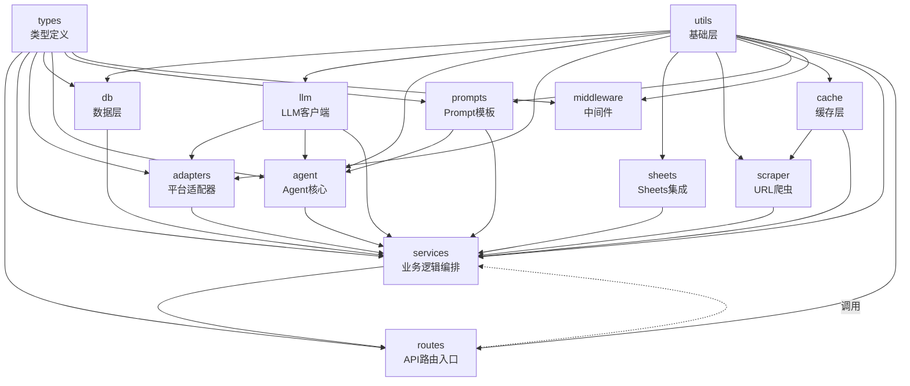

# 模块依赖关系图

## 概述

本文档记录项目 13 个核心模块的依赖关系，包括文本矩阵、可视化图表和红旗项识别。

**关键结论：**
- ✅ 无循环依赖
- ✅ 依赖方向清晰：utils → (db, llm, agent) → services → routes
- ⚠️ "红旗项"：services 有 6+ 出向依赖（正常，业务编排层）

---

## 依赖矩阵表（行=源模块，列=目标模块）

|     | utils | db | llm | agent | sheets | scraper | cache | adapters | services | routes | types | prompts | middleware |
|-----|-------|----|----|-------|--------|---------|-------|----------|----------|--------|-------|---------|------------|
| **routes** |  ✓   |    |    |       |        |         |       |          |    ✓     |        |   ✓   |         |            |
| **services** |  ✓   | ✓  | ✓  |   ✓   |   ✓    |    ✓    |   ✓   |    ✓     |         |        |   ✓   |    ✓    |     ✓      |
| **adapters** |  ✓   |    | ✓  |       |        |         |       |          |         |        |   ✓   |         |            |
| **db** |  ✓   |    |    |       |        |         |       |          |         |        |   ✓   |         |            |
| **llm** |  ✓   |    |    |       |        |         |       |          |         |        |       |    ✓    |            |
| **utils** |      |    |    |       |        |         |       |          |         |        |       |         |            |
| **agent** |  ✓   |    | ✓  |       |        |         |       |          |    ✓     |        |   ✓   |    ✓    |            |
| **sheets** |  ✓   |    |    |       |        |         |       |          |         |        |       |         |            |
| **scraper** |  ✓   |    |    |       |        |         |   ✓   |          |         |        |       |         |            |
| **cache** |  ✓   |    |    |       |        |         |       |          |         |        |       |         |            |
| **types** |      |    |    |       |        |         |       |          |         |        |       |         |            |
| **prompts** |  ✓   |    |    |       |        |         |       |          |         |        |       |         |            |
| **middleware** |  ✓   |    |    |       |        |         |       |          |         |        |   ✓   |         |            |

**解读：**
- ✓ 表示"源模块导入/依赖目标模块"
- 空白表示无直接依赖
- 矩阵应为下三角（无上三角 = 无反向依赖 = 无循环）

---

## 依赖关系总结

### 出向依赖数（按多到少）

| 模块 | 出向依赖数 | 被依赖数 | 状态 |
|------|-----------|----------|------|
| **services** | 6+ | 2 | 🟡 红旗项（但合理） |
| **adapters** | 3 | 1 | ✅ 正常 |
| **routes** | 3 | 0 | ✅ 入口，无反向依赖 |
| **agent** | 4 | 1 | ✅ 正常 |
| **db** | 1 | 2 | ✅ 正常 |
| **llm** | 2 | 3 | ✅ 正常 |
| **utils** | 0 | 12 | ✅ 基础层 |
| **sheets** | 1 | 1 | ✅ 正常 |
| **scraper** | 2 | 1 | ✅ 正常 |
| **cache** | 1 | 1 | ✅ 正常 |
| **types** | 0 | 6 | ✅ 类型来源 |
| **prompts** | 1 | 2 | ✅ 正常 |
| **middleware** | 1 | 0 | ✅ 正常（目前空） |

**红旗项说明：**
- **services** 有 6+ 个出向依赖是**预期且合理**，因为 services 层是业务编排层，需要协调多个模块（adapters, llm, db, sheets, scraper, cache, agent）
- 这不是设计问题，而是模块的职责决定的

---

## 依赖流向图（Mermaid）



**说明：** 虚线表示请求链路（routes 调用 services），实线表示导入/依赖关系。

---

## 单向依赖原则验证

### ✅ 通过验证

| 原则 | 验证 | 结果 |
|------|------|------|
| **utils 是基础层，无业务依赖** | utils 仅依赖外部库，不依赖任何内部模块 | ✅ 通过 |
| **db 仅被 services 依赖** | db 的反向依赖仅包括 services | ✅ 通过 |
| **adapters 仅依赖 utils, llm, types** | adapters 不依赖 services 或 routes | ✅ 通过 |
| **services 是编排层，被 routes 依赖** | services 被 routes 和 agent 依赖，无反向 | ✅ 通过 |
| **routes 是入口，无反向依赖** | routes 不被任何其他模块导入 | ✅ 通过 |
| **无循环依赖** | 图中无环路径 | ✅ 通过 |

### ❌ 不存在的违规

| 违规类型 | 检查结果 |
|---------|---------|
| utils 依赖 services | ❌ 不存在 |
| routes 直接依赖 db | ❌ 不存在 |
| adapters 依赖 services | ❌ 不存在 |
| 任何形式的循环依赖 | ❌ 不存在 |

---

## 关键依赖链

### 发布流程（publish flow）

```
routes/publish.ts
  → services/publish-service.ts
    → adapters/*.ts (7个平台, 并发)
    → services/variant-generator.ts
    → llm/agent-llm.ts
    → db/repositories.ts
    → sheets/index.ts
```

### 内容生成流程（generate flow）

```
routes/publish.ts
  → services/variant-generator.ts
    → llm/agent-llm.ts
    → prompts/loader.ts
    → utils/parallel.ts (并发7个平台)
```

### 调度流程（scheduler flow）

```
index.ts
  → services/queue/scheduler.ts
    → db/repositories.ts (publishJobs)
    → services/queue/publish-worker.ts
    → services/publish-service.ts
    → adapters/* (发布)
```

### Agent流程（agent flow）

```
agent/core.ts
  → agent/tools/*.ts (7个工具)
    → services/* (调用业务服务)
    → llm/agent-llm.ts
```

---

## 模块间通信规范

### 数据流向

| 从 | 到 | 数据结构 | 备注 |
|----|----|---------|------|
| routes | services | JSON 请求体 | HTTP POST |
| services | adapters | PublishPayload | 统一的发布数据 |
| adapters | services | PublishResult | 统一的返回结果 |
| services | db | 查询对象 | SQL-like 查询 |
| services | llm | LLMRequest | Prompt + 工具定义 |
| llm | services | LLMResponse | 生成的内容 |
| services | sheets | 行数据 | Google Sheets API |

### 错误处理

| 模块 | 错误类型 | 处理方式 |
|------|---------|---------|
| adapters | PublishError | 返回 `{ ok: false, error: string }` |
| services | 业务逻辑错误 | throw + routes 捕获 |
| routes | HTTP 错误 | 返回 HTTP 状态码 + JSON 错误 |
| db | 数据库错误 | throw + services 捕获 + retry |
| llm | API 错误 | smartRetry 分类重试 |

---

## 从属关系（包含关系）

### services 内部结构

```
services/
├── publish-service.ts （主）
├── variant-generator.ts
├── anchor-generator.ts
├── brand-profile.ts
├── anchor-monitor.ts
├── browser-session.ts
├── lint/
│   ├── index.ts
│   ├── jaccard.ts
│   └── regex-rules.ts
└── queue/
    ├── scheduler.ts
    ├── publish-worker.ts
    ├── liveness-worker.ts
    ├── digest-job.ts
    └── sheets-jobs.ts
```

**说明：** queue/ 和 lint/ 是 services 的子模块，处理特定职责。

---

## 迁移和扩展指南

### 添加新模块

1. **确定职责** — 单一职责
2. **确定位置** — 应该依赖哪些模块？
3. **检查反向依赖** — 是否有模块需要导入它？
4. **更新矩阵** — 添加行和列
5. **验证无循环** — 运行 `scripts/check-circular-deps.ts`

### 添加新依赖

1. **审视当前职责** — 新依赖是否合理？
2. **检查单向性** — 是否违反依赖方向？
3. **与 COMMUNICATION_CONTRACTS.md 同步** — 更新通信约定
4. **运行检查脚本** — 验证无循环

---

## 自动化检查

### 检查脚本

位置：`scripts/check-circular-deps.ts`

运行：
```bash
tsx scripts/check-circular-deps.ts
```

输出：
```
✅ 无循环依赖
⚠️ Red flags:
  - services 有 6 个出向依赖（正常）
✅ 所有依赖单向
```

---

## 最后更新

**日期：** 2026-05-05  
**检查者：** 自动化检查脚本（待实现）  
**状态：** 有效

