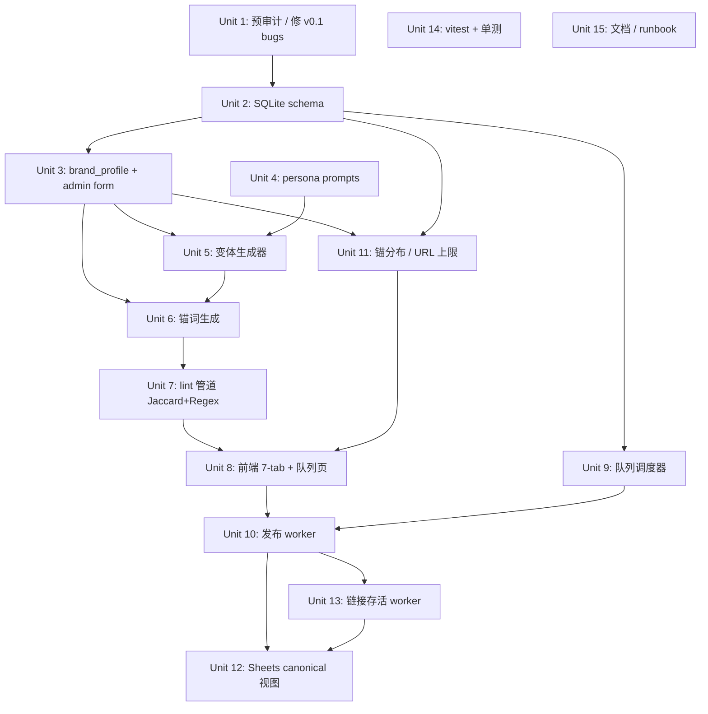

# 第三方口吻外链分发工具 (v0.2 重构)

## Overview

把 v0.1 的 `URL → 爬取 → 单篇 LLM 改写 → 顺序发布` 重构为 `编辑粘贴 → 7 平台并行变体（按人设组）→ 自动 lint 闸 → 7-tab 预览 → 持久化作业队列（随机延迟）→ 发布 → T+24h/T+7d 链接存活检查`。新增反链图谱健康监控（锚集中度、单 URL 周速率、存活率告警），Sheets 作为编辑日常 canonical 视图。

15 个实现单元分 4 阶段：基础（schema/品牌资料库），改写引擎（人设/变体/锚词/lint），UI+队列（前端/调度/worker/分布监控），追踪与可观测性（Sheets/存活检查/测试/文档）。

## Problem Frame

编辑（赵老师团队）需要为单一首发主站做长期 SEO 外链建设。v0.1 流程入口是 URL 爬取，与编辑实际"已写好草稿，需要伪装成第三方口吻分发"的工作流不匹配。同时 v0.1 共用一篇会触发 Google 重复内容判定，缺少品牌资料库、锚词差异化、人设差异化能力。新版定位为**单主站、多人设、多变体的第三方推荐外链工厂**，每日中频 3-10 篇稳定输出。完整问题描述见 origin 文档。

## Requirements Trace

完整 R1-R23 见 origin 文档 `docs/brainstorms/2026-04-30-third-party-voice-syndicator-requirements.md`。本 plan 实现单元逐一覆盖：

- 输入与首发方资料 (R1-R3) → Unit 3, 8
- LLM 改写与人设 (R4-R7) → Unit 4, 5
- 锚链注入策略 (R8-R10c) → Unit 6, 11
- 预览审核闸 (R11-R13) → Unit 7, 8
- 队列调度 (R14, R15) → Unit 9
- 发布失败处理与队列状态 (R16, R17) → Unit 10, 8
- 结果追踪 (R18-R23) → Unit 2, 7, 10, 12, 13

人设命名约定：**代码内统一使用英文 enum**（`tech_blogger`, `personal_essay`, `reviewer`，定义在 `src/types/index.ts` 的 `PersonaGroup` enum 和 `PERSONA_TO_PLATFORMS` 映射），**UI 与文档使用中文标签**（技术博主、个人随笔、评论客）。Unit 4 文件名用英文（`src/prompts/personas/<group>.md`），文件 frontmatter 内的 `persona_name` 字段用中文标签做 UI 渲染。

平台白名单：`MVP_PLATFORMS = ['Telegra.ph', 'Dev.to', 'Medium', 'Hashnode', 'GitHub', 'Blogger', 'WordPress']` 定义在 **`src/constants.ts`**（v0.1 已存在的常量文件），Unit 1 加入此常量、Unit 10 worker import 使用，禁止在多处重复字面量。

成功标准（性能、内容质量、反链图谱健康）映射到 Unit 5, 7, 13, 14 的 verification。

**Success Criteria 修订（基于 review 反馈）**：

| 原 origin 指标 | 修订后 | 理由 |
|----|----|----|
| T+7d 存活率 ≥ 80%（主） | **T+30d 存活率 ≥ 70%（主）+ T+7d ≥ 85%（早期预警）** | T+7d 太早，错过 Telegra.ph/Blogger/Medium 大批次 takedown 窗口（adversarial F10）。新增 Unit 2 schema 的 `health_check_t30d` job_type 和 link_checks `t30d` 分类支持 |
| Jaccard < 0.4 阈值 | **起始 0.5；前 50 批次直方图采样后再 tighten** | 0.4 在中文同主题变体上自然命中率 > 30%，会让编辑陷入反复重生成；先松后紧（adversarial F5） |
| 无 LLM 成本指标 | **新增：日 LLM 花费 ≤ $20，月度 ≤ $400**（超限 logger.warn + Sheets 红行；通过 Unit 2 新表 `llm_calls` 追踪） | 14 calls/批次 × 3-10 批次/日成本可观，没有监控会月底 surprise（adversarial F6） |
| 锚词集中度违反时"仅 UI 提醒" | **加 reason 字段**：越限继续必须在 publish_jobs.metadata 中填一句话，月度复盘可读 | 单 checkbox 会变机械点击，reason 字段保留审计痕迹（product-lens F4 / design-lens） |
| 失败仅 Sheets 染色 | **新增日终 digest**：每日 18:00 一封邮件或 TG 推送（brand_profile 配 digest_channel） | 异步队列下编辑数小时后才能发现失败，digest 是最小成本通知（product-lens F5） |

## Scope Boundaries

**沿用 origin 的边界**（不再展开，详见 origin "Scope Boundaries"）：单主站资料库、不做编辑手选人设、MVP 不含浏览器自动化平台、不做高频/多账号、不做 SEO 排名监控、不做权限/多用户、不做 Captcha 对抗、不防御 Google 算法重大变更。

**Plan 阶段补充的边界**：
- **MVP 仅启用 7 个 API adapter** 进入发布队列（Telegra.ph / Dev.to / Medium / Hashnode / GitHub / Blogger / WordPress）。repo 中实际注册了 19 个 adapter（7 API + 12 Browser-Automation），browser 那批仍保留代码但被 `publish_jobs.platform` 白名单拦在队列之外。
- **MVP 引入 vitest 但仅做纯逻辑单元测试**：Jaccard、regex lint、anchor histogram、brand profile 校验、URL 上限计数、liveness 状态分类。集成测试和 e2e 不在 MVP。
- **前端不引入 React/Vue 等构建栈**：保持 plain HTML + Tailwind CDN + 引入 **Alpine.js**（CDN，零构建）做 7-tab/队列状态的轻量响应式。
- **失败异步推送通道延后**：MVP 发布失败仅在 Sheets 染色 + 队列状态页可见；编辑需主动看。push 通道（邮件/IM）作为 Open Question 留给 v0.3。
- **不重写 v0.1 已正常工作的部分**（scraper、agent loop scaffolding 等保留，不进生产路径但不删，便于回滚）。

## Context & Research

### Relevant Code and Patterns

绝对路径 + 在 plan 中的角色：

| 文件 | 现状 | 在 v0.2 中的角色 |
|------|------|----------------|
| `src/server.ts` (769 行) | 入口 + 全部路由 + 内联 `publishToPlatforms` + `processBulkQueue` | **保留路由壳，替换 bulk 处理路径**为新队列调度。继续在此文件添加新端点（与现有约定一致；不强行抽 routes/） |
| `src/db/index.ts` | 仅有 `posts` 表 CREATE；`task_progress` CREATE **缺失** | Unit 1 先 `sqlite3 .data/syndicator.db .schema` 验证实盘 schema；Unit 2 重写本文件添加新表 |
| `src/llm/agent-llm.ts` | OpenAI（默认 `gpt-4o-mini`）+ Gemini（默认 `gemini-1.5-flash`）双通道 + 重试 | Unit 5 直接调用，新增 `invokeLLMForVariant(brand, persona, draft, opts)` 包装 |
| `src/llm/index.ts` | 旧 `invokeLLM`、`generateMarkdown`、`generatePromoMarkdown`，prompt 默认内联 + `.data/prompt_*.txt` 覆盖 | 不再用其 prompt 路径；Unit 4 改为 `src/prompts/personas/<group>.md` 文件化 |
| `src/adapters/base.ts` + `index.ts` | 19 个 adapter 注册，统一 `publish(options): Promise<PublishResult>` 契约 | Unit 10 worker 调用；用平台白名单数组 `MVP_PLATFORMS = ['Telegra.ph', 'Dev.to', 'Medium', 'Hashnode', 'GitHub', 'Blogger', 'WordPress']` 过滤 |
| `src/services/publish-service.ts` | **不是死代码**——被 `src/agent/tools/publish-tool.ts:2` 导入并在第 52 行调用。生产 server.ts 路径不用，但 agent 工具集仍 import。 | Unit 10 改造为 `publishOnce(adapter, payload)` 单次封装（origin R16 要求收敛重试）；同时 `publish-tool.ts` 必须同步更新调用签名，或 `publish-service.ts` 保留一个 `publishToPlatforms({...})` 薄壳包装新 worker 以保 agent 工具兼容（推荐后者，agent 框架本就不在生产路径，减少改动面） |
| `src/utils/parallel.ts` | `runParallel(items, task, concurrency=3)` worker pool | Unit 5 LLM 并发 fan-out 直接复用，`concurrency=3` 命中 origin Deferred R5 的 "并发节流" 答案 |
| `src/utils/healthCheck.ts` | GET-based 一次性健康检查 | Unit 13 改为 HEAD + 接 link_checks 表 + 调度 |
| `src/utils/smartRetry.ts` | 错误分类 + 指数退避 + 5 失败开 60s 熔断 | Unit 10 worker 调用单次发布时复用；2 次队列层重试由作业表 `attempts` 字段独立编排 |
| `src/utils/logger.ts` | console wrapper + `randomSleep(min, max)` | Unit 9 调度器复用 randomSleep 算下次间隔 |
| `src/cache/similarityCache.ts` | sha256 hash 假相似度 | **Unit 7 删除**或废弃；Jaccard 是新模块 |
| `src/sheets/index.ts` | 硬编码 3 列（Telegra.ph / Dev.to / Medium） | Unit 12 完全重写，新 schema |
| `public/index.html` | plain HTML + Tailwind/marked CDN，按钮多为 `alert()` 桩 | Unit 8 大改：粘贴表单、7-tab 预览、队列状态页 |
| `src/cli.ts` | Inquirer CLI（旧 URL→generate→publish 流） | 保留但不更新；CLI 不在 MVP 工作流，标注 deprecated |
| `src/scraper/index.ts` | Playwright + Readability + markitdown CLI | R1 保留可选 URL 抓取，scraper 仍可用；不主动改 |
| `src/agent/*` | 框架性 scaffold，未进生产路径 | 不动 |

### Institutional Learnings

来自 `~/.claude/plans/` 的相关模式：

1. **`Promise.allSettled` 而非 `Promise.all`**（cozy-wishing-turtle）：3 个人设组并发 fan-out 时，1 组 LLM 失败不能阻断另外 2 组。Unit 5 必用。
2. **限速在 worker dequeue 时**（elegant-snacking-raccoon）：作业入队时不限速（保证编辑可一次性提交批次），worker 拉作业时检查"目标 URL 周累计数"+"平台同账号最近提交时间"+"全局 LLM 调用配额"。Unit 9/10 落地。
3. **Dedup 在 rate-limit 计数前**（harmonic-dreaming-cook）：作业重试时不能让重试本身把 quota 用满。Unit 10 worker 拿到作业后先看 attempts > 0 是否是同一 batch_id+variant_id+platform 的重试，重试不重新计入 R10c 周上限。
4. **Sliding-window quota（twinkly-stargazing-flamingo）**：R10c 单目标 URL 周反链上限是滑动窗口 7 天，不是日历周。Unit 11 实现需要按 `published_at >= now() - 7d` 查询，不是 `WEEK(published_at) = WEEK(now())`。

### External References

未引入。本地代码 + learnings 已覆盖核心决策；Express 5 / better-sqlite3 / OpenAI v6 / Gemini SDK 都是已在 v0.1 跑通的生态，无需补外部 docs。Medium API 状态在 Unit 1 通过实际 health check 验证，不依赖文档。

## Key Technical Decisions

| 决策 | 选择 | 理由 |
|------|------|------|
| LLM 并发 | `runParallel(variants, task, concurrency=3)` | 复用现有 utils/parallel.ts；3 路并行避免撞 OpenAI tier-1/2 RPM；P50<90s 仍可达成 |
| 队列调度器 | 单进程 `setInterval(2000ms)` 轮询 SQLite `publish_jobs` | 单机部署不需要 Redis/BullMQ；进程重启时从 `status='scheduled' AND scheduled_at > now()` 加载剩余作业；学习 #2 把限速放在 dequeue 时 |
| 队列重试 | `attempts INT DEFAULT 0`，worker 失败 +1，到 2 即标 `failed_terminal` | 配合删除 publish-service.ts 的内嵌重试，避免 2×2=4 |
| Jaccard 实现 | 纯 JS：5-gram 字符 shingle → Set → `|A∩B|/|A∪B|` | 零外部依赖；7 篇变体两两计算 21 对，<10ms；Unit 14 单测覆盖 |
| Regex lint | brand_profile 行内存储 JSON 数组，lint-time 编译 `new RegExp(pattern, 'gi')` 数组，逐条 `.test()` | 不引入 lint 框架；命中即返第一个匹配的禁词供编辑修订 |
| 锚词动态生成 | 每个变体 LLM 单独跑一段"生成 1-2 条长尾锚词"的 mini-prompt（输入：品牌名 + 文章主题 + 落地页语境标签 + 禁锚列表 + 近 30 篇锚使用 Top10），输出 JSON 数组 | 长尾分布对抗 Penguin 锚指纹；显式注入"近期热锚"让 LLM 主动避开 |
| 锚词分布监控 | `anchor_history(anchor_text, used_at, batch_id)` 表，预览页查询近 30 条；提醒不阻断 | origin R10b 决策；单测覆盖直方图计算逻辑 |
| 单 URL 周上限 | 滑动 7 天窗口；R10c 默认 6/周/URL，可配；UI 提示"已达建议上限"+ 必须 checkbox 明确确认 | 学习 #4 滑动窗口；origin 软控不硬阻 |
| 链接存活检查 | 复用 `publish_jobs` 表，新作业类型 `health_check_t24h` / `health_check_t7d`；发布成功时同时入队这两个未来时刻的检查作业；HEAD 请求；结果回写 `link_checks` 表 + Sheets | 不新建独立 cron；保持单一调度器；HEAD 比 GET 节省带宽和被识别为爬虫的几率 |
| Brand profile 持久化 | SQLite 单行 + admin form（不用 YAML） | 数据模型预留 `brand_id` 字段（origin Key Decision），未来扩多品牌不迁移 schema；YAML 方案在 multi-brand 场景需要重写持久化层 |
| 测试框架 | vitest（TS-native，零配置） | Jaccard、regex lint、anchor histogram、URL 上限计数、liveness 状态分类——这些纯逻辑必须有测试；引入 vitest 比手写脚本扩展性好 |
| 前端栈 | plain HTML + Tailwind CDN + **Alpine.js CDN** | 7-tab + 队列状态需要响应式但不值上 React 构建栈；Alpine 与现有 CDN-only 模式兼容 |
| 失败通知 | MVP 仅 Sheets 染色 + UI 状态页；不上 push 通道 | scope 控制；编辑接受需主动看；如果月度统计发现痛点再加 |
| Sheets schema | 重写为 8+ 列 canonical schema：批次 ID、品牌 ID、平台、人设、锚词、目标 URL、发布 URL、状态、T+7d 存活；汇总 sheet 跨批次聚合 | origin R19/R22；放弃 v0.1 硬编码 3 列 |

## Open Questions

### Resolved During Planning

- **Adapter 范围**：MVP = 7 API（Telegra.ph / Dev.to / Medium / Hashnode / GitHub / Blogger / WordPress）；12 个 browser-automation 留在注册表但 `publish_jobs.platform` 白名单不收。
- **LLM 并发**：`runParallel(items, task, 3)`，`utils/parallel.ts` 现成。
- **队列调度器**：单进程 setInterval + SQLite polling；新表 `publish_jobs(id, batch_id, variant_id, platform, payload_json, scheduled_at, status, attempts, last_error, created_at, updated_at)`。
- **Jaccard 库**：自实现 5-gram 字符 shingle，无外部依赖。**起始阈值 0.5**（不再是 0.4）；只重生成配对中较弱的那一个变体，不重生整批。
- **Regex lint 框架**：自实现，brand_profile 中 JSON 数组存模式。
- **锚词分布阈值**：默认 30%，brand_profile 中可配。
- **单 URL 周上限**：默认 6/周/URL，brand_profile 中可配。**越限确认必须填 reason ≥ 10 字**，写入 publish_jobs.metadata 用于月度复盘。
- **前端栈**：plain HTML + Tailwind + Alpine.js（CDN + public/lib/ fallback）。
- **测试框架**：vitest，仅纯逻辑单元测试。
- **失败通知通道**：**MVP 加入日终 digest**（每日 18:00 邮件 / TG，由 brand_profile.digest_channel 选）；per-failure realtime push 推迟到 v0.3。
- **链接存活检查窗口**：T+24h（早期）+ T+7d（中期）+ **T+30d（主指标）**——origin 单纯 T+7d 主指标错配 takedown 时间线。
- **HEAD vs GET 选择**：Unit 1 preflight 实测 7 平台 HEAD 支持，落到 `PLATFORM_HEAD_SUPPORTED` 常量；Unit 13 据此选方法，避免 HEAD-then-GET 双倍流量。
- **LLM 成本观测**：每次 LLM 调用写 `llm_calls` 表（model / tokens / cost）；日预算告警 $20，月预算 $400。
- **brand_profile 单行约束**：CHECK trigger 阻止误插多行；服务端 PUT 硬编码 brand_id='main'。
- **401 自动停损**：连续 3 次平台 401 自动从运行时 MVP_PLATFORMS 摘除并取消该平台 scheduled jobs（不再仅 logger.warn）。
- **Schema 单源**：inline 在 `src/db/index.ts`（不再额外建 migrations/0001 SQL 文件）。
- **Repository 单文件多命名空间**：`src/db/repositories.ts`（不再拆 4 个文件）。
- **3-month review 触发器**：用 `/schedule` skill 部署日 + 90d 自动触发提醒，而不是仅留模板 doc。

### Deferred to Implementation

- **Medium token 状态**：Unit 1 实地 health check；不可用则把 Medium 从 `MVP_PLATFORMS` 数组剔除（变 6 平台）或换 Substack adapter（有 Substack browser adapter 可考虑改 API 化，需另行评估）。
- **persona prompt 模板初版内容**：Unit 4 起草，依靠 Unit 5 实测 LLM 输出质量迭代；首版可能需要 2-3 次回炉。
- **brand_profile 种子数据**：禁用词列表（≥10 条）、禁锚列表（3-5 条）、目标页清单（含语境标签）需赵老师团队提供；Unit 3 提供 admin form，Unit 7 lint 上线前必须填好。
- **单 tab 重生成的锚词处理**：Unit 7 决定——优先方案是"重新跑 LLM 生成新锚，但传入'同批次其他变体已用锚'到 prompt 让其回避"，并把"较弱方变体定义"（词数/暴露禁词命中数/生成顺位）实测后定。
- **LLM rate-limit 真实表现**：Unit 5 实跑后看是否 3 路并行也撞 429；如撞则降到 2 路并仍守 P50<90s 目标。
- **锚词单调用 vs 双调用拓扑（spike）**：Unit 4 起草双 prompt 模板时同步草一个"合并 prompt"试样（让 LLM 一次返回 `{body, anchors[]}`）；Unit 5 实施前先跑 N=20 实验对比：(a) 双调用 baseline（成本 100%）vs (b) 合并方案。如 (b) 的 Jaccard 通过率 ≥ 双调用 80%，切换为 (b)，月度 LLM 成本省一半（adversarial F6 + product-lens P0-1）。
- **`/api/bulk-publish` v0.1 兼容路径**：Unit 10 实施时确认是否有外部消费者依赖同步 response；如有，新端点 `/api/v2/dispatch`，旧 `/api/bulk-publish` 保留 410 + 迁移 warning；如无，行为切换到异步入队（adversarial F9 / P2-8）。
- **Sheets 配额节流**：Unit 12 实施时实测 batchUpdate 行为；如峰值确实撞 60/min，T+24h health check 入队时加 stagger（每作业间隔 30s 写入到不同 scheduled_at）。
- **digest_channel 渠道选**：Unit 13 在 Unit 1 preflight 后让赵老师团队选邮件 vs TG（取决于哪个团队成员实际看；brand_profile 加 `digest_channel` 和 `digest_destination` 字段）。
- **Smart-fix 类配置**：`MODEL_PRICING` token 单价表在 src/constants.ts 维护，Unit 5/6 record 成本时 lookup；模型变更时更新此表。

## High-Level Technical Design

> *本节是为 reviewer 验证模块边界与主数据流，不是实现规约。实现 agent 应把它当上下文，而不是逐字复制。*

### 模块依赖与数据流（mermaid）

```mermaid
flowchart TB
    subgraph UI["前端 (public/index.html + Alpine.js)"]
        PasteForm[粘贴表单]
        Preview[7-tab 预览页]
        QueueUI[队列状态页]
        AdminForm[品牌资料库表单]
    end

    subgraph Routes["server.ts 路由层"]
        PostGenerate[POST /api/v2/generate]
        PostDispatch[POST /api/v2/dispatch]
        GetQueue[GET /api/v2/queue]
        BrandCRUD[/api/v2/brand-profile]
    end

    subgraph Engine["改写引擎 (src/services/)"]
        Variants[variant-generator.ts]
        AnchorGen[anchor-generator.ts]
        Lint[lint/index.ts]
        Jaccard[lint/jaccard.ts]
        Regex[lint/regex-rules.ts]
    end

    subgraph Queue["队列层 (src/services/queue/)"]
        Scheduler[scheduler.ts setInterval]
        Worker[publish-worker.ts]
        HealthWorker[liveness-worker.ts]
    end

    subgraph Data["持久化"]
        DB[(SQLite: brand_profiles, publish_jobs, link_checks, anchor_history, posts)]
        Sheets[Google Sheets]
    end

    subgraph External["外部"]
        LLM[OpenAI / Gemini]
        Adapters[7 API adapters]
    end

    PasteForm --> PostGenerate --> Variants
    Variants --> LLM
    Variants --> AnchorGen --> LLM
    Variants --> Lint
    Lint --> Jaccard & Regex
    Lint --> Preview
    Preview --> PostDispatch --> DB
    Scheduler -->|tick 2s| DB
    DB --> Worker
    Worker --> Adapters
    Worker --> DB
    Worker --> Sheets
    Worker -->|入队 health_check_t24h/t7d| DB
    HealthWorker --> DB & Sheets
    QueueUI --> GetQueue --> DB
    AdminForm --> BrandCRUD --> DB
```

### 单批次时间线（pseudo）

```
T+0:    编辑提交原文
T+0-10s: 系统读 brand_profile，前置闸（R10c 周上限）
T+10-90s: LLM 并发 (concurrency=3) 跑 7 变体 + 7 个锚词 mini-prompt
T+90s:  Lint（Jaccard 两两 21 对 + Regex 7 次）
T+90s:  渲染 7-tab 预览
T+...   编辑校对，单 tab 可重生
T+N:    点"一键发布"
        生成 7 条 publish_jobs，scheduled_at 按 R15 算（同平台间隔 20-90 min）
T+N+rand: scheduler tick 拉到期作业 → worker → adapter.publish() → 落地 URL 写 DB+Sheets
        每条发布成功的同时入队 2 条 health_check job (now()+24h, now()+7d)
T+24h:  HealthWorker 跑 HEAD，回写 SQLite + Sheets 存活列
T+7d:   同上
```

## Implementation Units

实现单元依赖图（非线性，Unit 14 与所有单元并行；Unit 11/12 fan-in）：



---

- [ ] **Unit 1: v0.1 预审计与小 bug 修复**

**Goal:** 在动 schema 之前确认 v0.1 真实状态，修 4 个已知小 bug，跑 7 个 API 平台 health check 确认 token 全部可用。

**Requirements:** 所有后续单元的前置条件；origin Deferred to Planning 中的 Medium token / configValidator 拼写错误 / errorHandler 语法错误。

**Dependencies:** 无。

**Files:**
- 修改: `src/utils/configValidator.ts` (修 `SLECTED_MODEL` → `SELECTED_MODEL`)
- 修改: `src/utils/errorHandler.ts` (line 150 多余括号)
- 修改: `src/constants.ts`（新增 `MVP_PLATFORMS` 数组，见前述命名约定）
- 新建: `scripts/preflight-check.ts`（**保留在 repo**，可重跑用于平台 health 复检；commit 后由 Unit 15 README 的 ops 段引用）
- 不动: `src/db/index.ts` 的 `task_progress` CREATE 语句——**统一在 Unit 2 处理**（避免两个单元同时改 db/index.ts）

注：实盘 schema 快照（`.data/schema-snapshot.sql`）由本 unit 产出但只读不写。

**Approach:**
- `sqlite3 .data/syndicator.db .schema > .data/schema-snapshot.sql` 抓实盘
- 对比 `src/db/index.ts` 写出补漏的 CREATE
- preflight 脚本对每个 adapter 调用其 API 的最轻量端点（GET /me、GET /publications 等），打印可用性矩阵
- 输出表格：`platform | token configured | API reachable | recommended for MVP`
- 把 Medium 状态作为该单元的 deliverable 报回赵老师团队决策

**Patterns to follow:**
- 现有 `src/utils/healthCheck.ts` 的 fetch + 错误分类模式
- `src/llm/agent-llm.ts` 的 `process.env` 检查模式

**Test scenarios:**
- 集成: preflight 脚本输出 7 行结果（每平台一行），格式稳定可复用为 doc
- 集成: configValidator 修复后 `npm start` 能正确读到 `SELECTED_MODEL`
- Edge: `task_progress` 表实盘已有时，CREATE TABLE IF NOT EXISTS 不破坏数据
- Edge: 实盘没有 `task_progress` 时，写入 `updateTaskProgress` 不再静默失败

**Verification:**
- `.data/schema-snapshot.sql` 提交到 docs/ 作为 v0.1 基线
- preflight 输出已知，赵老师团队明确 MVP 平台清单（7 或 6）
- preflight 矩阵新增第二列：每个平台的 `https://known-published-url` 跑一次 HEAD（统计 200/405/其他），结果落到 `src/constants.ts` `PLATFORM_HEAD_SUPPORTED: Record<Platform, boolean>`，Unit 13 据此选择 HEAD 或 GET（adversarial F4）
- `npm start` 启动无 SLECTED_MODEL 警告

---

- [ ] **Unit 2: SQLite schema 扩展（6 张新表）**

**Goal:** 加入支撑 v0.2 的 6 张新表 + 扩展 `posts` 关联，所有写入路径切到 better-sqlite3 prepared statement。

**Requirements:** R2, R14, R18, R21；Key Decisions 中的"brand_id 字段预留"；新增 LLM 成本可观测性、草稿持久化。

**Dependencies:** Unit 1。

**Files:**
- 修改: `src/db/index.ts`（新增 6 张表 + 补回 `task_progress`，**inline schema as the single source of truth**——不再额外建 migrations/0001 SQL 文件，避免双源；启动时逐条 `db.exec()` IF NOT EXISTS 幂等）
- 新建: `src/db/repositories.ts`（**单文件多命名空间**：`brandProfile.{get,upsertMain}`、`publishJobs.{insert,dequeue,markFailed,...}`、`linkChecks.{insert,find}`、`anchorHistory.{insert,recentTopN,topAnchorsForBatchScope}`、`llmCalls.{record,dailySpend}`、`draftBatches.{save,load,archive}`——延续 v0.1 单 db/index.ts 模式）
- 测试: `src/db/__tests__/repositories.test.ts`（合并到一个测试文件）

**Approach:**
- 表设计（不写 SQL，给 reviewer 看 schema 形状）：
  - `brand_profiles`: `brand_id PK, name, name_variants_json, target_urls_json, exposure_blocklist_json, anchor_blocklist_json, signature, anchor_concentration_threshold REAL DEFAULT 0.30, weekly_url_cap INT DEFAULT 6, updated_at`，**额外 `CHECK ((SELECT COUNT(*) FROM brand_profiles) <= 1)` trigger** 防止误插多行（adversarial F7）
  - `publish_jobs`: `id PK, batch_id, variant_id, platform, job_type ENUM('publish'|'health_check_t24h'|'health_check_t7d'|'health_check_t30d'), payload_json, scheduled_at DATETIME, status ENUM('scheduled'|'running'|'succeeded'|'skipped'|'failed_retryable'|'failed_terminal'), attempts INT DEFAULT 0, last_error, metadata_json, created_at, updated_at`，索引 `(status, scheduled_at)`，UNIQUE `(batch_id, variant_id, platform, job_type)` 保证 health_check 入队幂等。注：`metadata_json` 用于存储越限确认 reason、绕过批次标记等审计信息（P1-5）。
  - `link_checks`: `id PK, batch_id, variant_id, platform, published_url, check_type ENUM('t24h'|'t7d'|'t30d'), http_status INT, classification ENUM('alive'|'404'|'410'|'timeout'|'redirect_alive'|'unknown'), checked_at`
  - `anchor_history`: `id PK, batch_id, variant_id, platform, anchor_text, target_url, used_at`，索引 `used_at` 和 `batch_id`
  - **`llm_calls`**（新增）: `id PK, batch_id, variant_id, kind ENUM('variant_body'|'variant_anchor'|'regenerate'), model TEXT, input_tokens INT, output_tokens INT, cost_usd REAL, created_at`，索引 `created_at`——支撑日预算告警（P0-2）
  - **`draft_batches`**（新增）: `batch_id PK, brand_id, draft_text, variants_json, lint_result_json, status ENUM('drafting'|'dispatched'|'archived'), created_at, updated_at`——支撑预览页关掉浏览器后回来恢复 (R13) 和单 tab 重生时 prompt 注入"同批次其他变体"上下文（P1-9）
- `posts` 表加列 `batch_id TEXT`、`brand_id TEXT DEFAULT 'main'`（向后兼容，旧行 batch_id 为 NULL），加 UNIQUE `(batch_id, variant_id, platform)` 索引保证 worker 幂等 upsert

**Patterns to follow:**
- `better-sqlite3` 同步 API（v0.1 已用）
- `src/db/index.ts` 现有 `savePost` 的 prepared statement 模式

**Test scenarios:**
- Happy: 4 张表 CRUD 各自往返一次（写、读、改、删）
- Edge: 重复跑 migration 不报错（IF NOT EXISTS）
- Edge: brand_profiles 读 'main' brand_id 不存在时返回 null（让 admin form 引导首次填写）
- Integration: 注入一个 batch 三表的关联 INSERT（publish_jobs → 发布成功 → link_checks → anchor_history），用一个 transaction 验证一致性
- Edge: `attempts` 字段从 0 自增到 2 后状态自动转 `failed_terminal`（在 repositories/publish-jobs.ts 的 `markFailed()` 中实现）

**Verification:**
- `sqlite3 .data/syndicator.db .schema` 出现 4 张新表
- 重启服务多次后，schema 无重复创建错误
- 所有 vitest test 通过

---

- [ ] **Unit 3: brand_profile 数据模型 + admin 表单**

**Goal:** 实现 brand_profile 单条记录的 GET/PUT 端点和管理表单，落实 R3 前置条件门。

**Requirements:** R2, R3。

**Dependencies:** Unit 2。

**Files:**
- 新建: `src/services/brand-profile.ts`（业务逻辑：读、写、校验前置条件）
- 修改: `src/server.ts`（添加 `/api/v2/brand-profile` GET/PUT 路由）
- 新建: `public/admin.html`（独立页，轻量，含品牌名/变体/目标 URL 列表/禁用词列表/禁锚列表/必带尾巴/阈值/上限的表单）
- 测试: `src/services/__tests__/brand-profile.test.ts`

**Approach:**
- BrandProfile 类型 (`src/types/index.ts` 加新接口)：含 R2 全部字段，`anchor_concentration_threshold`、`weekly_url_cap` 默认值在表单里展示但可改
- 校验：品牌主名非空 + 至少 1 条 target_url + exposure_blocklist 至少 5 条；不满足则 PUT 返 422 + 字段级错误
- target_urls 是 `Array<{url: string, context_tag: string}>` 让 LLM 可按文章主题选页
- exposure_blocklist 和 anchor_blocklist 是 `string[]` 直存 JSON
- admin 表单 vanilla JS（不上 Alpine，因为这页交互简单）

**Patterns to follow:**
- `src/server.ts` 现有路由命名（`/api/...`）
- `src/types/index.ts` 现有的 interface 写法

**Test scenarios:**
- Happy: 写入完整 brand_profile，读出无差
- Error: 缺品牌主名 → PUT 返 422 + `{field: 'name', error: 'required'}`
- Error: target_urls 空 → PUT 422
- Error: exposure_blocklist < 5 条 → PUT 422 提示具体差几条
- Edge: PUT 同一 brand_id 多次幂等覆盖
- Edge: 缺省 `anchor_concentration_threshold` 时使用 0.30
- Integration: Unit 7 lint 在 brand_profile 不满足前置条件时直接返 412 Precondition Failed（让 UI 引导编辑去 admin 页）

**Verification:**
- 表单填写完整后 `/api/v2/generate` 不再 412
- 第一次访问时 admin form 自动展示空白模板与必填提示

---

- [ ] **Unit 4: 三组人设 prompt 模板（文件化）**

**Goal:** 起草并落地 `tech_blogger / personal_essay / reviewer` 三组 persona 的 prompt 模板，文件化便于迭代。

**Requirements:** R4, R6。

**Dependencies:** 无（可与 Unit 3 并行）。

**Files:**
- 新建: `src/prompts/personas/tech_blogger.md`（Dev.to / Hashnode / GitHub）
- 新建: `src/prompts/personas/personal_essay.md`（Medium）
- 新建: `src/prompts/personas/reviewer.md`（Telegra.ph / Blogger / WordPress）
- 新建: `src/prompts/anchor-generator.md`（锚词 mini-prompt）
- 新建: `src/prompts/loader.ts`（启动时读入并 cache，文件改动后下次请求重读，无需重启）
- 修改: `src/types/index.ts`（加 `PersonaGroup` enum、`PERSONA_TO_PLATFORMS` 映射）
- 测试: `src/prompts/__tests__/loader.test.ts`

**Approach:**
- prompt 文件结构（每组）：YAML frontmatter（persona name、tone keywords、example phrases）+ 主 prompt 模板正文，正文用 `{{brand_name}} {{target_url}} {{anchor_words}} {{draft_content}}` 等占位符
- 必含约束：
  - 所有人设都禁出现 R4 的官宣语（"作为我们""本品牌""官方推荐"等——在 prompt 里直接列禁词样例）
  - tech_blogger：80%+ 段落含技术细节、数据、对比
  - personal_essay：第一人称回忆性叙事，至少一段"我亲身用过"
  - reviewer：客观对比 2-3 个同类产品再推荐
- loader：`getPersonaPrompt(group): {frontmatter, body}`，简单 `fs.readFileSync` + `mtime` 比较缓存

**Patterns to follow:**
- v0.1 的 `.data/prompt_main.txt` 文件覆盖思路，但这次是源码内的 `src/prompts/` 不是 `.data/`，避免运行时被无意覆盖
- `src/llm/agent-llm.ts` 的字符串替换模式

**Test scenarios:**
- Happy: 加载 3 组 prompt，frontmatter 正确解析
- Edge: 文件不存在时 throw 明确错误（不静默 fallback）
- Edge: 编辑文件后立刻下一次调用读到新内容（mtime 缓存失效）
- Edge: 占位符未替换的内容（`{{xxx}}` 残留）必须导致单测失败——加 `assertNoUnsubstitutedPlaceholders(rendered)` 工具
- 注意: 本 Unit 不测 LLM 输出质量，那是 Unit 5 的事；这里只测 loader 机械正确

**Verification:**
- 运行 `npm test src/prompts/` 全绿
- 编辑 `tech_blogger.md` 后调用 `getPersonaPrompt('tech_blogger')` 拿到新内容

---

- [ ] **Unit 5: 变体生成器（7 平台 LLM 并发 fan-out）**

**Goal:** 实现一次输入产出 7 个变体的核心服务，3 路并发，单变体失败不阻断其他。

**Requirements:** R4, R5, R6, R7。

**Dependencies:** Unit 3, Unit 4。

**Files:**
- 新建: `src/services/variant-generator.ts`
- 新建: `src/services/__tests__/variant-generator.test.ts`（mock LLM）
- 新建: `src/types/index.ts` 中 `Variant` 接口（platform, persona_group, title, body_markdown, anchor_words[], target_url, generation_status, error?）

**Approach:**
- 入口 `generateVariants(input: { draft, title?, target_url_override?, brand: BrandProfile }): Promise<Variant[]>`
- **Input handling rules**（解 design-lens edge case 缺失，P1-6）：
  - **最低字数闸**：`draft.replace(/\s+/g, '').length < 600` 直接 throw `{code: 'DRAFT_TOO_SHORT', minLength: 600}` 不走 LLM。前端表单实时显示字数计数。
  - **图片 markdown** (``)：透传到所有变体（不重托管，不 OCR）；Telegra.ph adapter 已处理 inline 图片，其他平台 markdown 渲染各自的图床或直接显示 URL。
  - **代码块** (` ``` `)：技术组（tech_blogger）保留并允许 LLM 改写注释；个人随笔（personal_essay）prompt 中明确"用一句话总结代码块意图，不嵌入代码"；评论客（reviewer）保留代码块但仅展示前 10 行加"完整代码请见 [target_url]"。
  - **原文已含锚链** (`[text](url)`)：解析提取，传入 LLM prompt 让其在 rewriting 时**保留这些锚不删**；同时这些"原生锚"必须**计入 anchor_history 周分布**（避免漏算）。
  - **反复改原文重新提交**：每次 `generateVariants` 都新建一个 `draft_batches` 行，旧 batch 自动 `status='archived'`；预览页读最新 drafting 状态行恢复。
- 实现：
  1. 构建 7 个 task（每个对应一平台），按 PERSONA_TO_PLATFORMS 决定用哪组 prompt
  2. `runParallel(tasks, generateOne, 3)` from utils/parallel.ts
  3. `generateOne(task)`: 用 `Promise.allSettled` 包 LLM 调用避免抛错传播；失败则 Variant 标 `generation_status='failed'` 加 error，上层 UI 显示该 tab 红色 + 重生按钮
  4. 每次 LLM 调用结束后写一行 `llm_calls`（kind='variant_body'，记录 model / input_tokens / output_tokens / cost_usd）。成本计算用 model 名查 `src/constants.ts` 中的 `MODEL_PRICING` 表（OpenAI / Gemini 主流模型 token 单价硬编码）。
- **锚词由 Unit 6 单独跑 LLM mini-prompt 生成**（每变体 +1 次调用，全批次共 7 主体 + 7 锚 = **14 LLM 调用**）。Unit 5 跑完主体后把 Variant 数组传给 Unit 6 `attachAnchors(variants, brand)`，并发同样 `runParallel(concurrency=3)`，结果合并回 Variant.anchor_words；主体 wave + 锚词 wave **串行**，总耗时约 50s + 25s ≈ 75s 加 Unit 7 lint ~5s ≈ 80s（紧贴 P50<90s 边界）。若实测 P95 失守，备选方案"合并 anchor 到主 prompt"见 Open Questions。
- 输出顺序按 `MVP_PLATFORMS` 数组顺序保证 UI 稳定

**Patterns to follow:**
- `utils/parallel.ts` 的 worker pool 模式
- `src/llm/agent-llm.ts` 的 retry/backoff 模式
- 学习 #1 `Promise.allSettled` 不是 `Promise.all`

**Test scenarios:**
- Happy: 7 个 task 全部成功，输出顺序与 MVP_PLATFORMS 一致
- Failure: 1 个 task 抛错，其他 6 个仍返回成功；失败那个 generation_status='failed' 带 error 字段
- Failure: 全部 7 个抛错，整个调用不抛而是返回 7 个 failed Variant
- Performance: mock LLM 每次 200ms，7 个跑总时长 < 1500ms（验证并发=3 的加速比）
- Edge: brand.target_urls 多个时，AI 选与文章主题最近的；mock 时验证传入的 prompt 中包含全部 url + tag
- Integration: 真实小型 input 走通完整链（依赖 Unit 4 prompt 文件）；与 Unit 6 的 anchor-generator 联调时跑一次端到端

**Verification:**
- vitest 全绿
- 手动跑 `npm start` 后 POST /api/v2/generate 返回 7 个 Variant 的 JSON

---

- [ ] **Unit 6: 锚词动态生成器**

**Goal:** 给每个变体单独跑 mini-prompt 生成 1-2 条长尾锚词，过禁用列表，必要时重抽。

**Requirements:** R8, R10。

**Dependencies:** Unit 4 (anchor-generator.md), Unit 5。

**Files:**
- 新建: `src/services/anchor-generator.ts`
- 测试: `src/services/__tests__/anchor-generator.test.ts`

**Approach:**
- 入口 `generateAnchors(variant: Variant, brand: BrandProfile, recentTopAnchors: string[]): Promise<string[]>` 返回 1-2 条
- prompt 输入包含：品牌名、品牌变体、本变体主题摘要（变体生成时输出 80 字 summary）、落地 URL 语境标签、禁锚列表、近 30 篇 Top10 锚（让 LLM 主动避开高频锚）
- LLM 输出 JSON 数组；如有任何条目命中禁用列表则整组重生（最多 3 次），仍失败回落到"裸 URL"+ `[fallback_to_naked]` flag
- 锚词预提交到 Variant 对象，待 Unit 7 lint 时使用

**Patterns to follow:**
- Unit 4 prompt 文件 + loader 模式
- Unit 5 retry 风格（重抽不是 retry）

**Test scenarios:**
- Happy: 输出 1-2 条锚词，全部不在禁用列表
- Edge: 第一次输出有命中禁用，第二次干净 → 返回干净那次
- Edge: 3 次都命中禁用 → 返回 `['__naked_url__']` 占位（Unit 7 lint 看到这标记跳过 anchor 检查，UI 显示"本变体仅裸链"警告）
- Edge: LLM 返回非 JSON → 抛 ParseError，上游标 generation_status='failed'
- Integration: 与 Unit 5 联调，确保锚词进入最终 Variant 的 anchor_words 数组
- Edge: recentTopAnchors 传空数组也能正常生成（首次启动时无历史）

**Verification:**
- vitest 全绿
- mock LLM 输入下 100 次调用平均锚词字符数 > 8（验证不退化为单字短锚）

---

- [ ] **Unit 7: Lint 管道（Jaccard + Regex 双闸）**

**Goal:** 实现 R23 阻断式 lint：身份暴露 regex 命中即返单变体级阻断；7 变体两两 5-gram Jaccard ≥ **0.5（起始阈值，brand_profile 中可配，前 50 批次后基于直方图 tighten）** 即返批次级阻断。**仅重生成"配对中较弱"的那一个变体**（依据：词数较少 / 含暴露禁词更多者 / 后生成顺位）而不是整批重生（adversarial F5）。

**Requirements:** R23 (核心)、R4 (lint 实现身份暴露检测)、R8 (anchor 校验)。

**Dependencies:** Unit 5, Unit 6。

**Files:**
- 新建: `src/services/lint/jaccard.ts`（纯函数）
- 新建: `src/services/lint/regex-rules.ts`（编译 brand_profile.exposure_blocklist 为 RegExp 数组）
- 新建: `src/services/lint/index.ts`（管道入口）
- 测试: `src/services/lint/__tests__/{jaccard,regex-rules,pipeline}.test.ts`
- 修改: `src/cache/similarityCache.ts` 删除或留空 with deprecation comment（被替代）

**Approach:**
- `jaccard.ts`：
  - `tokenize5gram(text: string): Set<string>`：去 markdown 格式 → 小写 → 字符级 5-gram
  - `jaccardSim(a: Set, b: Set): number = |a∩b| / |a∪b|`
  - `pairwiseMaxJaccard(variants: Variant[]): {pair: [int,int], sim: number}`
- `regex-rules.ts`：
  - `compileBlocklist(blocklist: string[]): RegExp[]`（每条 wrap `\b...\b`，加 `gi` flag）
  - `findExposure(text: string, rules: RegExp[]): string | null`（首个命中返回；null 通过）
- `lint/index.ts`：
  - `runLint(variants: Variant[], brand: BrandProfile): LintResult`
  - LintResult: `{ variantViolations: Map<platform, exposureMatch>, batchViolation: {pair, sim} | null }`
  - variantViolations 非空 → 该 tab UI 红 + 必须编辑或跳过；batchViolation 非空 → 整批阻断 + UI 强制重生提示

**Test scenarios:**
- Happy: 7 个差异化变体 Jaccard < 0.5（默认阈值）→ batchViolation null
- Happy: 7 个变体均无禁词 → variantViolations 空
- Error: 2 个变体几乎一模一样（同源复制粘贴）→ pairwiseMax > 0.7，batchViolation 命中
- Error: 1 个变体含"作为我们"→ variantViolations 包含 platform + matched word
- Edge: 空 blocklist → findExposure 永远返 null（但 Unit 3 前置闸应已保证 ≥5 条）
- Edge: 短文本（< 50 字符）的 5-gram 仅几个 token，相似度计算仍稳定（不会因 |union|=0 NaN）
- Edge: variant 含 markdown 链接 `[anchor](url)`，tokenize 应剥离 url 与 markdown 语法只看可见文本
- Performance: 100KB 单变体两两 Jaccard < 200ms（保证 Unit 5 的 P50<90s 不被 lint 占用过多）

**Verification:**
- vitest 全绿
- 端到端：用 Unit 5 实跑出的 7 变体喂 lint，输出 LintResult JSON

---

- [ ] **Unit 8: 前端重写（粘贴表单 / 7-tab 预览 / 队列状态）**

**Goal:** 替换 v0.1 的 alert 桩前端，落实 R1, R11-R13, R17 的 UI；引入 Alpine.js 做轻量响应式。

**Requirements:** R1, R11, R12, R13, R17；origin design-lens P1 findings。

**Dependencies:** Unit 3, 5, 6, 7（API 端点已存在）。

**Files:**
- 大改: `public/index.html`（拆为多 view）
- 新建: `public/preview.html`、`public/queue.html`（或单页 + Alpine 路由）
- 新建: `public/js/syndicator.js`（Alpine components: PasteForm、PreviewTabs、QueueList）
- 修改: `src/server.ts`（路由 /api/v2/* 端点 + 静态文件托管路径）

**Approach:**
- 三个核心 view（建议单 SPA + Alpine x-show 切换）：
  1. **粘贴表单**：textarea 草稿、可选标题、可选 target_url 下拉（来自 brand_profile）、提交按钮；提交时显示进度条（轮询 generation status）
  2. **7-tab 预览**：tab 名 = 平台名（扁平 7 个，不分组以减少认知负担；每 tab 标签上加小色块标识 persona group）；每 tab 内：标题、正文 markdown 预览、锚词列表、落地 URL；按钮：编辑正文 / 重新生成本 tab / 跳过本 tab；顶部有 LintResult 区显示 batch 级 Jaccard 警告 + 单变体禁词警告；底部"一键发布"按钮（disabled 直到 lint 通过）
  3. **队列状态**：表格 5 个 status 分组（进行中、待发、已发、失败可重试、已放弃）；轮询 /api/v2/queue 每 5s 刷新；每行显示 batch_id、平台、人设、scheduled_at、attempts、错误（如有）；批次行可展开看 7 个 sub-jobs
- 锚集中度提醒（R10b）和 URL 周上限提醒（R10c）在粘贴表单提交时由 server 返回。**警告 UI 不再是单 checkbox**：每条警告必须配一个文本框 reason（≥ 10 字，例如"该 URL 是新品发布要冲量"），点击"我确认越限"按钮后 reason 写入 batch 元数据（draft_batches.metadata 和后续 publish_jobs.metadata）。表单顶部用红色 banner 显示"本周已绕过 N 次上限"（N 来自 SQL 查 publish_jobs metadata 含 reason 的批次数）。
- 单 tab "重新生成"调用 /api/v2/regenerate-variant 触发 Unit 5+6+7 跑这一个变体；服务端要再跑一次本批次的 Jaccard，可能触发 batch 级阻断

**Patterns to follow:**
- 现有 `public/index.html` 的 Tailwind class 风格
- v0.1 已经在用 marked.js CDN，沿用为 markdown 预览渲染

**Test scenarios:**
- Happy: 提交粘贴 → 预览页 7 tab 渲染 → 一键发布 → 队列页看到 7 个 scheduled job
- Edge: lint 失败时一键发布按钮 disabled + tooltip 解释为什么
- Edge: 单 tab 跳过后再发布，队列只有 6 条作业
- Edge: 单 tab 重生后批次级 Jaccard 命中 → UI 显示 batch 阻断，需要再多重生 1-2 个 tab
- Edge: 编辑离开预览页再回来时，能从草稿历史恢复（origin R13 的"再次打开可看上次发了什么"）
- 注: 前端单测在 vitest 不强求；可在 Unit 14 加 Playwright e2e 一条 happy path 兜底（也可推迟）

**Verification:**
- 手动跑通粘贴 → 预览 → 发布全流程，每个状态切换 < 200ms 响应感
- queue 页轮询 5s 更新，无明显卡顿

**Execution note:** UI 改动较多，建议先用一个 prototype branch 出可点击 wireframe，确认信息架构与赵老师团队对齐后再写最终代码。

---

- [ ] **Unit 9: 队列调度器（setInterval + SQLite polling）**

**Goal:** 实现单进程持久化作业调度器，进程重启后自动恢复未到期作业。

**Requirements:** R14, R15。

**Dependencies:** Unit 2。

**Files:**
- 新建: `src/services/queue/scheduler.ts`
- 新建: `src/services/queue/__tests__/scheduler.test.ts`
- 修改: `src/index.ts` 启动时调用 `scheduler.start()`
- 修改: `src/server.ts` 加 `/api/v2/queue` GET 端点

**Approach:**
- `scheduler.start()`：
  - 启动时一次性 + **每分钟一次循环清理** `SELECT * FROM publish_jobs WHERE status='running' AND updated_at < now()-5min` 把僵尸作业重置为 `failed_retryable`（覆盖启动后才发生的僵尸场景，例如笔记本休眠 / handler 死锁 / 网络挂起）
  - 然后开 `setInterval(2000ms)` tick
- 每次 tick：
  - `SELECT * FROM publish_jobs WHERE status='scheduled' AND scheduled_at <= now() ORDER BY scheduled_at LIMIT 5`
  - 对每个作业：状态转 `running` → 调用 dispatcher（Unit 10/13 注册的 handler 按 job_type 路由）→ 根据返回成功/失败转 `succeeded`/`failed_retryable`
  - 失败时根据 `attempts >= 2` 决定下次：< 2 → `attempts+1` + 新 scheduled_at（按 R15 算）+ 状态回 `scheduled`；= 2 → `failed_terminal`
- 重试间隔 = 上次 scheduled_at + R15 random(20, 90) 分钟
- 工厂注册：`scheduler.registerHandler(job_type, handler)`，Unit 10 注册 `'publish'`，Unit 13 注册 `'health_check_t24h'` 和 `'health_check_t7d'`

**Patterns to follow:**
- 学习 #2 限速放在 dequeue 时（Unit 10 的 publish handler 在执行前 check R10c）
- `utils/smartRetry.ts` 的错误分类，决定 failed_retryable 还是 failed_terminal

**Test scenarios:**
- Happy: 入 1 条 publish_job scheduled_at=now，2s 后 tick 拉到，handler 被调，状态变 succeeded
- Edge: 入 1 条 scheduled_at=now+10min，10 分钟内不被拉
- Edge: handler 抛错 → attempts+1 + 状态 failed_retryable + 新 scheduled_at；attempts=2 抛错 → failed_terminal
- Edge: 进程崩溃前 1 条 status='running' 的作业；重启后被识别为僵尸（updated_at 旧），重置为 failed_retryable
- Edge: 同 batch 7 个 jobs 同时到期，tick 一次只取 5 个，下次 tick 取剩下 2 个
- Performance: 1000 条 jobs（status=scheduled 但 scheduled_at 全在未来）下，tick 查询 < 50ms（依赖索引）

**Verification:**
- vitest 全绿
- 手动 `node` 一个 30 分钟脚本，反复重启服务，作业按预期恢复

---

- [ ] **Unit 10: 发布 Worker（替换 v0.1 processBulkQueue）**

**Goal:** 注册 `publish` job_type handler，调用 7 个 API adapter 之一，结果回写 SQLite + Sheets，发布成功时入队 health_check 作业。

**Requirements:** R14, R15, R16, R18。

**Dependencies:** Unit 9, **Unit 12a（Sheets stub interface — `writeRow(row)` 先 no-op 实现，让 Unit 10 可独立测试；Unit 12b 完整 schema 在 Unit 12 落地）**, Unit 2 (publish_jobs / link_checks)。解 product-lens P1-8 循环依赖。

**Files:**
- 新建: `src/services/queue/publish-worker.ts`
- 删除/重构: `src/server.ts` 中的内联 `publishToPlatforms` 和 `processBulkQueue`（迁到本 Unit）
- 删除/精简: `src/services/publish-service.ts`（保留 `publishOnce(adapter, payload)` 单次封装供本 Unit 调用，删除其内嵌 retry 循环）
- 测试: `src/services/queue/__tests__/publish-worker.test.ts`

**Approach:**
- `handlePublishJob(job): Promise<JobResult>`:
  1. 读 `publish_jobs.payload_json` 取 Variant
  2. **幂等闸（必须在最顶端）**：若 `publish_jobs.attempts > 0` 且对应 `posts.published_url` 已非空（例如崩溃前已发成功只是状态未落地），跳过实际发布，直接转步骤 4 的"补副作用"路径（写 anchor_history、入队 health_check、Sheets 同步），避免重复发帖。
  3. 检查平台白名单（`MVP_PLATFORMS` from `src/constants.ts`）；非白名单作业状态置 `skipped`（**新增 status 枚举值，区别于 `succeeded`，避免污染落地率指标**）
  4. 调 `publishOnce(adapter, payload)` 单次发布（不内嵌重试，把重试主权交给 scheduler）
  5. 成功：upsert `posts` 行（含 `published_url`，UNIQUE 约束基于 (batch_id, variant_id, platform) 防重） + 仅当 `attempts == 0` 时写 `anchor_history` 1-2 行 + 仅当 `attempts == 0` 时入队 2 条 health_check job（job 内基于 (batch_id, variant_id, platform, check_type) UNIQUE 防重） + 触发 Sheets sync（使用 batchUpdate，错误退避不阻断主流程）
  6. 失败：返回 error 让 scheduler 决定 retryable / terminal
- `publishOnce(adapter, payload)`: **直接调用 `classifyError(err)` 而非走 smartRetry 主循环**（避免触发 smartRetry 内嵌的 retry 循环和 circuit breaker 双计），返回 `{ ok: true, url } | { ok: false, error, classification }`。Scheduler 拿到 classification 决定下次 scheduled_at（rate_limit 加大间隔，auth 直接 failed_terminal 等）。
- 平台失活检测启发式：连续 3 次 same-platform 同账号 401/403 → **scheduler 自动从 `MVP_PLATFORMS` 运行时白名单中临时摘除该平台** + 把该平台所有 `status='scheduled'` 的 publish_jobs 转为 `failed_terminal` with error='auto_disabled_after_3x_401' + Sheets 红色告警行 + logger.warn。摘除后由 ops-runbook 触发人工介入（核账号、换 token、决定恢复）。这把 origin "接受单账号被封" 改为 "可观测 + 主动停损"，避免每次重试加速 ban。

**Patterns to follow:**
- 学习 #3 dedup before rate-limit count（attempts > 0 时不重新计入 R10c 周上限）
- `src/utils/smartRetry.ts` 的错误分类逻辑（rate_limit / auth / not_found）

**Test scenarios:**
- Happy: 发布成功 → posts 更新 + anchor_history 写入 + 2 条 health_check 入队 + Sheets 同步
- Failure: adapter 抛 401 → 状态 failed_retryable + scheduler 重试；连续 3 次 401 → logger.warn 标记
- Failure: adapter 抛 429 (rate limit) → failed_retryable + smartRetry 分类，下次 scheduled_at 加更多间隔
- Failure: adapter 抛 4xx (除 429) → failed_terminal 立即（不重试）
- Edge: 平台不在白名单 → succeeded with skipped=true，无副作用
- Edge: payload_json 损坏不能 parse → failed_terminal
- Edge: 重试时 attempts > 0，不再写入 anchor_history（防止重复计数）
- Integration: Sheets 写入失败不能阻断主流程；记日志，主作业仍 succeeded

**Verification:**
- vitest 全绿
- 端到端：跑通 1 条 publish_job 到 Sheets 看到行
- v0.1 的 `/api/bulk-publish` 端点保留兼容但内部走新 worker

---

- [ ] **Unit 11: 锚词分布监控 + 单 URL 周上限（R10b/R10c）**

**Goal:** 实现 R10b 的 30%-阈值锚集中度提醒，R10c 的滑动 7 天 URL 周上限软控。

**Requirements:** R10b, R10c。

**Dependencies:** Unit 2 (anchor_history 表), Unit 3 (brand_profile 阈值字段)。

**Files:**
- 新建: `src/services/anchor-monitor.ts`
- 修改: `src/server.ts` 加 `/api/v2/precheck` 端点（粘贴前端调用）
- 修改: `src/services/variant-generator.ts` 输出后调 monitor
- 测试: `src/services/__tests__/anchor-monitor.test.ts`

**Approach:**
- `getAnchorConcentration(brand): {topAnchors: [{anchor, count, ratio}], maxRatio: number}`：查 `SELECT anchor_text, COUNT(*) AS cnt FROM anchor_history WHERE brand_id=? GROUP BY anchor_text ORDER BY cnt DESC` 取前 N 条对应"近 30 篇"的锚词样本（"近 30 篇"指最近 30 个 batch_id 内出现过的锚，先用一个子查询 `WHERE batch_id IN (SELECT DISTINCT batch_id FROM anchor_history ORDER BY used_at DESC LIMIT 30)` 限定）
- `checkBatchOverThreshold(brand, projectedAnchors): boolean`：projectedAnchors（即将发布的 7 锚）合并历史后看是否任一锚 ratio > brand.threshold
- `checkWeeklyUrlCap(brand, target_urls)`：滑动 7 天窗口，count `posts.target_url IN target_urls AND published_at >= now()-7d`；返回每个 URL 当前已用次数 / 上限
- `/api/v2/precheck` 在粘贴页提交时被调，返回 `{warnings: [{type, message, reasonRequired: true}], bypassCountThisWeek: N}`；前端按警告类型展示 reason 文本框（≥ 10 字才能继续提交）。reason 持久到 draft_batches.metadata.bypass_reasons[]，发布时顺延到 publish_jobs.metadata。Unit 15 月报通过 SQL `SELECT batch_id, metadata_json FROM publish_jobs WHERE metadata_json LIKE '%bypass_reasons%'` 列出所有越限批次和原因。

**Patterns to follow:**
- 学习 #4 滑动窗口 7 天，不是日历周
- 学习 #2 dequeue 时也要再校验（worker 在拉到 publish job 时也调 checkWeeklyUrlCap，防止编辑确认后到发布时间窗口又超）

**Test scenarios:**
- Happy: anchor_history 30 条均匀分布，maxRatio < 0.30 → 不警告
- Edge: 同一锚 10/30 = 33% → maxRatio = 0.33 > 0.30 → 警告
- Edge: anchor_history 不足 30 条（首月）→ 用现有所有数据计算，仍按比例
- Happy: target_url 7d 内已 5 次，brand.cap=6，本批 1 次 → 不警告
- Edge: target_url 7d 内已 6 次，本批 1 次（=7 总）→ 警告，需要确认或换 URL
- Edge: 滑动窗口边界测试：7 天前的 1s 内 vs 1s 外计数不同
- Performance: 1 万行 anchor_history 下 getAnchorConcentration < 100ms（依赖 used_at 索引）

**Verification:**
- vitest 全绿
- 手动跑：发 6 篇都指向同 URL → 第 7 篇粘贴时弹警告

---

- [ ] **Unit 12: Sheets canonical 视图重写（拆为 12a stub + 12b full）**

**Goal:** 重写 v0.1 硬编码 3 列的 sheets/index.ts，新 schema 12 列；加跨批次聚合 sheet 和日终 reconciliation。**拆两步落地以解循环依赖**：

- **Unit 12a (先做，与 Unit 10 同期或先 Unit 10 一步)**：仅暴露接口 `writeRow(row)` / `updateRow(batchId, platform, patch)` / `appendBatch(rows)` 三个 no-op 桩 + 类型签名；Unit 10 import 此接口可独立测试。
- **Unit 12b (后做)**：填充真实 googleapis 实现、schema、Aggregates sheet、reconciliation job。

**Requirements:** R19, R20, R22。

**Dependencies:** **Unit 12a 仅依赖 Unit 2 类型；Unit 12b 依赖 Unit 10、Unit 13**。

**Files:**
- 大改: `src/sheets/index.ts`
- 新建: `src/sheets/types.ts`（Unit 12a 单独提取的接口签名）
- 测试: `src/sheets/__tests__/sheets.test.ts`（mock googleapis）

**Approach:**
- 主 sheet "Posts"：12 列 `timestamp | brand_id | batch_id | platform | persona_group | anchor_words | target_url | published_url | status | t24h_alive | t7d_alive | t30d_alive`
- 汇总 sheet "Aggregates"：每日 04:00 通过 publish_jobs 表的 `aggregate_sheets` job 触发，按 target_url / platform / persona 聚合 published 数量、t30d 存活率（主指标）+ t7d 存活率（早期预警）
- **Reconciliation sheet "Drift"**：每日 04:30 触发，读 SQLite 与 Posts sheet 的 batch_id 差集，标红补行；解 adversarial F3 quota 失败后的 SQLite-vs-Sheets 偏差。
- 写入策略：
  - 单条 publish 成功 → Unit 10 调 `writeRow`（append），实现用 batchUpdate 一次提交
  - liveness 回填 → Unit 13 调 `updateRow`（按 (batch_id, platform) 索引）
  - Aggregates / Drift / Daily Digest 都是 Unit 9 队列里的定时作业（job_type 各自命名）
- **Sheets 配额节流**：内部加令牌桶，每分钟最多 50 次写入（留 60/min 上限的 buffer）；超限走内部缓冲队列，不走 publish_jobs（因为 publish_jobs retry 间隔 20-90 min，对 Sheets 而言太长）。
- R20 批次详情页降级：UI 队列页中"批次链接"按钮直接 `https://docs.google.com/spreadsheets/d/<id>/edit#range=A<startRow>:K<endRow>`

**Patterns to follow:**
- v0.1 现有 service account 鉴权
- googleapis Sheets v4 batchUpdate

**Test scenarios:**
- Happy: append 一行 11 列正确写入
- Edge: liveness 回填时找到原行（按 batch_id + platform 复合查询）并更新；找不到时报警不抛错
- Edge: Aggregates sheet 重新生成是覆盖式（先清空再写），保证不重复
- Edge: Sheets API 返 429 → 退避重试 3 次后放弃，记日志，主流程不中断
- Edge: brand_id 字段始终为 'main'，但列保留以备多品牌

**Verification:**
- 真实 Sheets 上手动检查 11 列写入正确
- 汇总 sheet 4:00 自动跑一次后看到聚合行

---

- [ ] **Unit 13: 链接存活检查 Worker（T+24h/T+7d）**

**Goal:** 注册 `health_check_t24h` / `health_check_t7d` / **`health_check_t30d`** 三个 job_type handler，对 published URL 做存活检查，结果分类后回写。同时实现日终 digest（P1-4）。

**Requirements:** R21；成功标准从"T+7d 存活率 ≥ 80%"调整为"**T+30d 存活率 ≥ 70%（主指标），T+7d ≥ 85%（早期预警）**"——见后续 Success Criteria 修订段。

**Dependencies:** Unit 9, Unit 10（发布时同时入队 3 条 health_check job：T+24h / T+7d / T+30d），Unit 12（回填 Sheets）。

**Files:**
- 修改: `src/utils/healthCheck.ts`（**HEAD vs GET 选择由 Unit 1 preflight 矩阵决定**：preflight 输出"哪些平台 HEAD 405"，存到 `src/constants.ts` `PLATFORM_HEAD_SUPPORTED` 映射；本 worker 启动时读该映射，HEAD 不支持的平台直接走 `GET Range: bytes=0-4`，避免每次都 HEAD-then-GET 两次请求）
- 新建: `src/services/queue/liveness-worker.ts`
- 新建: `src/services/queue/digest-job.ts`（end-of-day digest，周期 cron 通过 publish_jobs 表 job_type='daily_digest'，每日 18:00 触发）
- 测试: `src/services/queue/__tests__/{liveness-worker,digest-job}.test.ts`

**Approach:**
- handler 拿到 job：
  1. 读 payload 取 published_url + platform
  2. 查 `PLATFORM_HEAD_SUPPORTED[platform]`：true → HEAD；false → GET with `Range: bytes=0-4`
  3. `fetch(url, { method: 选定方法, redirect: 'manual', signal: AbortSignal.timeout(10s) })`
  4. 分类：200/2xx/206 → `alive`；3xx 含 Location 跟一次再判（含目标域名仍可达 → `redirect_alive`，否则 `unknown`）；404 → `404`；410 → `410`；其他 4xx/5xx → `unknown`；网络层超时/refused → `timeout`
  5. 写 `link_checks` 行 + update Sheets 对应行的 `t24h_alive` / `t7d_alive` / `t30d_alive` 列（用 batchUpdate，Unit 12 提供）
- **health_check 重试策略与 publish 不同**（adversarial F2 P2-6）：max_attempts=3，间隔 5min/10min/20min（不走 R15 的 20-90 min），3 次 timeout 都不通才落 `unknown`
- 月度告警：scheduler 加一条 `monthly_alert_job`，每月 1 号查 t30d 存活率 < 70% 触发 Sheets 红色告警 + logger.error（人工读）
- **`daily_digest` job**: 每日 18:00 由 scheduler 自动入一条；handler 查当日 publish_jobs 统计：`{published, failed_terminal, scheduled_pending}` 按平台分组；输出一段文本 → 通过 googleapis Gmail API（v0.1 已用 service account）发到 brand_profile 配置的 `digest_email` 字段，或 TG webhook（任选其一，brand_profile 加 `digest_channel` ENUM('none'|'email'|'telegram') + 对应 destination 字段）

**Test scenarios:**
- Happy: HEAD 200 → classification='alive'，Sheets 列更新
- Edge: HEAD 404 → '404'；410 → '410'
- Edge: 平台在 PLATFORM_HEAD_SUPPORTED=false 时直接 GET range 不再先 HEAD
- Edge: 重定向到同域名 → 'redirect_alive'；第三方（疑似 takedown 页）→ 'unknown'
- Edge: 超时 → 'timeout'
- Edge: T+30d 比 T+7d 早 fire（因 scheduled_at 计算错）→ 入队时校验 scheduled_at 严格递增
- Edge: daily_digest 当日无活动 → digest 跳过（不发空邮件）
- Edge: digest_channel='none' → 不发送，仅日志
- Integration: 与 Unit 12 联调，sheets 行 t30d_alive 真的被更新
- Performance: 70 个并发 health_check 请求总耗时 < 30s

**Test scenarios:**
- Happy: HEAD 200 → classification='alive'，sheets 列更新
- Edge: HEAD 404 → '404'；410 → '410'
- Edge: HEAD 不支持（405 Method Not Allowed）→ 回退 GET range 头
- Edge: 重定向到同域名 → 'redirect_alive'；重定向到第三方（疑似 takedown 页）→ 'unknown'
- Edge: 超时 → 'timeout'
- Integration: 与 Unit 12 联调，sheets 行真的被更新
- Performance: 70 个并发 HEAD 请求总耗时 < 30s（不影响其他作业）

**Verification:**
- vitest 全绿
- 手动跑一篇真发布的 24h 后 job → 看 sheets t24h_alive 填上

---

- [ ] **Unit 14: 测试框架 + 单元测试基线**

**Goal:** 引入 vitest，让前面 12 个 Unit 的纯逻辑测试有运行环境；至少覆盖 Jaccard / regex lint / anchor-monitor / brand-profile 校验 / queue scheduler 状态转换 / liveness 分类。

**Requirements:** 间接保障所有自动化质量门（Jaccard < 0.4 / regex lint / 30% 阈值 / 6/周/URL）的实现正确。

**Dependencies:** 平行于 Unit 1-13；最晚在 Unit 7、9、10、11、13 落地前必须就绪（其测试要能跑）。

**Files:**
- 修改: `package.json`（加 `vitest`、`@vitest/coverage-v8` devDeps；加 `test` 和 `test:watch` scripts）
- 新建: `vitest.config.ts`（精简配置：jsdom 环境对部分 UI 工具，node 环境对其他；test 路径模式 `**/__tests__/**/*.test.ts`）
- 新建: `tsconfig.test.json`（`extends` 主配置 + 加 `types: ['vitest/globals']`）
- 修改: 上面所有 Unit 的 test 文件实际跑通

**Approach:**
- 仅测纯逻辑模块；不测 LLM 真实输出（mock）、不测 Sheets API（mock googleapis）、不测 SQLite IO（用内存 sqlite `:memory:`）
- 不写 e2e 测试；前端 happy path 改为手测 + 简单 Playwright 脚本（可推迟）
- coverage 不强求；CI（如有）跑 `vitest run`
- 把现有 root 的 `test_scraper.ts` 和 `test_script.js` 删掉（确认无依赖后），避免命名混淆

**Patterns to follow:**
- vitest 标准 ts-native 写法，无需 babel/ts-jest

**Test scenarios:**
- 本 Unit 自身验证：`npm test` 全部 Unit 测试一次性绿；CI 退出码正确

**Verification:**
- `npm test` 通过
- 任一前述 Unit 的测试故意改一行让它失败，CI/本地都能捕获

---

- [ ] **Unit 15: 部署文档 + 运维 SOP + 上线复盘节点**

**Goal:** 文档化一切让赵老师团队能独立跑工具的内容；记录 origin Key Decision 中"上线后 3 个月对比 GSC 排名变化"的复盘节点。

**Requirements:** origin Key Decisions 中"do-nothing baseline 假设记录"对应的复盘节点。

**Dependencies:** Unit 1-13。

**Files (collapsed from 5 docs to 2)**：
- 大改: `README.md`（替换 v0.1 README）。包含：30s 概述、5 步 setup（含首次 brand_profile 填写）、日常工作流、Sheets schema appendix（12 列说明）、3-month review 节奏说明
- 新建: `docs/ops-runbook.md`（运维 SOP）。包含：常见故障（单平台 401 长期、月度 t30d 存活率 < 60%、Sheets quota 异常、Medium token 过期、digest 推送失败）+ 每月运维节奏（手动跑 SQL 看锚集中度、bypass batches 列表、LLM 月度成本汇总）+ 3-month review checklist（GSC 排名对比、外链总数、do-nothing baseline 评估）
- 修改: `.env.example`（v0.1 outdated；列出所有 25+ 真实使用的 env 变量 + 新增 OPENAI_DAILY_BUDGET_USD / MONTHLY_BUDGET_USD / DIGEST_CHANNEL / DIGEST_DESTINATION）
- **新增**: 用 `/schedule` skill 在部署日创建一个 routine：90 天后触发 Telegram/邮件提醒赵老师团队执行 3-month review checklist；routine 配置写到 `docs/ops-runbook.md` 的部署步骤里（解 product-lens P2-3）

**Approach:**
- README 提纲：30s 概述、目标用户、5 步 setup、日常工作流、月度复盘节奏
- runbook 用问题 → 诊断 → 处置三段式；每个故障给具体 SQL 查询和命令
- 3-month-review 是模板 doc，到时直接 fill

**Test scenarios:**
- 注: 此 Unit 无测试代码；通过让一个不熟悉的同事按文档独立部署一遍验证

**Verification:**
- 同事按 README 步骤跑通完整流程无人工辅助
- runbook 至少覆盖 4 类常见故障

---

## System-Wide Impact

- **Interaction graph:**
  - 新增 Express 路由 `/api/v2/*`（generate、precheck、dispatch、queue、brand-profile、regenerate-variant），与 v0.1 `/api/*` 共存
  - 新增 `Scheduler.start()` 在 `src/index.ts` 启动调用，影响进程生命周期
  - `processBulkQueue` 从 server.ts 删除，引用它的旧路由 `/api/bulk-publish` 改为入新队列；外部调用方（如果有）行为变成"作业入队"而不是"等返回"
  - `src/services/publish-service.ts` 的旧导出全部删除——确认无任何 import 后再删

- **Error propagation:**
  - LLM 调用失败：单变体级，影响 1 个 tab，编辑可重生
  - Lint 失败：阻断式，整批不能发，编辑必须改
  - Adapter 调用失败：作业级，2 次重试后 failed_terminal，不阻断同批其他作业
  - Sheets 写入失败：日志告警，主流程不阻断
  - Liveness 检查失败：仅记录 'unknown' 状态，不影响发布

- **State lifecycle risks:**
  - `publish_jobs.status='running'` 进程崩溃后变僵尸 → Unit 9 启动时清理（前 5 分钟边界）
  - `posts` 表与 `publish_jobs` 双写：worker 必须先写 posts（成功标志），再 update job 状态；中间崩溃时 status 仍 running，下次启动重置为 retryable，但 posts 已写——重试时检查 published_url 已存在则跳过 publish 仅补 anchor_history 和 health_check 入队
  - `anchor_history` 重复写入风险：Unit 10 的 attempts > 0 dedup 防止重复计数

- **API surface parity:**
  - v0.1 的 `/api/generate` 路径仍工作（URL 抓取流），不删（origin R1 保留可选）
  - CLI (`src/cli.ts`) 不更新，README 标 deprecated；不阻塞上线
  - Browser-automation adapter 注册保留但生产路径绕过

- **Integration coverage:**
  - 端到端流程不在 vitest 范围；通过手动 + 一条可选 Playwright 脚本兜底
  - Sheets 写入路径需要在 staging 环境实测（service account 鉴权 + quota）

- **Unchanged invariants:**
  - `PlatformAdapter` 接口契约（`base.ts` 中的 publish 签名）不变
  - `posts` 表已有列不变（仅加列）
  - `.env` 文件路径与读写机制不变（仍 dotenv + runtime 改写）
  - service account JSON 鉴权方式不变

## Risks & Dependencies

| Risk | Mitigation |
|------|------------|
| Medium API token 不可用 → MVP 平台数从 7 变 6 | Unit 1 preflight 实测；如不可用，剔除 Medium 或换 Substack（影响成功标准 P50 < 90s 计算基线） |
| 7 路并发 LLM 仍撞 OpenAI 429 | Unit 5 默认 concurrency=3；如实测仍撞，降到 2 但守 P95<180s，超出则退化 to 顺序+排队 |
| `publish_jobs.status='running'` 僵尸作业堆积 | Unit 9 启动清理 5 分钟前的 running；监控告警 |
| Sheets API quota 触顶 | googleapis 内置 429 退避；写入失败仅告警不阻断 |
| 前端 alpine.js CDN 不稳 | Unit 8 提交时把 alpine.min.js 静态副本下载到 `public/lib/alpine.min.js`（约 50KB）；HTML 引 CDN 同时设 `onerror` 回落 `/lib/alpine.min.js`；同样模式适用于 marked.js、Tailwind |
| brand_profile 禁词列表初版漏关键短语 → AI 暴露率失控 | origin 已规定每月人工审视；Unit 15 runbook 明确审视 SOP |
| Jaccard 阈值校准 | 起始 0.5（brand_profile.jaccard_threshold 字段，可配）；前 50 批次记录 maxPairwiseJaccard 直方图（写到 publish_jobs.metadata），月度复盘 tighten；只重生配对中较弱者，不重生整批 |
| 链接存活检查误报（HEAD 不被支持的小站点） | Unit 13 回退 GET range；分类含 'unknown' 不计入存活率分子 |
| 单进程调度器在低端机崩溃丢作业 | persistent SQLite + 启动恢复机制；如未来需要可移到 systemd 自动重启 |
| 编辑被锚集中度 / URL 上限警告反复打扰 → 直接点确认绕过 | Unit 15 月度复盘 SOP 把所有"绕过确认"批次列出来人工审视；如比例 > 50%，回到 brainstorm 重新评估默认阈值 |
| origin "do-nothing baseline 假设" 实际失败（自动化反而损伤 SEO） | Unit 15 规定上线后 3 个月强制复盘节点；如 GSC 关键词排名下降 → 暂停工具，回到手动放置 |

## Documentation / Operational Notes

- README、setup.md、ops-runbook.md、3-month-review.md、sheets-schema.md 在 Unit 15 一并产出
- `.env.example` 同步实际 25+ env vars（v0.1 仅列 5 条）
- v0.1 的 v0.1-frozen branch 保留作为回滚点；上线 1 个月内不做 force-push 主分支
- 每月手动跑：(a) `SELECT count(*) WHERE t7d_alive='alive'` 看存活率；(b) anchor 集中度 SQL 一条；(c) 越限确认批次列表

## Sources & References

- **Origin document:** [docs/brainstorms/2026-04-30-third-party-voice-syndicator-requirements.md](../brainstorms/2026-04-30-third-party-voice-syndicator-requirements.md)
- **Repo audit (本 plan 撰写时的快照基础):** Unit 1 后会产出 `.data/schema-snapshot.sql` 和 platform health matrix 报告
- **Institutional learnings:** `~/.claude/plans/cozy-wishing-turtle.md`（Promise.allSettled）、`elegant-snacking-raccoon.md`（dequeue 限速）、`harmonic-dreaming-cook.md`（dedup before counting）、`twinkly-stargazing-flamingo.md`（sliding-window quota）
- **Key files:** `src/server.ts`, `src/db/index.ts`, `src/llm/agent-llm.ts`, `src/utils/parallel.ts`, `src/utils/healthCheck.ts`, `src/utils/smartRetry.ts`, `src/adapters/`, `src/sheets/index.ts`, `public/index.html`
