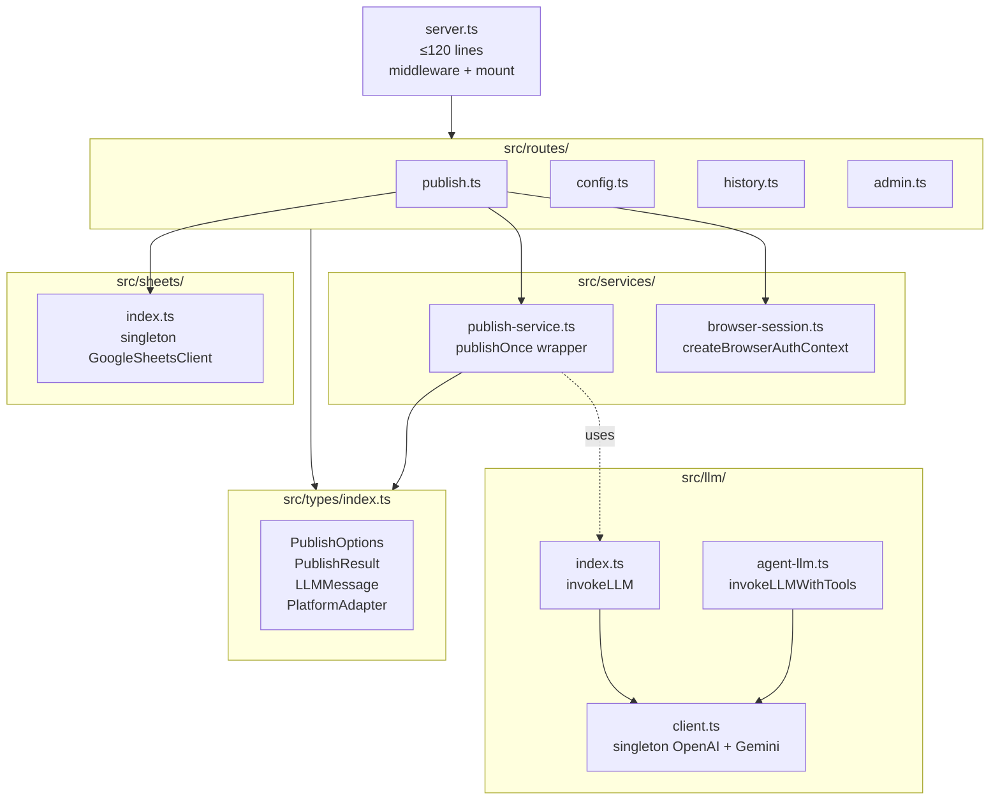
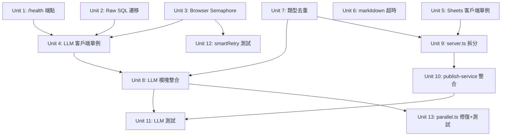

# refactor: 代碼品質全面優化 (P0-P3)

## Overview

修復多個 P0 穩定性錯誤（Docker healthcheck 永遠失敗、原始 SQL 繞過 repository 層、瀏覽器並發限制未實現），消除 P1 性能瓶頸（LLM 客戶端每次請求重建、Sheets auth 每次重建、`markitdown` 子進程無超時），重構 P2 代碼品質問題（893 行 server.ts 巨石、雙 LLM 實現、類型重複聲明、`publish-service.ts` 游離），補充 P3 關鍵測試覆蓋。**不新增功能，不改動 v0.2 計劃中的業務邏輯。**

## Problem Frame

項目在功能快速迭代後積累了系統性技術債：

1. **正確性缺口**：`/health` 路由不存在但 Docker healthcheck 依賴它；`runPublishingTask` 直接寫原始 SQL 而非用 `publishJobs.markSucceeded/markFailed`；`BROWSER_MAX_TABS = 3` 常量定義但從未在 `browserManager` 中執行。
2. **性能浪費**：每次 LLM 調用都 `new OpenAI()` / `new GoogleGenerativeAI()`，無法複用 HTTP keep-alive 連接池；`appendToSheet()` 每次重建 Google Auth；`markitdown` 子進程無超時上限，掛死時阻塞整個 scrape 路徑。
3. **可維護性**：`server.ts`（893 行）同時包含路由定義、業務邏輯、瀏覽器會話管理、環境變量寫入；存在兩套近乎重複的 LLM 實現；`PublishOptions`、`PublishResult`、`LLMMessage` 等接口在 3 處獨立聲明已出現結構分叉；`publish-service.ts` 從未被 `server.ts` 直接調用（僅 `src/agent/tools/publish-tool.ts` 使用），其實現路徑與 `server.ts` 的 `publishToPlatforms` 存在語義分叉未整合。
4. **測試空白**：LLM 模塊、adapters、`smartRetry` 斷路器、`parallel.ts` fan-out 均無測試，而 `parallel.ts` 的 fail-fast 語義已確認會讓整批 7 變體因單個 LLM 超時全部丟失。

## Requirements Trace

### 正確性（P0）
- R-P0a: 補充 `/health` 端點，Docker healthcheck 應返回 200
- R-P0b: `runPublishingTask` 所有 `publish_jobs` 狀態更新走 repository 層
- R-P0c: `browserManager` 實際執行最大並發 page 數限制

### 性能（P1）
- R-P1a: OpenAI 和 GoogleGenerativeAI 客戶端為模塊級單例
- R-P1b: `GoogleSheetsClient` 為全局單例，所有調用方共享同一 TokenBucket
- R-P1c: `markitdown` 子進程設超時（推薦 30s），超時後拋出可識別錯誤

### 代碼品質（P2）
- R-P1d: `src/types/index.ts` 為唯一類型聲明來源，各模塊改為 import-only（**從 P2 升級為 P1**，因 Unit 4 LLM 單例依賴此工作先完成）
- R-P2b: 雙 LLM 實現合併為統一接口，對外 API 保持向後兼容
- R-P2c: `server.ts` 拆分為路由模塊 + 服務模塊，主文件 ≤ 120 行
- R-P2d: `publish-service.ts` 的 `publishOnce` 封裝替換所有內嵌重試，整合進主發布路徑

### 測試覆蓋（P3）
- R-P3a: LLM 模塊有 mock-provider 單元測試
- R-P3b: `smartRetry` 斷路器有覆蓋所有狀態轉換的測試
- R-P3c: `parallel.ts` 修復 fail-fast 問題並加測試

## Scope Boundaries

- 不修改 v0.2 計劃的業務邏輯（scheduler、anchor-monitor、lint pipeline、persona 系統）
- 不新增業務功能端點（`/health` 監控端點作為 P0 基礎設施修復的一部分，例外允許）
- 不改動數據庫 schema
- `bulk-publish → Scheduler` 的接入屬於功能工作，不在本計劃內
- adapter 層的功能邏輯不動，只做類型引用遷移
- 不修改 `public/index.html` 前端代碼

## Context & Research

### Relevant Code and Patterns

- `src/server.ts:28-37` — `asyncRoute` / `syncRoute` 包裝器（已有良好模式，拆分時保留）
- `src/db/repositories.ts` — `publishJobs.markSucceeded()` / `publishJobs.markFailed()` 已存在，`server.ts` 中原始 SQL 應替換為這些方法
- `src/sheets/index.ts:232` — `createSheetsClient()` 工廠已正確封裝 auth + TokenBucket，問題在於未做單例緩存
- `src/utils/browserManager.ts` — 已有 `globalBrowser` 單例防止重複啟動，缺 semaphore 限制 page 數
- `src/constants.ts:32` — `CONCURRENCY_CONFIG.BROWSER_MAX_TABS = 3`，本次在 `browserManager` 中實際使用
- `src/llm/index.ts` — 供內容生成，含 `invokeLLM()`，有 JSON fallback 兜底
- `src/llm/agent-llm.ts` — 供 Agent，含 `invokeLLMWithTools()`，Gemini function calling 是空實現，JSON.parse 無保護
- `src/utils/parallel.ts:22` — fail-fast `throw e` 語義，必須改為 `Promise.allSettled` 語義

### Institutional Learnings

- **類型分叉風險**：`PlatformAdapter` 在 `src/types/index.ts` 多了 `config?: {...}` 字段，`src/adapters/base.ts` 版本沒有；TypeScript structural typing 會靜默通過，運行時出現字段缺失。去重必須做完整比對後以 `types/index.ts` 版本為準。
- **Sheets TokenBucket 計數陷阱**：多路由各自調用 `createSheetsClient()` 會產生多個獨立 bucket，限流失效，超出 60 req/min 上限。
- **publish-service 雙重重試乘算**：v0.1 publish-service 有自己的 retry 循環，隊列層也有 `attempts ≤ 2`，實際最多 4 次調用同一平台。整合時必須移除 publish-service 的內嵌重試。
- **parallel.ts 的 fan-out 失效**：`task` 函數內部直接 `throw` 導致一個 LLM 超時使整批 7 變體全部丟失。修復方式：task 函數內 catch 並返回 `{ ok: false, error }` 結構，調用方用 `Promise.allSettled` 或等效模式。

### External References

- Express 5 Router 模塊化：`express.Router()` 可在子文件中定義路由再 `app.use(prefix, router)` 掛載
- Node.js `child_process.exec` 的 `timeout` 選項：`execPromise(cmd, { timeout: 30_000 })` 超時後拋出 `ETIMEDOUT`

## Key Technical Decisions

- **LLM 單例策略：懶初始化模塊變量**：在 `src/llm/client.ts` 用 `let _openai: OpenAI | null = null` + getter 函數，首次調用時從 `process.env` 讀取 key 並實例化，之後複用。不用模塊頂層直接 `new OpenAI()`，因為測試和冷啟動時 env 可能未加載。

- **server.ts 拆分邊界**：路由文件按關注點分組（`publish`、`config`、`history`、`admin`），業務邏輯提取到 `src/services/`。`asyncRoute` / `syncRoute` 幫助函數搬到 `src/routes/_helpers.ts`。選擇「按關注點分路由文件」而非「按 HTTP method 分」，因為現有路由已有明確的業務分組（發布、配置、歷史、管理）。

- **LLM 模塊合併策略：保留兩個入口，共享底層客戶端**：`src/llm/index.ts` 的 `invokeLLM()` 和 `src/llm/agent-llm.ts` 的 `invokeLLMWithTools()` 各有不同用途（內容生成 vs. Function Calling），對外 API 不合並，但底層的 OpenAI/Gemini 客戶端實例抽取到 `src/llm/client.ts` 共享。這避免了對外 API 的破壞性變更，同時消除了重複的客戶端實例化。

- **parallel.ts 修復：task 函數內部 catch，不改 allSettled**：保持 `runParallel` 接口不變，在調用 `runParallel` 的地方（LLM 變體生成等）將 task 函數包為 `async () => { try { return await actualTask() } catch(e) { return { ok: false, error: e } } }`，這樣 runParallel 的調用方可以用類型收窄區分成功/失敗結果，向後兼容。

- **publish-service.ts 整合方向：保留文件，移除內嵌重試，讓 server.ts 使用它**：`publish-service.ts` 已有質量評分過濾、UTM 注入、`publishOnce` 封裝，這些有價值。移除其內部 retry 循環，暴露 `publishOnce(adapter, payload): Promise<PublishResult>` 作為主要出口，然後在 `server.ts` 的路由中調用此函數代替現有的內嵌 `publishToPlatforms`。

## Open Questions

### Resolved During Planning

- **`/health` 回應格式**：返回 `{ status: 'ok', uptime: process.uptime(), version: pkg.version }`，HTTP 200。Docker compose healthcheck 已存在 curl 命令，無需修改 docker-compose.yml。
- **`markitdown` 超時值**：30 秒。markitdown 處理 50MB HTML 通常 < 10s，30s 留足餘量但防止無限掛死。
- **browser semaphore 實現方式**：用簡單計數器 + async 等待（`while (activeTabs >= MAX_TABS) await sleep(100)`），不引入新依賴。符合 MVP 規模。
- **類型去重後 `src/adapters/base.ts` 保留策略**：`base.ts` 保留 `BaseAdapter` 抽象類，但 `PublishOptions`、`PublishResult`、`PlatformAdapter` 接口全部改為從 `src/types` re-export，不再本地聲明。

### Deferred to Implementation

- 是否需要在 server.ts 拆分後調整 vitest 的 coverage exclude 列表：取決於拆分後的文件命名，在實現時確認。
- `invokeLLMSimple()` 的 JSON.parse 兜底格式：修復時需確認 agent 調用方期望的返回類型，不可靜默改變行為。
- **`publish_jobs.payload_json` 填充**：當前存 `'{}'`，Scheduler 驅動的重試無法從 DB 恢復完整 payload（title/content/tags）。這是 v0.2 功能完整性問題，不在本計劃範圍內，但 Unit 2 的 repository 遷移不得讓問題更難修復（即保留 `payload_json` 字段，只是本計劃不填充它）。
- **SIGTERM graceful shutdown**：semaphore waiter 在進程退出時會掛起，`browser-session.ts` 的 `setInterval` 泄漏。實現 SIGTERM handler 是後續工作，本計劃僅要求不引入新的泄漏點。
- **`/api/auto-publish` 和 `bulk-publish` 的三路發布路徑對齊**：這三條路徑（`runPublishingTask`、server.ts 本地 `publishToPlatforms`、agent tools）功能不一致是已知問題，本計劃只修復 `runPublishingTask` 的 raw SQL（Unit 2）和 `publish-service.ts` 整合（Unit 10），其他兩條路徑的對齊是 v0.2 功能工作。

## High-Level Technical Design

> *此圖示意目標模塊邊界，為方向性指導，不是實現規範。*

**目標模塊依賴圖（拆分後）：**



**LLM 單例初始化流程：**

```
首次調用 getOpenAIClient()
  → _openai === null ?
      → new OpenAI({ apiKey: process.env.OPENAI_API_KEY })
      → _openai = instance
  → return _openai
後續調用 → return _openai（複用連接池）
```

## Implementation Units



---

- [x] **Unit 1: 補充 `/health` 端點**

**Goal:** 讓 Docker compose healthcheck 能成功返回，消除持續失敗狀態。

**Requirements:** R-P0a

**Dependencies:** 無

**Files:**
- Modify: `src/server.ts`
- Test: `tests/server.health.test.ts`（新建）

**Approach:**
- 在所有路由掛載之前（靜態文件之後）插入 `/health` GET 路由
- 回應 `{ status: 'ok', uptime: process.uptime(), version }` from `package.json`
- 不需要任何認證中間件（Docker healthcheck 是內部調用）

**Patterns to follow:**
- `src/server.ts:39-47` 的 `syncRoute` 包裝模式

**Test scenarios:**
- Happy path: GET /health 返回 HTTP 200，body 包含 `status: 'ok'`
- Happy path: `uptime` 字段為正數
- Happy path: `version` 字段與 package.json 一致

**Verification:**
- `curl -sf http://localhost:3000/health | jq .status` 輸出 `"ok"`
- Docker `docker compose ps` 顯示 health: healthy

---

- [x] **Unit 2: `runPublishingTask` 原始 SQL 遷移至 Repository**

**Goal:** 消除 `server.ts` 中直接操作 `publish_jobs` 表的原始 SQL，確保所有狀態更新通過 repository 層。

**Requirements:** R-P0b

**Dependencies:** 無（repository 方法已存在）

**Files:**
- Modify: `src/server.ts`（L690-L730 的 `runPublishingTask` 函數，以及 L669 的 `/api/batch-status` 路由）
- Modify: `src/db/repositories.ts`（新增 `markSucceededWithUrl(db, id, publishedUrl)` 方法）

**Approach:**
- **新增 repository 方法**：在 `repositories.ts` 新增 `markSucceededWithUrl(db, id, publishedUrl: string)` — 同時更新 `status = 'succeeded'`、`last_error = NULL`、`metadata_json = JSON.stringify({ publishedUrl })`。這確保現有 raw SQL 中的 `publishedUrl` 寫入不丟失（`/api/batch-status` 的 publishedUrl 字段依賴此數據）。
- `runPublishingTask` 中的成功路徑 `stmtSetSucceeded.run(metadata, id)` 替換為 `publishJobs.markSucceededWithUrl(db, id, result.publishedUrl)`
- `runPublishingTask` 中的失敗路徑 `stmtSetFailed.run(...)` 替換為 `publishJobs.markFailed(db, id, errorMsg, null, 2)`（`null` = 不調度重試，`2` = maxAttempts，與當前 terminal 行為等價）
- `/api/batch-status` 中的原始 `SELECT` 替換為 `publishJobs.byBatch(db, batchId)`（方法已存在於 `src/db/repositories.ts`，無需新增）
- import `publishJobs` from `src/db/repositories`

**Patterns to follow:**
- `src/db/repositories.ts` 中現有的 repository 方法簽名模式

**Test scenarios:**
- Happy path: 任務成功時調用 `markSucceededWithUrl`，`publish_jobs.status` 為 `'succeeded'`，`metadata_json` 中包含 `publishedUrl`
- Happy path: `/api/batch-status` 返回結果中 `publishedUrl` 字段非空
- Error path: 任務失敗時 `status` 為 `'failed_terminal'`，`last_error` 字段有值，行為與原 raw SQL 等價
- Integration: `publishJobs.byBatch(db, batchId)` 返回結果與直接讀 DB 一致

**Verification:**
- grep 確認 `server.ts` 中沒有 `db.prepare('.*publish_jobs.*')` 的直接 SQL（`markSucceededWithUrl` 的 SQL 在 repositories.ts，不在 server.ts）

---

- [x] **Unit 3: `browserManager` 實現並發 Page 上限 + Browser 啟動序列化**

**Goal:** 讓 `BROWSER_MAX_TABS = 3` 真正生效，防止 OOM；同時修復 browser launch 並發竟態（兩個請求同時發現 `globalBrowser` 未就緒時各自啟動 Chromium，第二個覆蓋第一個引用導致進程泄漏）。

**Requirements:** R-P0c

**Dependencies:** 無

**Files:**
- Modify: `src/utils/browserManager.ts`（新增 `acquirePage()` + 計數器 + browser 啟動序列化）
- Modify: `src/scraper/index.ts`（替換 `context.newPage()` 為 `acquirePage(context)`）
- Modify: `src/adapters/browser.ts`（替換 `context.newPage()` 為 `acquirePage(context)`）
- Modify: `src/server.ts`（browser-session 相關的 2 處 `context.newPage()` 替換）
- Test: `tests/utils/browserManager.test.ts`（新建）

**Approach:**
- **Page 並發上限**：在模塊頂層添加 `let activePages = 0` 計數器。從 `browserManager.ts` 導出 `acquirePage(context: BrowserContext): Promise<Page>` 統一封裝：進入前 `while (activePages >= CONCURRENCY_CONFIG.BROWSER_MAX_TABS) await sleep(100)`，`newPage()` 成功後 `activePages++`，page 關閉時 try/finally 確保 `activePages--`。所有 4 個 `context.newPage()` 調用點均改用此函數（scraper、browser adapter、server.ts x2）。
- **Browser 啟動序列化**：添加 `let _launchingPromise: Promise<Browser> | null = null`。當 `globalBrowser` 未就緒時，不直接 `chromium.launch()`，而是 `_launchingPromise ?? (_launchingPromise = chromium.launch().then(b => { globalBrowser = b; _launchingPromise = null; return b; }))`，並發請求等待同一個 Promise 而非各自啟動新進程。
- `sleep` 使用 inline 實現（`new Promise(r => setTimeout(r, 100))`），避免引入 `randomSleep` 的隨機性影響 tab 調度。

**Patterns to follow:**
- `src/constants.ts:32` 的 `CONCURRENCY_CONFIG.BROWSER_MAX_TABS`
- `src/utils/browserManager.ts` 現有的 `globalBrowser` 懶初始化模式

**Test scenarios:**
- Happy path: 3 個並發 page 請求在 MAX_TABS=3 時均成功創建
- Edge case: 第 4 個請求在前 3 個釋放前被阻塞，釋放後繼續
- Error path: page 創建拋出異常時，`activePages` 計數正確歸還（finally 塊執行）
- Concurrency: 兩個請求同時發現 browser 未就緒，只啟動一個 Chromium 進程，兩者都等待同一個 Promise

**Verification:**
- 並發 5 個 scrape 請求，監控進程打開的 browser context 數不超過 3
- 重啟後首次並發請求，確認系統進程中只有 1 個 Chromium 實例

---

- [x] **Unit 4: LLM 客戶端單例化 + Key 更新失效機制**

**Goal:** 將 OpenAI / GoogleGenerativeAI 客戶端提升為模塊級懶初始化單例，複用 HTTP 連接池；同時確保 `/api/settings` 更新 API key 後單例能正確失效重建，防止靜默失效。

**Requirements:** R-P1a

**Dependencies:** Unit 7（類型去重，確保 LLMMessage 等接口來源統一）

**Files:**
- Create: `src/llm/client.ts`
- Modify: `src/llm/index.ts`
- Modify: `src/llm/agent-llm.ts`
- Modify: `src/server.ts`（`updateEnv` 函數，保存 LLM key 後調用 reset）

**Approach:**
- `src/llm/client.ts` 導出兩個 getter 函數：`getOpenAIClient(): OpenAI` 和 `getGeminiClient(): GoogleGenerativeAI`
- 模塊頂層 `let _openai: OpenAI | null = null`，getter 首次調用時檢查 `process.env.OPENAI_API_KEY` 並實例化；**單例初始化代碼必須在 getter 函數體內，不能是模塊頂層的 `const _openai = new OpenAI()`，避免 dotenv 加載前求值**
- 同時導出 `resetLLMClients(): void`（將 `_openai` 和 `_gemini` 置 null），供 config 更新路徑調用
- `src/server.ts` 的 `updateEnv()` 函數：當被保存的 key 包含 `OPENAI_API_KEY`、`GEMINI_API_KEY`、`SELECTED_MODEL` 時，在 `process.env[key] = value` 之後調用 `resetLLMClients()`
- `src/llm/index.ts` 和 `src/llm/agent-llm.ts` 刪除各自的 `new OpenAI()` / `new GoogleGenerativeAI()`，改為調用 getter
- Gemini 的 `safetySettings` 配置在 client.ts 中統一設置（當前兩個文件各自重複配置）

**Patterns to follow:**
- `src/utils/browserManager.ts` 的 `globalBrowser` 懶初始化模式

**Test scenarios:**
- Happy path: 連續兩次調用 `getOpenAIClient()` 返回同一實例（`===` 比較）
- Edge case: `OPENAI_API_KEY` 未設置時 getter 拋出明確的配置錯誤（而非 SDK 的隱晦錯誤）
- Happy path: `getGeminiClient()` 同樣是單例
- Integration: `resetLLMClients()` 後再次調用 `getOpenAIClient()` 返回新實例（`!==` 舊實例）
- Integration: 模擬 `/api/settings` 更新 `OPENAI_API_KEY`，確認下一次 LLM 調用使用新 key

**Verification:**
- 在現有測試跑通的前提下，無 `new OpenAI(` 調用殘留在 `llm/index.ts` 和 `llm/agent-llm.ts`
- grep `server.ts` 確認 `updateEnv` 在保存 LLM 相關 key 時調用 `resetLLMClients`

---

- [x] **Unit 5: Google Sheets 客戶端單例 + v0.1 Shim 遷移**

**Goal:** `createSheetsClient()` 結果全局緩存，消除多路由獨立限流計數陷阱；`appendToSheet()` v0.1 shim 遷移至工廠模式。

**Requirements:** R-P1b

**Dependencies:** 無

**Files:**
- Modify: `src/sheets/index.ts`
- Modify: `src/server.ts`（替換 `appendToSheet` 調用）

**Approach:**
- 在 `src/sheets/index.ts` 模塊頂層添加 `let _sheetsClient: GoogleSheetsClient | null = null`
- 導出 `getSheetsClient(): GoogleSheetsClient` getter，首次調用時 `_sheetsClient = createSheetsClient()`
- v0.1 兼容函數 `appendToSheet()`（L252-L297）內部改為 `getSheetsClient().append(...)` 而非每次重建
- `server.ts` 中直接調用 `appendToSheet` 的地方保持不變（接口兼容），只需確認底層共享同一 client

**Patterns to follow:**
- `src/sheets/index.ts:232` 的 `createSheetsClient()` 工廠
- Unit 4 的懶初始化模式

**Test scenarios:**
- Happy path: 連續兩次調用 `getSheetsClient()` 返回同一實例（`===`）
- Happy path: `appendToSheet()` 內部使用 client 的 TokenBucket 進行限流（mock 驗證不創建新 bucket）
- Edge case: Google Auth 憑證缺失時 getter 拋出明確錯誤

**Verification:**
- grep 確認 `appendToSheet` 實現中沒有 `new google.auth.GoogleAuth(` 調用

---

- [x] **Unit 6: `markitdown` 子進程超時保護**

**Goal:** `markitdown` 外部 Python 進程掛死時不再阻塞整個 scrape 路徑，超時後拋出可識別錯誤。

**Requirements:** R-P1c

**Dependencies:** 無

**Files:**
- Modify: `src/scraper/index.ts`（L128 附近的 `execPromise` 調用，替換為 `execFile`）

**Approach:**
- **安全修復**：將 `execPromise(\`markitdown "${tempHtmlPath}"\`, ...)` 替換為 `execFileAsync('markitdown', [tempHtmlPath], { maxBuffer: ..., timeout: 30_000 })`，路徑作為獨立 argv 參數傳入，完全避免 shell metacharacter 注入風險。`execFileAsync` 可通過 `util.promisify(execFile)` 獲得。
- catch `error.killed === true` 的情況（Node.js `exec`/`execFile` timeout 觸發 SIGTERM，`error.killed` 為 `true`，`error.code` 為 `null`——**不是** `ETIMEDOUT`；`ETIMEDOUT` 僅出現在 DNS/socket API，不在 exec），拋出 `new Error('markitdown timeout after 30s')`
- 在 scraper 的調用方（`server.ts`）中，timeout 錯誤應記錄 warning 並返回空 markdown，而非使整個 publish 請求失敗（降級策略）

**Patterns to follow:**
- `src/llm/index.ts` 的 `fallback` 降級模式

**Test scenarios:**
- Happy path: markitdown 30s 內完成，正常返回 markdown
- Error path: 進程超過 30s 未返回，拋出帶 'timeout' 關鍵字的錯誤
- Error path: 降級後 scraper 返回空字串，scrape 路徑繼續而非崩潰

**Verification:**
- 用 `sleep 60` 替代 markitdown 執行，確認 30s 後請求返回降級結果而非掛死

---

- [x] **Unit 7: 統一類型定義（消除重複聲明）**

**Goal:** `src/types/index.ts` 成為唯一類型聲明來源，消除已確認的接口結構分叉風險。

**Requirements:** R-P1d（已升級為 P1）

**Dependencies:** 無（此 Unit 是 Units 4、8、9 的先決條件；升級為 P1 確保執行順序正確）

**Files:**
- Modify: `src/types/index.ts`（補充缺失字段，確保為完整來源）
- Modify: `src/adapters/base.ts`（移除本地 `PublishOptions`、`PublishResult`、`PlatformAdapter` 聲明，改為 import）
- Modify: `src/llm/agent-llm.ts`（移除本地 `LLMMessage`、`LLMResponse`、`LLMWithToolsOptions` 聲明，改為 import）
- Modify: `src/scraper/index.ts`（若本地 `ScrapedData` 與 `types/index.ts` 不同，以 types 版本為準）

**Approach:**
- 首先比對每對重複接口的字段差異（特別是 `PlatformAdapter.config` 字段）
- 以 `src/types/index.ts` 版本為 canonical，將缺失字段補充進去（帶 `?` 可選標記）
- 各模塊改為 `import type { PublishOptions, ... } from '../types'`，刪除本地聲明
- **注意**：`src/adapters/base.ts` 的 `PlatformAdapter` 聲明被 8 個 adapter 文件（browser.ts、github.ts、blogger.ts、hashnode.ts、telegraph.ts、medium.ts、devto.ts、wordpress.ts）及 `server.ts`、`adapters/index.ts` import，去重後須同步更新所有這些文件的 import 路徑
- 運行 `tsc --noEmit` 確認無新增類型錯誤

**Patterns to follow:**
- TypeScript 的 `import type` 語法（避免 runtime 副作用）

**Test scenarios:**
- Integration: 修改後 `tsc --noEmit` 零錯誤
- Integration: vitest 全套測試（136 個用例）通過

**Verification:**
- grep 確認 `PublishOptions`、`PublishResult`、`LLMMessage` 只在 `src/types/index.ts` 中有 `interface` / `type` 聲明

---

- [x] **Unit 8: LLM 模塊整合（共享客戶端 + 修復 agent-llm 缺陷）**

**Goal:** 兩套 LLM 實現共享 Unit 4 的單例客戶端；修復 `invokeLLMSimple` 的 `JSON.parse` 無保護問題；補充 Gemini function calling 的空實現告警。

**Requirements:** R-P2b

**Dependencies:** Unit 4（LLM client 單例，必須先完成——Unit 4 同時修改了 `llm/index.ts` 和 `llm/agent-llm.ts` 的客戶端初始化，Unit 8 在此基礎上修復剩餘缺陷）、Unit 7（類型統一）

**Files:**
- Modify: `src/llm/agent-llm.ts`
- Modify: `src/llm/index.ts`

**Approach:**
- `agent-llm.ts` 中所有 `new OpenAI()` / `new GoogleGenerativeAI()` 替換為 `getOpenAIClient()` / `getGeminiClient()`
- `invokeLLMSimple()` 的 `JSON.parse(response.content)` 包 try/catch，catch 後 `logger.warn` 並返回原始字符串（與 `llm/index.ts` 的 fallback 模式對齊）
- Gemini function calling 的空實現（L132 `// Simplified`）添加 `logger.warn('Gemini function calling not implemented, tool_calls will be empty')` 讓問題可見，不靜默失敗
- 兩個文件的 `safetySettings` 配置刪除（已移至 `client.ts`）

**Patterns to follow:**
- `src/llm/index.ts` 的 `try/catch + fallback` JSON 解析模式

**Test scenarios:**
- Error path: `invokeLLMSimple` 收到非 JSON 字符串時返回原始字符串，不拋出
- Happy path: `invokeLLMWithTools` 使用 mock `getOpenAIClient()` 可正常調用（單例注入可測試）
- Integration: `getOpenAIClient()` 調用兩次返回同一實例

**Verification:**
- grep 確認 `agent-llm.ts` 中沒有 `JSON.parse` 直接暴露（必須有 try/catch）

---

- [x] **Unit 9: `server.ts` 拆分**

**Goal:** `server.ts` 從 893 行縮減至 ≤ 120 行，路由邏輯遷移至各自的路由文件，業務邏輯遷移至服務模塊。

**Requirements:** R-P2c

**Dependencies:** Unit 5（Sheets 單例），Unit 7（類型統一）

**Files:**
- Create: `src/routes/_helpers.ts`（`asyncRoute` / `syncRoute` + `Req` / `Res` 類型別名）
- Create: `src/routes/publish.ts`（`/api/publish`、`/api/auto-publish`、`/api/batch-status` 等）
- Create: `src/routes/config.ts`（`/api/env`、`/api/config`、`/api/update-env` 等）
- Create: `src/routes/history.ts`（`/api/posts`、`/api/links`、`/api/anchor-stats` 等）
- Create: `src/routes/admin.ts`（`/api/brand-profile`、`/api/dispatch-gate`、`/api/lint` 等）
- Create: `src/services/browser-session.ts`（`createBrowserAuthContext` 函數）
- Modify: `src/server.ts`（僅保留 middleware setup + `app.use(prefix, router)` 掛載 + export app）

**Approach:**
- 以 `express.Router()` 創建各路由模塊，在 `server.ts` 用 `app.use('/api', publishRouter)` 等掛載
- `createBrowserAuthContext` 從 `server.ts` 提取到 `src/services/browser-session.ts`，因為它管理的是跨請求的瀏覽器會話狀態
- `publishToPlatforms` 和 `runPublishingTask` 留在 `src/routes/publish.ts` 中（作為路由層的私有幫助函數），除非它們在路由外被調用
- `updateEnv` / `getMaskedEnv` 提取到 `src/routes/config.ts` 的頂部（局部幫助函數）
- Unit 1 的 `/health` 路由在 `src/server.ts` 中直接掛載（不走 Router，因為它是基礎設施端點）

**Patterns to follow:**
- Node.js Express Router 模塊化模式

**Test scenarios:**
- Integration: 拆分後所有現有 API 端點仍可正常響應（smoke test 覆蓋主要路由）
- Integration: vitest 全套 136 個用例通過（確認無破壞性變更）
- Happy path: `server.ts` 行數 ≤ 120（`wc -l src/server.ts` 驗證）

**Verification:**
- `wc -l src/server.ts` ≤ 120
- 現有端點響應正常（啟動服務器後 curl 主要路由）

---

- [x] **Unit 10: `publish-service.ts` 整合**

**Goal:** 將 `publish-service.ts` 的有效邏輯（質量評分過濾、UTM 注入）整合進主發布路徑，移除內嵌重試避免雙重重試乘算（2×2=4 次）。

**Requirements:** R-P2d

**Dependencies:** Unit 9（server.ts 拆分，確定 `publishToPlatforms` 的新位置）

**Files:**
- Modify: `src/services/publish-service.ts`（移除內嵌 retry 循環，統一 API/Browser 分離邏輯 + quality-score 過濾）
- Modify: `src/routes/publish.ts`（調用 `publish-service.ts` 的 `publishToPlatforms` 替代內嵌邏輯）
- Modify: `src/agent/tools/publish-tool.ts`（確認調用接口向後兼容；內嵌 retry 刪除後 agent 路徑的重試由隊列層承擔）

**Approach:**
- **整合兩套發布邏輯**：`publish-service.ts` 的最終 `publishToPlatforms` 融合 server.ts 的 API/Browser 分離執行邏輯（`apiAdapters` 並發 + `browserAdapters` 串行）和 publish-service 的 quality-score 過濾（`qualityScore >= threshold` 過濾 Hashnode/Medium）、UTM 注入
- **刪除 retry 循環**：`publish-service.ts` 中的 `while (retries >= 0)` 完全刪除；重試編排由隊列層（`publish_jobs.attempts`）負責
- `src/routes/publish.ts` 中的內嵌 `publishToPlatforms` 改為調用整合後的 `publish-service.publishToPlatforms`，server.ts 版本的 `publishToPlatforms` 函數徹底刪除
- **確認 agent-tool 兼容性**：`src/agent/tools/publish-tool.ts` 目前調用 `publish-service.publishToPlatforms`，接口不變，retry 刪除後 agent 路徑的重試責任移至外層（agent 的 task 調用系統），在 Unit 10 的測試中驗證 agent 路徑調用後 retry 計數正確
- **整合前驗證**：記錄 server.ts 版本的 UTM 格式和 quality-score 閾值，整合後用相同輸入對比輸出確保功能等價

**Patterns to follow:**
- `src/services/brand-profile.ts` 的服務模塊模式

**Test scenarios:**
- Happy path: 質量評分達標的 post 調用 `publishOnce` 一次，不重試
- Error path: `publishOnce` 失敗時拋出錯誤（由隊列層決定是否重試），不在 service 層自行重試
- Integration: UTM 參數出現在最終發布的 URL 中

**Verification:**
- grep 確認 `publish-service.ts` 中沒有 retry loop（`for attempt` / `while (attempt <` 等模式）

---

- [x] **Unit 11: LLM 模塊測試**

**Goal:** `src/llm/index.ts` 和 `src/llm/agent-llm.ts` 有 mock-provider 單元測試，覆蓋主要路徑和錯誤處理。

**Requirements:** R-P3a

**Dependencies:** Unit 8（LLM 模塊整合完成，接口穩定）、Unit 13（**必須在 Unit 13 完成後才寫測試文件**——Unit 13 將 `runParallel` 返回類型從 `R[]` 改為 `{ok,value,error}[]`，若先於 Unit 13 寫 mock 則測試需重寫）

**Files:**
- Create: `tests/llm/invokeLLM.test.ts`
- Create: `tests/llm/invokeLLMWithTools.test.ts`

**Approach:**
- 用 `vi.mock('../../../src/llm/client')` mock `getOpenAIClient()` / `getGeminiClient()`，返回 mock 對象
- 測試 OpenAI → fallback Gemini 的切換邏輯（mock OpenAI 拋出，確認 Gemini 被調用）
- 測試 `invokeLLMSimple` 收到非 JSON 時的降級行為

**Patterns to follow:**
- `tests/services/brand-profile.test.ts` 的 vitest mock 模式

**Test scenarios:**
- Happy path: `invokeLLM` 調用 OpenAI mock，返回正確格式的內容
- Error path: OpenAI 失敗時 fallback 到 Gemini
- Error path: `invokeLLMSimple` 收到非 JSON 響應時返回原始字符串而非拋出
- Happy path: `invokeLLMWithTools` 返回 tool_calls 數組（mock 場景）
- Edge case: API key 未設置時拋出明確的配置錯誤（via `getOpenAIClient()` getter）

**Verification:**
- `vitest run tests/llm/` 全部通過

---

- [x] **Unit 12: `smartRetry` 斷路器測試**

**Goal:** `src/utils/smartRetry.ts` 的錯誤分類、重試策略、斷路器狀態轉換有完整測試覆蓋。

**Requirements:** R-P3b

**Dependencies:** Unit 3（browser semaphore，與 smartRetry 獨立但都在 utils）

**Files:**
- Modify: `src/utils/smartRetry.ts`（新增 export `_resetCircuitBreakers()` 用於測試 isolation）
- Create: `tests/utils/smartRetry.test.ts`

**Approach:**
- `smartRetry.ts` 中的 `circuitBreakers: Map` 當前未 export，測試無法 reset 它，跨測試用例會相互污染（一個測試觸發 OPEN 狀態，後續測試全部被拒）。在 `smartRetry.ts` 末尾新增 `export function _resetCircuitBreakers() { circuitBreakers.clear(); }`，僅供測試使用（前綴 `_` 表示內部）。
- 測試 `classifyError()` 對各類錯誤碼（429、401、404、5xx、ETIMEDOUT）的分類
- 測試重試延遲計算（指數退避、jitter）
- 測試斷路器狀態機：`CLOSED → OPEN → HALF_OPEN → CLOSED`（若實現了斷路器）

**Patterns to follow:**
- `tests/services/scheduler.test.ts` 的 vitest 模式

**Test scenarios:**
- Happy path: `classifyError({ status: 429 })` 返回 `ErrorType.RATE_LIMIT`
- Happy path: `classifyError({ code: 'ETIMEDOUT' })` 返回 `ErrorType.TIMEOUT`
- Edge case: 未知錯誤返回 `ErrorType.UNKNOWN`
- Happy path: 網絡錯誤觸發重試，認證錯誤不重試（`shouldRetry` 邏輯）
- Integration: 重試策略在 N 次後停止，不無限重試
- Isolation: 每個測試 `beforeEach` 調用 `_resetCircuitBreakers()`，確認斷路器狀態不跨用例

**Verification:**
- `vitest run tests/utils/smartRetry.test.ts` 全部通過
- coverage 覆蓋 `classifyError` 和 `shouldRetry` 的所有分支

---

- [x] **Unit 13: `parallel.ts` fail-fast 修復 + 測試**

**Goal:** 修復 `runParallel` 的 fail-fast 語義，讓單個 LLM 超時不再中斷整批 7 變體；添加測試確保修復穩定。

**Requirements:** R-P3c

**Dependencies:** Unit 8（LLM 模塊整合）

**Files:**
- Modify: `src/utils/parallel.ts`
- Create: `tests/utils/parallel.test.ts`

**Approach:**
- 確認當前 `runParallel` 的具體實現（worker 內部直接 `throw e`，在 `Promise.all(workers)` 時導致 fail-fast）
- **修復策略（SRP 原則）**：錯誤隔離責任留在 `runParallel` 函數本身，不要求 task 函數提前包裝錯誤。在 `runParallel` 內部，每個 worker 執行 `try { results[i] = await task() } catch (e) { results[i] = { ok: false, error: e } }`，成功時 `results[i] = { ok: true, value }`。返回類型從 `R[]` 更新為 `Array<{ ok: true; value: R } | { ok: false; error: Error }>`。這樣 task 函數可以自由 throw，`runParallel` 保證不 fail-fast。
- 當前 `runParallel` 沒有實際調用方（`LLM_FAN_OUT` 常量存在但 v0.2 LLM 變體生成尚未實現），返回類型變更不需要更新 caller。但 **Unit 11（LLM 測試）的測試文件必須在 Unit 13 之後寫**，避免基於舊 `T[]` 返回類型的 mock 在 Unit 13 後破掉。

**Patterns to follow:**
- `Promise.allSettled` 的 `PromiseSettledResult` 結果模式（標準庫參考，但本 Plan 自定義 `{ok, value, error}` 更具描述性）

**Technical design:** *(directional guidance)*
```
// Before (fail-fast)
async function worker(i) { results[i] = await tasks[i](); }
await Promise.all(workers);  // one throw kills all

// After (error-isolated)
async function worker(i) {
  try { results[i] = { ok: true, value: await tasks[i]() }; }
  catch (e) { results[i] = { ok: false, error: e }; }
}
await Promise.all(workers);  // all complete regardless
```

**Test scenarios:**
- Happy path: 3 個並發 task 均成功，返回 3 個 `{ ok: true }` 結果
- Error path: 1 個 task 拋出，其餘 2 個仍正常完成，返回 2 個 `{ ok: true }` + 1 個 `{ ok: false }`
- Edge case: 全部 task 失敗時返回 N 個 `{ ok: false }`，不拋出
- Edge case: concurrency=1 時串行執行，行為正確

**Verification:**
- `vitest run tests/utils/parallel.test.ts` 全部通過
- 7 個 mock task 中 1 個 reject，確認返回 7 個結果（6 ok + 1 failed），而非拋出

---

## System-Wide Impact

- **Interaction graph:** `server.ts` 拆分後，`app` 對象在各 Router 模塊中不可見——各模塊只操作 `Router` 實例，`app` 只在 `server.ts` 中存在。`src/index.ts` 只 import `app` 不感知拆分。
- **Error propagation:** LLM 客戶端單例化後，初始化失敗（API key 缺失）會在首次調用時拋出，而非應用啟動時。需確保路由層的 `asyncRoute` catch 能正確處理。
- **State lifecycle risks:** Sheets 單例在測試中可能持久化狀態到下個測試用例；各測試文件需在 `beforeEach` 中 reset mock 或清除單例。
- **API surface parity:** `/health` 端點的 schema（`uptime`, `version` 字段）需記錄在 README 或 API 文檔中，避免 Docker compose 以外的監控工具依賴後誤解。
- **Integration coverage:** `server.ts` 拆分後，現有 `vitest.config` 的 `coverage.exclude` 若包含 `server.ts` 需更新為排除新路由文件名，否則 coverage 報告會失真。
- **Unchanged invariants:** 所有現有的 API 端點路徑（`/api/publish`、`/api/auto-publish` 等）保持不變，僅內部模塊邊界改變。前端 `public/index.html` 的 fetch 路徑不需要修改。

## Risks & Dependencies

| Risk | Mitigation |
|------|------------|
| `server.ts` 拆分引入循環依賴（routes 引用 services，services 引用 db，db 引用 types） | 依賴方向：routes → services → db → types；禁止反向引用；拆分後立即 `tsc --noEmit` 驗證 |
| LLM 單例在 `/api/settings` 更新 key 後靜默失效（繼續用舊 key，不報錯） | Unit 4 的 `resetLLMClients()` 必須在 `updateEnv()` 的 key 寫入後立即調用；整合測試覆蓋此場景 |
| Browser launch 並發竟態（兩請求同時啟動 Chromium，第二個覆蓋引用導致進程泄漏） | Unit 3 加入 `_launchingPromise` 序列化機制；測試用並發請求驗證只有 1 個 Chromium 進程 |
| `parallel.ts` 返回類型從 `T[]` 改為 `{ok, value?, error?}[]`，影響現有 caller | grep 確認當前無 caller（`runParallel` 尚未被調用）；Unit 11 測試寫作必須在 Unit 13 之後 |
| LLM 單例在測試環境中跨測試文件持久化（污染隔離） | `tests/llm/` 測試文件用 `vi.mock` 替換整個 `client.ts` 模塊，不依賴真實單例 |
| `smartRetry.ts` 的 `circuitBreakers` Map 跨測試用例污染（斷路器狀態殘留） | Unit 12 在 `smartRetry.ts` 新增 `export _resetCircuitBreakers()`，每個測試 `beforeEach` 調用 |
| `createBrowserAuthContext` 提取到 service 後，`setInterval` 生命周期游離，進程退出時泄漏 | 提取時同步在 `browser-session.ts` 維護 `activeIntervals: NodeJS.Timeout[]`，供 SIGTERM handler 清理（記錄為已知 deferred 問題，不在本計劃實現，但不得新增泄漏） |
| `publish-service.ts` 整合後 UTM 注入邏輯改變現有發布 URL 格式 | 整合前記錄現有 UTM 參數格式；整合後用相同輸入對比輸出 URL，確保格式一致 |
| Sheets 單例在生產重啟後 token bucket 計數重置（符合預期，記錄在案） | 這是正確行為：重啟後 bucket 清空，但 Google API 的服務端限流仍然存在；文檔說明 |
| `publish_jobs.payload_json` 當前存的是 `'{}'`，Scheduler 驅動的重試無法恢復 payload | 本計劃 Unit 2 修復 raw SQL 但不填充 payload——這是 v0.2 功能工作，作為 Deferred 在 Open Questions 中記錄，本計劃不擴展範圍 |
| `/api/settings` 端點更新 `OPENAI_API_KEY` / `GEMINI_API_KEY` 無認證保護（API key 明文傳輸 + 寫入 .env 文件） | **已知安全風險**：當前工具為 Docker 內部網絡使用，暫未暴露公網。Unit 9 的 `config.ts` 路由拆分時需確認是否有全局 auth 中間件保護 `/api/*`；若無，需在 `/api/settings` 前加 Bearer token 驗證（pre-shared admin token）。Log 層需確保 key 值不出現在 stdout。後續安全審計優先級：P0。 |
| `markitdown` 子進程原本使用 shell 字符串插值（已修復為 execFile） | Unit 6 改用 `execFileAsync('markitdown', [path])` 消除此風險。 |

## Documentation / Operational Notes

- `/health` 端點上線後，可將 docker-compose.yml 的 healthcheck interval 從默認（30s）調整為更合理的 10s，並設置 `retries: 3`（當前 docker-compose.yml 配置需檢查）
- `server.ts` 拆分後更新 README 的「項目結構」章節，說明各路由文件的職責
- `parallel.ts` 返回類型變更需在 CHANGELOG 中記錄（雖然是 monorepo 內部，調用方需要知道）

## Sources & References

- Repo research: `src/server.ts`、`src/llm/`、`src/sheets/`、`src/utils/`、`src/db/`（2026-05-05 掃描）
- Existing plan: [docs/plans/2026-04-30-001-feat-third-party-voice-syndicator-plan.md](docs/plans/2026-04-30-001-feat-third-party-voice-syndicator-plan.md)（機構知識來源）
- `src/constants.ts` — `CONCURRENCY_CONFIG.BROWSER_MAX_TABS = 3`
- `src/db/repositories.ts` — `publishJobs.markSucceeded/markFailed`
- `src/sheets/index.ts:232` — `createSheetsClient()` 工廠
