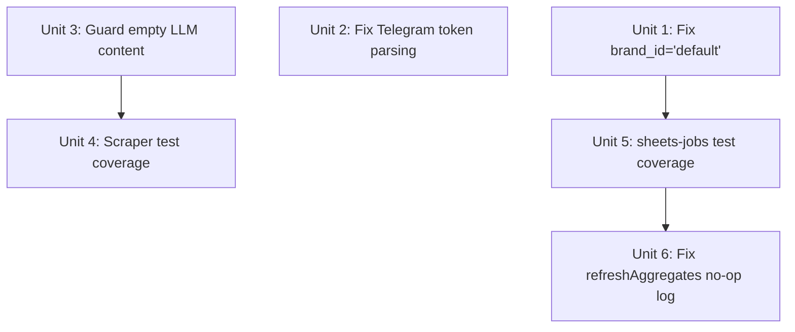

# fix: service stability hardening — confirmed P0-P2 bugs

## Overview

修复代码库中已确认的六类稳定性问题：一个 P0 静默数据失效 bug、一个 P1 Telegram 消息静默不发 bug、一个 P1 空内容发布风险、两个 0%-7% 覆盖率盲区（核心发布路径无测试保护）、以及一个 `refreshAggregates()` 永远静默 no-op 的误导性 stub。全部以最小改动原则处理，不涉及新功能或架构重构。

## Problem Frame

前一个重构计划（`2026-05-05-001`，status: completed）已修复 LLM 单例、server.ts 拆分、browser semaphore、markitdown 超时等结构性技术债。本计划处理剩余的**运行时 bug 和测试空白**：

1. 用户保存"偏好平台"配置后，设置永远不生效（SQL `WHERE brand_id='default'`，但数据库只有 `'main'` 行）。
2. Telegram 日报完全沉默：真实 bot token 格式 `botID:HASH:CHATID` 在 `split(':')` 后将 HASH 误认为 chatId，API 调用使用错误的 chat_id。
3. LLM 返回合法 JSON 但 `title`/`content` 为空串时，lint 正常通过，系统可能发布空内容文章。
4. `src/scraper/index.ts`（7% 覆盖率）和 `src/services/queue/sheets-jobs.ts`（0%）是核心路径中覆盖率最低的两个模块，任何改动都缺乏回归保护。
5. `refreshAggregates()` 是永久 no-op，每日定时任务执行后日志显示"成功"但 Sheet 聚合区从未更新，造成运营误判。

## Requirements Trace

- R1: `updatePreferredPlatforms()` 成功写入后，`getPreferredPlatforms()` 必须返回刚写入的值
- R2: Telegram 日报能成功发送到正确的 chat，不论 bot token 是否包含内嵌冒号
- R3: `generateMarkdown` / `generatePromoMarkdown` 在 LLM 返回空 title 或空 body 时拒绝结果并报错（不静默通过）
- R4: `src/scraper/index.ts` 有覆盖 happy path、markitdown timeout fallback、Playwright fallback 的单元测试
- R5: `src/services/queue/sheets-jobs.ts` 的 `handleAggregateSheets` 和 `handleReconciliation` 有端到端 mock 测试
- R6: `refreshAggregates()` 要么实现基础聚合逻辑，要么移除 no-op 并明确文档说明何时会实现（移除误导性"成功"日志）

## Scope Boundaries

- 不修改 v0.2 variant pipeline 业务逻辑
- 不变动数据库 schema（避免迁移风险）
- 不改动前端 HTML
- `updateLiveness()` 线性扫描（P2 性能问题，仅在帖子量极大时才显现）不在本计划内
- `errorHandler.ts` 与 `smartRetry.ts` 的 `classifyError` 重复（P2 技术债）不在本计划内
- 不修改 v0.1 `runPublishingTask` / `processBulkQueue` 路径的架构（已由前计划做了 repository 迁移，当前无功能性 bug）

## Context & Research

### Relevant Code and Patterns

- `src/services/brand-profile.ts:253` — `WHERE brand_id = 'default'`，其他所有函数（`upsertMain`、`getPreferredPlatforms`）均使用 `'main'`
- `src/services/queue/digest-job.ts:122-127` — `const [botPart, chatId] = token.split(':')` 仅取前两段，real token 格式 `botID:HASH:CHATID` 解析后 chatId 拿到 HASH
- `src/services/queue/__tests__/digest-job.test.ts:174` — 测试用 `'bot123:chatid'`（无 HASH 段）掩盖了 bug，测试通过但不覆盖生产格式
- `src/llm/index.ts:79-133` — `invokeLLM()` 直接 `return JSON.parse(resultString)` 无字段验证；`generateMarkdown`/`generatePromoMarkdown` 直接 return 结果
- `src/sheets/index.ts:193-197` — `refreshAggregates()` 函数体只有 `logger.info` + 无操作
- `src/services/queue/sheets-jobs.ts:29` — 定时任务调用 `sheets.refreshAggregates()`，返回"成功"日志

### Institutional Learnings

- 无 `docs/solutions/`，本计划是首批问题解决记录，建议后续补充

### External References

- Telegram Bot API token 格式：官方格式为 `<numeric_id>:<hash>`（含一个冒号），API 端点需要完整 token：`https://api.telegram.org/bot<full_token>/sendMessage`

## Key Technical Decisions

- **brand_id 修复：直接改 SQL 常量，不增加参数** — `updatePreferredPlatforms` 函数目前没有 brand_id 参数，整个系统是单品牌设计（F7 protection 注释明确说明），直接将字符串常量 `'default'` 改为 `'main'` 是最小风险修复。不引入参数化重构，避免影响调用方。

- **Telegram 修复：用 `lastIndexOf` 替代 `split(':')[1]`** — 对 `bot<ID>:<HASH>:<CHATID>` 格式，用 `token.lastIndexOf(':')` 分割最后一个冒号，后半部分是 chatId，前半部分去 `bot` 前缀后是完整 bot token（含 `ID:HASH`）。这样兼容旧的简化格式（`bot123:chatid`，无 HASH）和新的完整格式。不改变函数签名。

- **LLM 空内容守卫：在 `generateMarkdown` 层添加验证，不在 `invokeLLM` 层** — `invokeLLM` 是通用函数，被多处调用（包括非内容生成场景如 `analyzeDOMForSelectors`），不适合在此加内容非空校验。在 `generateMarkdown` 和 `generatePromoMarkdown` 两个函数的返回值处添加 guard，若 `title.trim()` 或 `content.trim()` 为空则 throw，让调用方（publish 路由）走现有的 try/catch 路径。

- **`refreshAggregates` 处理：替换 no-op 为 structured stub 并修正日志** — 完整实现需要决定 Sheet 聚合格式（超出本次范围），但 no-op + 误导性成功日志比"功能还没做"更危险。方案：保留 stub 结构，但将 `logger.info` 改为 `logger.warn`，加明确说明（"聚合未实现，操作已跳过"），使运营知晓这不是成功状态。在 Open Questions 中明确记录何时实现。

## Open Questions

### Resolved During Planning

- **`brand_id` 修复是否需要迁移旧数据**：不需要。`brand_profiles` 表中已有 `brand_id='main'` 的行（由 `upsertMain()` 写入），旧的 `'default'` 行如果存在也可以在迁移时清理，但 fix 本身只需要改 SQL 常量。`getPreferredPlatforms` 用 `LIMIT 1` 查询（不过滤 brand_id），所以如果有两行会取第一行，风险低。
- **Telegram 测试是否需要更新**：需要。`digest-job.test.ts:174` 的 `'bot123:chatid'` 测试需要升级为同时覆盖 `'bot123:HASH:chatid'` 格式，确保修复正确。
- **scraper 测试如何处理 Playwright 依赖**：使用 `vi.mock('../adapters/browser')` + mock `execFileAsync` 进行单元测试，不启动真实浏览器。Playwright 全流程属于 E2E 测试范畴，不在单元测试中覆盖。

### Deferred to Implementation

- **`refreshAggregates()` 完整实现**：需要确认 Sheet 的聚合格式、目标 tab 名称、数据字段映射。在数据量达到可验证规模（>50 条帖子）后实现。本计划只修复误导性日志。
- **`updateLiveness()` 线性扫描优化**：需要在 `publish_jobs` 加 `sheets_row_index` 列或使用 Sheets MATCH API。涉及 DB schema 变更，延至下期。

## Implementation Units

---

- [x] **Unit 1: 修复 `updatePreferredPlatforms()` 的 `brand_id='default'` 硬编码**

**Goal:** 让偏好平台设置能真正写入数据库，消除静默丢失 bug。

**Requirements:** R1

**Dependencies:** 无

**Files:**
- Modify: `src/services/brand-profile.ts`（第 253 行 `WHERE brand_id = 'default'`）
- Test: `tests/services/brand-profile.test.ts`（新增测试用例）

**Approach:**
- 将 `WHERE brand_id = 'default'` 改为 `WHERE brand_id = 'main'`
- **强制清理步骤**：在实现前检查生产数据库是否存在 `brand_id='default'` 行（`SELECT COUNT(*) FROM brand_profiles WHERE brand_id='default'`），若有，执行 `DELETE FROM brand_profiles WHERE brand_id='default'`，防止 `getPreferredPlatforms` 的 `LIMIT 1` 返回旧行
- 可选增强：将 `.run()` 返回值的 `changes` 字段与 1 做比较，若 `changes === 0` 说明无 `'main'` 行可更新，应返回 `{ ok: false, error: 'brand profile not initialized' }` 而非静默成功（当前行为是 `ok: true` 但 0 行被更新）——此项按实现者判断决定是否在此次一起修复
- 在现有测试文件中新增：先调用 `updatePreferredPlatforms`，再调用 `getPreferredPlatforms`，断言返回值一致

**Patterns to follow:**
- `src/services/brand-profile.ts` 中 `upsertMain()` 使用 `brand_id = 'main'` 的模式

**Test scenarios:**
- Happy path: `updatePreferredPlatforms(db, ['github', 'medium'])` 后 `getPreferredPlatforms(db)` 返回 `['github', 'medium']`
- Edge case: 重复调用 `updatePreferredPlatforms` 覆盖旧值，最终只保留最新值（`['twitter']` 覆盖 `['github', 'medium']`）
- Error path: 传入空数组 `[]` → 函数返回 `{ ok: false, error: '必须至少选择一个平台' }`（现有校验逻辑，不修改）
- Error path: 传入非数组参数 → 返回 `{ ok: false, error: ... }`

**Verification:**
- 修复后 grep 确认 `brand-profile.ts` 中没有 `brand_id = 'default'`
- `vitest run tests/services/brand-profile.test.ts` 全通过

---

- [x] **Unit 2: 修复 Telegram token 解析（`lastIndexOf` 替代 `split(':')[1]`）**

**Goal:** 让包含完整 bot token（`botID:HASH:CHATID` 格式）的 Telegram 日报能正确发出。

**Requirements:** R2

**Dependencies:** 无

**Files:**
- Modify: `src/services/queue/digest-job.ts`（`sendTelegramDigest` 函数，约 L122-127）
- Test: `src/services/queue/__tests__/digest-job.test.ts`（补充 full-token 格式测试）

**Approach:**
- 将 `const [botPart, chatId] = token.split(':')` 替换为 `lastIndexOf` 模式（方向性示意，非实现规范）：`lastColon = token.lastIndexOf(':')` → `chatId = token.slice(lastColon + 1)` → `botToken = token.slice(0, lastColon).replace(/^bot/, '')`
- **注意变量名遮蔽**：现有代码 L127 已有 `const botToken = ...` 声明，重写时需删除旧声明并用新的单一 `const botToken` 替换整个解析块，避免 TypeScript 报 duplicate declaration 错误
- 更新 guard：`!botToken || !chatId` 保持不变，`lastIndexOf` 在无冒号输入时返回 `-1`，使 `chatId = token`（非空）但 `botToken = ''`（空），guard 仍能正确拦截
- 更新 `digest-job.test.ts` 中的 Telegram 测试：新增 `'bot123456:HASH:chatid'` 格式的 case，验证 `botToken = '123456:HASH'`，`chatId = 'chatid'`

**Patterns to follow:**
- `src/services/queue/digest-job.ts` 现有的 warn + return 错误处理模式

**Test scenarios:**
- Happy path: `'bot123:chatid'`（旧简化格式）→ botToken=`'123'`，chatId=`'chatid'`，fetch 被调用一次
- Happy path: `'bot1234567890:AABBCCDDEEFF:123456789'`（完整格式）→ botToken=`'1234567890:AABBCCDDEEFF'`，chatId=`'123456789'`，fetch 被调用一次
- Error path: `'invalid'`（无冒号）→ warn 被调用，fetch 不被调用
- Error path: `''`（空字符串）→ warn，不发送

**Verification:**
- `vitest run src/services/queue/__tests__/digest-job.test.ts` 全通过
- grep 确认 `digest-job.ts` 中已不含 `token.split(':')` 的两值解构写法

---

- [x] **Unit 3: 在 `generateMarkdown`/`generatePromoMarkdown` 添加空内容守卫**

**Goal:** 防止 LLM 返回空 title 或空 content 时系统静默发布空文章。

**Requirements:** R3

**Dependencies:** 无

**Files:**
- Modify: `src/llm/index.ts`（`generateMarkdown` 和 `generatePromoMarkdown` 函数）
- Test: `src/llm/__tests__/invokeLLM.test.ts`（已有文件，新增测试）

**Approach:**
- 在 `generateMarkdown` 中，`invokeLLM()` 返回结果后，检查：若 `result.title?.trim()` 或 `result.content?.trim()` 为空，throw 一个描述性错误（如 `'LLM returned empty title or content'`），让调用方（publish 路由）走现有的 `asyncRoute` catch 路径
- `generatePromoMarkdown` 做相同检查
- **不修改 fallback 逻辑**：fallback 路径返回的 `fallbackTitle` / `fallbackContent` 均有值，不会触发此 guard
- 不修改 `invokeLLM` 本身（通用函数，其他调用方不需要此校验）

**Patterns to follow:**
- `src/llm/index.ts:94` 的 `throw new Error("No output from OpenAI LLM")` 模式

**Test scenarios:**
- Happy path: LLM 返回 `{ title: "T", content: "C", tags: [], excerpt: "" }` → 函数正常返回
- Error path: LLM 返回 `{ title: "", content: "some content" }` → `generateMarkdown` 抛出错误
- Error path: LLM 返回 `{ title: "T", content: "   " }` → 空白 content → 抛出错误
- Error path: LLM 返回 `{ title: null, content: "C" }` → null title → 抛出错误
- Happy path: fallback 路径（Gemini 失败 + 无 OpenAI key）返回的 fallbackContent 不触发 guard（因 fallback 内容有实质文本）

**Verification:**
- `vitest run tests/llm/` 全通过
- 手动构造返回空字段的 mock，确认 publish 路由日志中出现错误（不是空内容成功发布）

---

- [x] **Unit 4: `scraper/index.ts` 单元测试覆盖（7% → >65%）**

**Goal:** 为 scraper 核心路径建立测试安全网，覆盖 markitdown 超时降级和 Playwright 调用。

**Requirements:** R4

**Dependencies:** Unit 3（LLM guard 稳定后，scraper 测试更容易隔离）

**Files:**
- Create: `src/scraper/__tests__/scraper.test.ts`
- 参考: `src/scraper/index.ts`（当前约 200 行）

**Approach:**
- Mock `child_process.execFile`（或其 promisified 版本）控制 markitdown 的返回行为
- **同时 mock `getBrowser` 和 `acquirePage`**（两者都需要，`getBrowser()` 会尝试启动真实 Playwright，在 CI 环境会失败）：`vi.mock('../../utils/browserManager', () => ({ getBrowser: vi.fn(), acquirePage: vi.fn(), releasePage: vi.fn() }))` — mock 路径基于测试文件位置 `src/scraper/__tests__/`
- 不 mock `src/llm`（scraper 不调用 LLM，与 LLM 无关）
- 覆盖路径：正常 markitdown 成功、markitdown 超时（`error.killed=true`）降级返回空内容、markitdown 进程出错降级、Playwright fallback 被调用的场景

**Patterns to follow:**
- `src/services/queue/__tests__/publish-worker.test.ts` 的 vi.mock 外部依赖模式
- `tests/llm/invokeLLM.test.ts` 的 mock 替换模式

**Test scenarios:**
- Happy path: `scrapeUrl('http://example.com')` 调用 markitdown 成功 → 返回 `{ title, content, url }`
- Error path: markitdown `error.killed=true`（超时）→ scrapeUrl 不抛出，返回降级内容（空 content 或 scraped raw）
- Error path: markitdown 返回非零退出码 → 降级处理，不崩溃
- Integration: 当 markitdown 不可用时，Playwright fallback 路径被调用（mock acquirePage 验证）
- Edge case: URL 为空字符串 → 函数抛出或返回空结构，不 hang

**Verification:**
- `vitest run tests/scraper/` 通过
- `vitest run --coverage` 后 `scraper/index.ts` 覆盖率 ≥65%

---

- [x] **Unit 5: `sheets-jobs.ts` 单元测试覆盖（0% → >60%）**

**Goal:** 为定时 sheet 任务建立测试，防止 `handleAggregateSheets` 和 `handleReconciliation` 静默失败。

**Requirements:** R5

**Dependencies:** Unit 1（brand_id 修复后数据库状态更可预期，测试更稳定）

**Files:**
- Create: `src/services/queue/__tests__/sheets-jobs.test.ts`
- 参考: `src/services/queue/sheets-jobs.ts`（103 行）

**Approach:**
- Mock `src/sheets/index.ts` 的 `getSheetsClient()`（或 `GoogleSheetsClient`）
- Mock `src/db` 的 `db` 对象（使用内存 SQLite 或 vi.mock）
- 测试 `handleAggregateSheets`：验证它调用 `sheets.refreshAggregates()` 和/或 `sheets.appendOrUpdatePost()`；验证异常不 crash 进程（only log warn）
- 测试 `handleReconciliation`：验证它读取 DB 数据并调用 sheets 的 reconcile 方法

**Patterns to follow:**
- `src/services/queue/__tests__/publish-worker.test.ts` 的 mock DB + mock external 模式

**Test scenarios:**
- Happy path: `handleAggregateSheets` 成功运行，sheets mock 的 `refreshAggregates` 被调用一次
- Error path: sheets mock 抛出异常 → `handleAggregateSheets` 捕获并 warn，不 rethrow（进程不 crash）
- Happy path: `handleReconciliation` 在 DB 有数据时调用 sheets reconcile，传入正确参数
- Edge case: DB 为空（无帖子）时，`handleReconciliation` 不调用 sheets（或以空列表调用），不报错

**Verification:**
- `vitest run tests/services/queue/sheets-jobs.test.ts` 全通过
- `vitest run --coverage` 后 `sheets-jobs.ts` 覆盖率 ≥60%

---

- [x] **Unit 6: 修复 `refreshAggregates()` 的误导性 no-op 日志**

**Goal:** 消除运营每天看到"聚合成功"日志但 Sheet 从未更新的误判风险。

**Requirements:** R6

**Dependencies:** Unit 5（Unit 5 测试 mock 了 sheets client，Unit 6 改 `sheets/index.ts` 的日志级别不影响 mock 测试结果；但按顺序执行可确保 sheets-jobs 测试通过后再修改 sheets 实现，提供信心基线）

**Files:**
- Modify: `src/sheets/index.ts`（`refreshAggregates` 方法，L193-197）

**Approach:**
- 将 `logger.info('[Sheets] refreshAggregates: no-op pending data volume')` 改为 `logger.warn('[Sheets] refreshAggregates: not yet implemented — sheet aggregates will not be updated')`
- 在方法体顶部加注释：说明预期实现时机（>50 帖子量时，需要确认 aggregate tab 格式）
- **不实现聚合逻辑**（超出本次范围，在 Open Questions 中已标注）

**Patterns to follow:**
- `src/sheets/index.ts` 现有的 `logger.warn` 非致命错误模式

**Test scenarios:**
- Happy path: `refreshAggregates()` 调用后，`logger.warn` 被调用一次，内容包含 'not yet implemented'
- Happy path: 方法正常返回（不抛出），caller 的 await 能继续

**Verification:**
- Unit 5 的测试（mock logger.warn）在 Unit 6 改动后仍通过
- grep 确认 `refreshAggregates` 不再调用 `logger.info`

---

## System-Wide Impact

- **Interaction graph:** Unit 1 的修复影响所有使用品牌偏好平台的发布路径（`dispatchVariantJobs` 会调用 `getPreferredPlatforms`）；Unit 3 的 guard 会让之前静默通过的空内容请求变为显式错误，确认 `asyncRoute` 的错误处理会向用户返回 500 而非发布空内容。
- **Error propagation:** Unit 3 的 throw 会由 `src/routes/publish.ts` 的 `asyncRoute` wrapper 捕获，返回 HTTP 500 给前端，不影响已进入队列的其他任务。
- **State lifecycle risks:** Unit 1 修复后，若生产数据库中同时存在 `brand_id='default'` 和 `brand_id='main'` 的行（旧数据残留），`getPreferredPlatforms` 的 `LIMIT 1` 会取第一行，可能不是预期行。建议在实现时检查 DB 是否有旧 `'default'` 行，手动清理。
- **API surface parity:** Unit 2 的修复不改变 Telegram API 调用的外部行为（依然是 sendMessage），只是确保 bot token 和 chat_id 正确。
- **Integration coverage:** Unit 4 的 scraper 测试使用 mock，不覆盖真实 Playwright 渲染场景，保留 E2E 测试盲区作为已知风险。
- **Unchanged invariants:** v0.1 的 `runPublishingTask` 流程不受影响；`liveness-worker.ts` 的 `updateLiveness` 线性扫描保持原状（P2，已知 deferred）。

## Risks & Dependencies

| Risk | Mitigation |
|------|------------|
| 生产 DB 中可能有 `brand_id='default'` 的旧行与 `'main'` 行并存 | Unit 1 实现前检查 DB 是否有孤立 `'default'` 行；若有，先手动 DELETE 后再上线修复 |
| Telegram 修复改变了 `botToken` 的内容（从只有 numeric ID 变为完整 token），若用户实际存储的是旧格式（只有 numeric ID），修复后也能正确工作（`lastIndexOf` 在无额外冒号时行为与旧代码相同） | 向后兼容——已在 Test scenarios 的旧简化格式 case 中验证 |
| Unit 3 的空内容 guard 可能在 LLM fallback 路径被错误触发（fallback 内容包含模板文本，不应是空） | fallback content 有实质文本内容（HTML 注释 + 原文），不会触发 `trim()` 为空的判断；已在 Test scenarios 中覆盖 |
| Unit 4 scraper 测试中 mock `execFileAsync` 可能与 `markitdown` 超时修复（前计划 Unit 6）的实现细节耦合 | 查看 `src/scraper/index.ts` 中实际使用的 import 路径后再写 mock，不假设细节 |
| Unit 6 改 `logger.info` → `logger.warn` 后，Unit 5 的测试如果硬编码断言 `logger.info` 会 fail | Unit 6 依赖 Unit 5，实现顺序应为 Unit 5 先写测试（mock warn，不 assert info），再执行 Unit 6 |

## Documentation / Operational Notes

- Unit 1 上线后，运营人员保存偏好平台后应重新发布一批测试帖子，确认目标平台正确。
- Unit 2 上线后，需要确认 Telegram `digest_destination` 字段中存储的格式：若旧格式是 `bot<id>:<chatid>`（无 HASH），修复后行为不变；若新格式是 `bot<id>:<hash>:<chatid>`，则开始正常工作。
- Unit 6 上线后，运营看到 WARN 级别日志属正常现象（功能待实现），不代表系统故障。

## Sources & References

- 前置计划: [docs/plans/2026-05-05-001-refactor-code-quality-optimization-plan.md](docs/plans/2026-05-05-001-refactor-code-quality-optimization-plan.md)（status: completed，本计划接续其剩余问题）
- `src/services/brand-profile.ts:253` — 硬编码 `'default'`
- `src/services/queue/digest-job.ts:122-127` — token 解析 bug
- `src/llm/index.ts:79-133` — `invokeLLM` 无内容校验
- `src/sheets/index.ts:193-197` — `refreshAggregates` no-op
- `src/scraper/index.ts` — 7% 覆盖率
- `src/services/queue/sheets-jobs.ts` — 0% 覆盖率
- Telegram Bot API: token format `<numeric_id>:<hash>` (官方文档)
