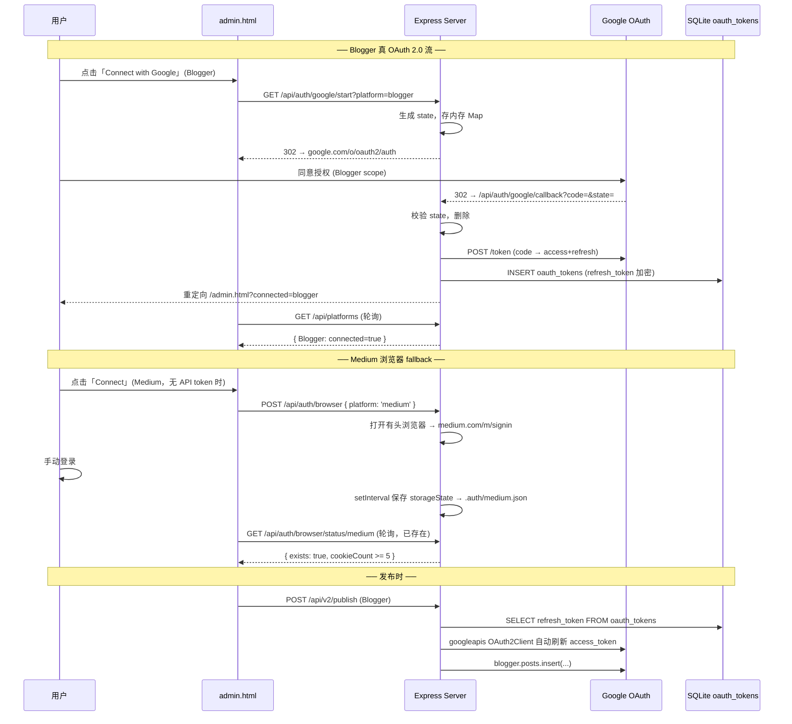
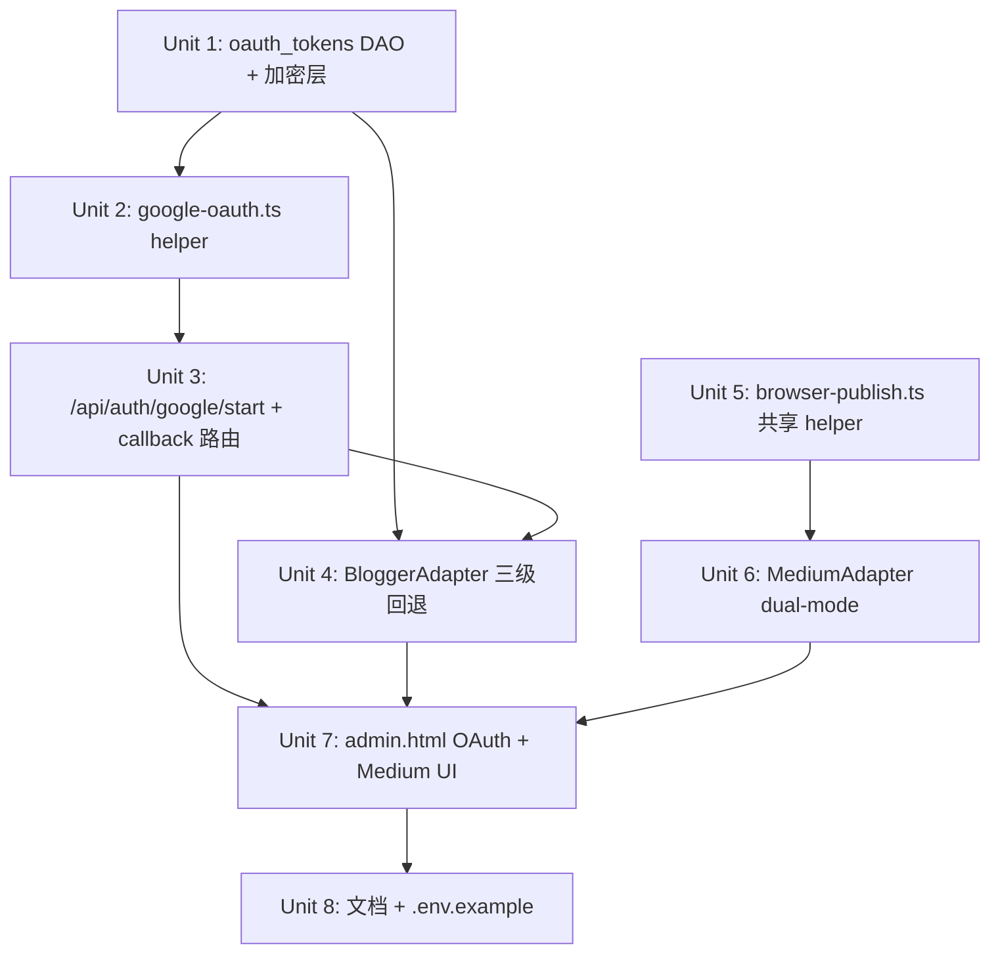

# Medium 浏览器回退 + Blogger Google OAuth 2.0 用户授权流

## Overview

把首要的两个分发平台从「需手动配置 token / service account」改造为「点击按钮 → 跳浏览器登录 → 自动获得授权」的统一 UX。

技术现实分两条路：

- **Medium**：官方 API 自 2023 起停止发新 integration token，现存 token 仍可用但**新用户无 OAuth 路径**。沿用 plan #002 已建好的浏览器 session 捕获基础设施，新增 Playwright DOM 发布能力作为 fallback。MediumAdapter 优先用 API token（兼容存量），否则走浏览器自动化。
- **Blogger**：Google OAuth 2.0 user-consent 流可正常使用。新增 `GET /api/auth/google/start` + `GET /api/auth/google/callback`，把 refresh_token 加密入库（`oauth_tokens` 表已在 schema.ts L232 定义但未接入路由）。BloggerAdapter 优先用 OAuth user token，回退 service account，再回退报错。

**目标**：用户在 admin.html 上点 Medium / Blogger 的「Connect」按钮 → 浏览器打开 → 完成登录 / 授权 → UI 自动显示「已连接」→ 后续发布走对应路径无需重新配置。

## Problem Frame

研究发现的现状：

| 层 | Medium | Blogger |
|---|---|---|
| 当前认证 | `MEDIUM_INTEGRATION_TOKEN`（API token） | `GOOGLE_APPLICATION_CREDENTIALS_JSON`（service account） |
| 新用户可获取 | ❌ Medium 已停发 token | ⚠️ Service account 不能访问个人博客（只能访问被显式 share 的） |
| 发布可靠性 | ✅ API 稳定（存量 token 用户） | ✅ API 稳定（service account 已 share 的博客） |
| 浏览器 session 文件 | `loginUrlMap` 已含 medium（admin.ts L159），文件可生成 | 已含 blogger 映射到 google.com（L162），但仅捕获 cookies，无法直接调 Blogger API |
| `oauth_tokens` 表 | — | ✅ schema.ts L232 已定义（platform/access_token/refresh_token/expires_at），但**路由和读写代码都没有** |
| admin.html UI | 仅 API key 表单，未连通 1-Click Connect | 仅 API key 表单（service account JSON 大字段），未连通任何 OAuth |

第二段尤其关键：`oauth_tokens` 表的存在说明**前作者已规划过这条路但没实现**。schema 注释明确写了 "Takes precedence over service-account JSON for adapters that support it (e.g. Blogger)"。本计划完成这个未竟之业。

## Requirements Trace

- **R1** — 用户在 admin.html 点击 Blogger「Connect with Google」→ 跳到 Google 同意页 → 同意后自动回到管理后台并显示「已连接」（无需手动复制粘贴任何东西）
- **R2** — 用户在 admin.html 点击 Medium「Connect」→ 走现有 1-Click Connect 浏览器登录 → 完成后能用 Playwright DOM 发布（无 API token 时）
- **R3** — 存量用户不破坏：已配 `MEDIUM_INTEGRATION_TOKEN` 的 Medium 仍走 API；已配 `GOOGLE_APPLICATION_CREDENTIALS_JSON` 的 Blogger 仍走 service account
- **R4** — Blogger refresh_token 在 SQLite 中加密存储（沿用 `encryption.ts` 的 AES-256-GCM）
- **R5** — Blogger access_token 过期时自动刷新（用 `google.auth.OAuth2` 内置机制）
- **R6** — OAuth 流抗 CSRF：`state` 参数随机生成 + 校验；`redirect_uri` 严格匹配
- **R7** — 文档：README + `.env.example` 写明 Google Cloud Console 配置步骤（创建 OAuth Client ID、scope、redirect URI），让用户能 5 分钟完成首次设置

## Scope Boundaries

**In scope:**
- Blogger 的 Google OAuth 2.0 authorization_code 流（含 refresh_token、自动刷新）
- `oauth_tokens` 表的读写代码 + refresh_token 加密层
- BloggerAdapter 三级回退：`oauth_tokens` → service account → 错误
- MediumAdapter 浏览器 fallback 发布路径（沿用 BrowserAutomationAdapter 模式）
- admin.html UI：Blogger「Connect with Google」按钮 + Medium「Connect」按钮（接 1-Click Connect）
- README + `.env.example` Google Cloud Console 配置说明

**Out of scope:**
- Medium 的 OAuth（Medium 不发新凭证，技术上不可行）
- Sheets / Gmail / Drive 等其他 Google 服务的 OAuth 改造（现有 service account 已能正常工作）
- 服务端 token 加密密钥轮换机制（现有 `ENCRYPTION_KEY` 单密钥已够 MVP）
- 多账号支持（每平台单 token，与 schema 现状一致）
- Blogger Blog ID 的自动发现（首版仍由用户手填或 OAuth 后从 `blogger.blogs.listByUser` 自动列出 — 留给 deferred）

## Context & Research

### Relevant Code and Patterns

- `src/db/schema.ts` L228–239 — `oauth_tokens` 表定义（platform PK / access_token / refresh_token NOT NULL / expires_at / updated_at）。注释明确说明该表为 Blogger 等适配器的 OAuth 用户凭证存储，**优先于 service account**
- `src/utils/encryption.ts` — AES-256-GCM 透明加解密，已在 `api_keys_encrypted` 字段上使用，refresh_token 直接套用
- `src/routes/admin.ts` L148–217 — `POST /api/auth/browser` 浏览器登录路由，已支持 medium。新 OAuth 路由的错误处理 / response shape 应保持一致
- `src/routes/admin.ts` L267–290 — `GET /api/auth/browser/status/:platform` 轮询模式，前端轮询 OAuth 完成状态时同样的客户端模式（cookieCount → tokenExists）
- `src/routes/_helpers.ts` — `syncRoute` / `asyncRoute` wrapper，新路由统一用
- `src/adapters/blogger.ts` — 当前用 `GoogleAuth` + service account；OAuth 改造后改为 `OAuth2Client` 实例，refresh_token 让 `googleapis` 库自动刷新
- `src/adapters/browser.ts` — `BrowserAutomationAdapter` 已有 `customAutomation` 钩子；Medium 浏览器 fallback 直接复用此模式（参考 Substack adapter 的 ProseMirror 处理 — adapters/index.ts L91–124）
- `public/admin.html` L490 `openApiKeyForm()` + L503 `1-Click Connect` 段 — UI 渲染分两类按钮的现有模式，OAuth 按钮新增第三类
- `src/services/queue/digest-job.ts` L186 — 现有 `google.auth.OAuth2` 使用范例（虽然是 service account 用法，但 import 路径和类型已熟）

### Institutional Learnings

- 加密字段同步于 `brand_profiles.api_keys_encrypted`（schema.ts L209）— Blogger refresh_token 是否复用此字段还是单独走 `oauth_tokens` 表？**走 `oauth_tokens` 表**：schema 已建好，每平台一行更清晰，且语义不同（refresh_token 是长期凭证，与短期 API key 应分开）
- `googleapis` v131+ 的 `OAuth2Client` 在调用 `.setCredentials({ refresh_token })` 后，访问 token 过期时会自动用 refresh_token 换新（无需手写刷新代码）
- 浏览器自动化登录已确认在 `chrome-isolated` / `chromium` 模式下稳定（plan #002 验证），Google 登录页 reCAPTCHA 偶发触发 — Blogger OAuth 走标准 web flow 不受此影响

### External References

- [Blogger API v3 — Using OAuth 2.0](https://developers.google.com/blogger/docs/3.0/using#auth) — 标准 authorization_code flow，scope 用 `https://www.googleapis.com/auth/blogger`
- [google-api-nodejs-client OAuth2 sample](https://github.com/googleapis/google-api-nodejs-client#oauth2-client) — `generateAuthUrl({ access_type: 'offline', prompt: 'consent' })` 是确保 refresh_token 返回的关键参数
- [Medium API archived notice](https://github.com/Medium/medium-api-docs) — 官方仓库 archived 标记 "no longer supported"，新 token 不再发放（验证选 browser fallback 路径的合理性）

## Key Technical Decisions

1. **Blogger OAuth：authorization_code + offline access**
   - 用 `google.auth.OAuth2` 的标准 server-side flow（confidential client，含 client_secret）
   - `generateAuthUrl({ access_type: 'offline', prompt: 'consent', scope: ['https://www.googleapis.com/auth/blogger'], state })`
   - `prompt: 'consent'` 是关键：不加这个，第二次同意时 Google **不会重发 refresh_token**，会导致刷新失败
   - **理由**：standard flow，无需 PKCE（client_secret 已在服务端），文档最完整，googleapis 库原生支持

2. **CSRF 防护：state 参数 + 短期内存存储**
   - `state = crypto.randomBytes(32).toString('hex')`，存入内存 Map（`Map<state, { platform, expiresAt }>`，5 分钟过期）
   - callback 校验 state 存在且未过期，校验后立即删除（一次性）
   - **理由**：服务端单实例部署（看 server.ts 是单进程 Express），内存 Map 够用；不引入 Redis 增加部署复杂度
   - **拒绝方案**：放数据库会污染 schema；signed JWT state 需要额外签名密钥管理

3. **三级回退优先级（BloggerAdapter）**
   - 优先级：`oauth_tokens` 表 → `GOOGLE_APPLICATION_CREDENTIALS_JSON` → 报错
   - **理由**：与 schema.ts L229 的注释一致；user OAuth 是更普遍的用例，service account 留给企业 / 已配置环境

4. **refresh_token 加密**
   - 写入 `oauth_tokens.refresh_token` 前用 `encryptApiKey()`，读取时 `decryptApiKey()`
   - access_token 不加密（短期凭证，过期前由 refresh_token 自动换新，落库主要是日志价值）
   - **理由**：refresh_token 是「永久」密钥，即使 DB 被偷也不能直接用；access_token 1h 过期，加密成本大于收益

5. **Medium 浏览器 fallback：把 MediumAdapter 改为 dual-mode**
   - 不删 `MediumAdapter.publish()` 的 API 路径，加一个分支：`if (!token && hasSavedBrowserSession('medium')) → callBrowserPublish()`
   - 浏览器发布逻辑：复用 `BrowserAutomationAdapter` 的 `customAutomation` 模式，但写在 MediumAdapter 内部以保留 `name='Medium'` 单实例语义
   - 抽出 `executeBrowserPublish(name, customAutomation, options)` 共享 helper，放在 `src/services/browser-publish.ts`，让 MediumAdapter 和 BrowserAutomationAdapter 都用
   - Medium 的 customAutomation：导航 `https://medium.com/new-story` → 标题（`h3[data-testid="editorTitleParagraph"]`，fallback DOM AI 分析）→ 正文（`.notranslate.graf--p` 或 contenteditable）→ 「Publish」按钮 → 「Publish now」确认
   - **理由**：保留 `MediumAdapter` 名字让 `API_CONNECTED['Medium']`、UI 卡片、`allAdapters` 顺序、测试套件最小变动；存量 token 用户零迁移

6. **redirect_uri 配置**
   - 默认 `http://localhost:{PORT}/api/auth/google/callback`，从 `process.env.OAUTH_REDIRECT_URI` 覆盖（部署到生产域名时改）
   - 启动时校验：`OAUTH_REDIRECT_URI` 与 `GOOGLE_OAUTH_CLIENT_ID` 必须同时配齐，否则 OAuth 按钮在 UI 上灰化并提示
   - **理由**：Google Cloud Console 要求 redirect URI 完全一致，配置漂移最常见的接入问题，明确报错比沉默失败强

## High-Level Technical Design

> *本图为方向性设计，供审阅验证，实现时以代码为准。*



## Implementation Units



---

- [ ] **Unit 1: oauth_tokens DAO + refresh_token 透明加密**

**Goal:** 提供干净的读写函数 `getOAuthTokens(platform)` / `saveOAuthTokens(platform, tokens)`，refresh_token 在写入 DB 时加密、读取时解密，调用方拿到的永远是明文。

**Requirements:** R4

**Dependencies:** 无（schema 已存在）

**Files:**
- Create: `src/db/oauth-tokens.ts`
- Test: `src/db/__tests__/oauth-tokens.test.ts`

**Approach:**
- 导出 `getOAuthTokens(platform: string): { refresh_token, access_token?, expires_at? } | null`
- 导出 `saveOAuthTokens(platform, { refresh_token, access_token?, expires_at? })`：upsert（`INSERT OR REPLACE`），refresh_token 必填非空
- 写入前 `encryptApiKey(refresh_token)`，读取后 `decryptApiKey(stored)`
- access_token 直接存明文（短期 + 自动刷新）
- 导出 `deleteOAuthTokens(platform)` 用于断开连接

**Patterns to follow:**
- `src/utils/encryption.ts` 现有 AES-GCM 透明加解密（已在 api_keys_encrypted 字段使用）
- `src/db/index.ts` better-sqlite3 prepared statement 模式

**Test scenarios:**
- Happy path: `saveOAuthTokens('blogger', { refresh_token: 'r1' })` → `getOAuthTokens('blogger')` 返回 `{ refresh_token: 'r1' }`
- Happy path: 同 platform 第二次 save 覆盖旧值（upsert 行为）
- Happy path: 加密落库后，直接 SQL 读 `refresh_token` 字段，值不等于明文（验证加密真在生效）
- Edge case: `refresh_token` 为空字符串 → 拒绝写入（throw 或返回 false）
- Edge case: `getOAuthTokens('not-exist')` → null（不抛错）
- Error path: 加密失败（构造异常环境，例如 mock encryptApiKey 抛错）→ 错误向上传递，不写脏数据

**Verification:**
- 测试套件全绿
- 手动 `sqlite3 db.sqlite "SELECT refresh_token FROM oauth_tokens"` 看到密文（hex 长串），不是明文

---

- [ ] **Unit 2: Google OAuth helper 模块**

**Goal:** 集中 OAuth 客户端构造、auth URL 生成、code 交换、token 刷新逻辑。让路由和适配器都引用同一个 helper，避免多处实例化 OAuth2Client 配置不一致。

**Requirements:** R1, R5, R6

**Dependencies:** Unit 1（saveOAuthTokens / getOAuthTokens）

**Files:**
- Create: `src/services/google-oauth.ts`
- Test: `src/services/__tests__/google-oauth.test.ts`

**Approach:**
- 导出 `createOAuthClient(): OAuth2Client` — 用 `process.env.GOOGLE_OAUTH_CLIENT_ID`、`GOOGLE_OAUTH_CLIENT_SECRET`、`OAUTH_REDIRECT_URI` 构造单例
- 导出 `generateAuthUrl(state: string, scopes: string[]): string` — 包含 `access_type: 'offline'`, `prompt: 'consent'`, `state`
- 导出 `exchangeCodeForTokens(code): Promise<{ refresh_token, access_token, expires_in }>` — 调 `client.getToken(code)`
- 导出 `getAuthorizedClient(platform): Promise<OAuth2Client>` — 从 oauth-tokens DAO 读 refresh_token，`setCredentials({ refresh_token })`，让 googleapis 内部自动刷新；BloggerAdapter 调这个拿现成 client
- 导出 `isOAuthConfigured(): boolean` — UI 灰化判断
- 导出常量 `BLOGGER_OAUTH_SCOPES = ['https://www.googleapis.com/auth/blogger']`
- 启动时不强制要求 OAuth env，缺失时 `isOAuthConfigured` 返回 false 即可

**Patterns to follow:**
- `src/services/queue/digest-job.ts` L186 现有 `google.auth.JWT` 用法（参考 import 风格）
- 单例 lazy init 模式（避免每次都重新构造）

**Test scenarios:**
- Happy path: 完整 env 下 `createOAuthClient()` 返回 OAuth2Client 实例，`generateAuthUrl(state, scopes)` 包含正确的 `client_id`, `redirect_uri`, `scope`, `state`, `access_type=offline`, `prompt=consent`
- Happy path: `exchangeCodeForTokens` mock googleapis → 返回 token 对象格式正确
- Happy path: `getAuthorizedClient('blogger')` 读取存好的 refresh_token，调用 `client.credentials.refresh_token` 等于解密后的值
- Edge case: `isOAuthConfigured()` 在缺 client_id / client_secret / redirect_uri 任一时返回 false
- Edge case: `getAuthorizedClient('blogger')` 在 oauth_tokens 表无记录时抛 `Error('No OAuth tokens for blogger')`
- Error path: 错误的 `code` → `exchangeCodeForTokens` 抛错并向上传递

**Verification:**
- 单元测试全绿
- 手动 `node -e "console.log(require('./src/services/google-oauth').generateAuthUrl('abc', ['...']))"` 输出可在浏览器打开的 Google 同意页

---

- [ ] **Unit 3: OAuth 路由 — start + callback**

**Goal:** 用户在 UI 点 Connect → 后端生成 state → 302 到 Google → 同意后回调 → 写库 → 重定向回 admin.html。

**Requirements:** R1, R6

**Dependencies:** Unit 1, Unit 2

**Files:**
- Modify: `src/routes/auth.ts`（已有 import-sessions 路由，OAuth 加在这里语义集中）
- Test: `src/routes/__tests__/google-oauth.test.ts`

**Approach:**
- `GET /api/auth/google/start?platform=blogger`:
  - 校验 `isOAuthConfigured()`，否则 503 + 「请配置 GOOGLE_OAUTH_CLIENT_ID 等环境变量」
  - 校验 `platform` 在白名单（首版只 `blogger`），否则 400
  - `state = crypto.randomBytes(32).toString('hex')`
  - 存内存 Map: `pendingStates.set(state, { platform, expiresAt: Date.now() + 5 * 60 * 1000 })`
  - 启动定时清理（或 lazy 清理：在每次 set/get 时顺手扫一遍）
  - `res.redirect(generateAuthUrl(state, BLOGGER_OAUTH_SCOPES))`
- `GET /api/auth/google/callback?code=&state=&error=`:
  - 处理 `error` 参数（用户拒绝授权）→ 重定向 `/admin.html?oauth_error=denied`
  - 校验 state 存在 + 未过期 → 取出 platform → **立即删除 state**（一次性）
  - state 不匹配 → 400 + 「Invalid state — possible CSRF」
  - `exchangeCodeForTokens(code)` → 拿 refresh_token
  - **重要**：如果 Google 没返回 refresh_token（用户已之前授权过 + 没加 prompt=consent 的旧 grant 还在），降级处理：返回错误页让用户去 [https://myaccount.google.com/permissions](https://myaccount.google.com/permissions) 撤销后重连
  - `saveOAuthTokens(platform, { refresh_token, access_token, expires_at })`
  - `res.redirect('/admin.html?connected=blogger')`
- 状态查询端点：复用 `GET /api/platforms`（Unit 4 让其反映 OAuth 状态），不新建专用状态端点

**Patterns to follow:**
- `src/routes/admin.ts` `asyncRoute` wrapper（错误自动向上）
- `src/routes/auth.ts` 现有 import-sessions 路由的 logger 用法

**Test scenarios:**
- Happy path: `/api/auth/google/start?platform=blogger` 返回 302，Location header 含 `accounts.google.com/o/oauth2`，含正确的 `state`
- Happy path: `/api/auth/google/callback?code=valid&state=<existing>` → 调用 `exchangeCodeForTokens`，调用 `saveOAuthTokens`，302 到 `/admin.html?connected=blogger`
- Edge case: `OAUTH_REDIRECT_URI` 等 env 未配 → `/start` 返回 503
- Edge case: `platform=unknown` → `/start` 返回 400
- Edge case: callback 收到 `error=access_denied` → 302 到 `/admin.html?oauth_error=denied`
- Error path: callback `state` 不存在 → 400「Invalid state」
- Error path: callback `state` 过期（>5min）→ 400「State expired」
- Error path: 同一 state 用两次 → 第二次 400（一次性已删）
- Error path: Google 不返回 refresh_token → 错误页提示用户撤销旧授权

**Verification:**
- 在本地配好真实 Google Cloud OAuth client，手工跑一遍：点 UI → 跳 Google → 同意 → 回到 admin.html，DB 里能看到加密的 refresh_token
- 改本地时间 +6min 测试 state 过期

---

- [ ] **Unit 4: BloggerAdapter — OAuth tokens 优先 → service account 回退**

**Goal:** Blogger 发布和 testConnection 都按「user OAuth → service account → 报错」三级回退。

**Requirements:** R1, R3, R5

**Dependencies:** Unit 1, Unit 2

**Files:**
- Modify: `src/adapters/blogger.ts`
- Test: `src/adapters/__tests__/blogger.test.ts`（新建或扩展）

**Approach:**
- 抽出 `private async getAuthClient(): Promise<OAuth2Client | GoogleAuth>`:
  - 先 `getOAuthTokens('blogger')`，存在则 `getAuthorizedClient('blogger')` 返回带 refresh_token 的 OAuth2Client
  - 否则 `process.env.GOOGLE_APPLICATION_CREDENTIALS_JSON` 存在则返回原 GoogleAuth
  - 都没有抛 `Error('Blogger 未配置：请点击 Connect with Google 授权，或设置 GOOGLE_APPLICATION_CREDENTIALS_JSON')`
- `publish()` 和 `testConnection()` 都调 `getAuthClient()`，不再各自构造 auth
- BlogId 仍从 `process.env.BLOGGER_BLOG_ID` 读（暂不改）— deferred 项见 Open Questions
- 错误信息明确区分两种回退路径，便于调试

**Patterns to follow:**
- 现有 `blogger.ts` 的 `google.blogger({ version: 'v3', auth })` 模式不变（只换 auth）

**Test scenarios:**
- Happy path: oauth_tokens 表有 blogger 记录 → `getAuthClient` 返回 OAuth2Client，testConnection 调用 blogger.blogs.get 成功
- Happy path: 无 oauth_tokens 但有 GOOGLE_APPLICATION_CREDENTIALS_JSON → 走 service account 路径（与现有行为一致）
- Happy path: 同时存在两者 → OAuth 优先（测 mock 调用顺序，service account 不被构造）
- Edge case: oauth_tokens 有记录但 refresh_token 已 revoke → googleapis 内部刷新抛 `invalid_grant` → testConnection 返回 `{ ok: false, error: 'Session revoked — please reconnect' }`，并清理 oauth_tokens 表（记录已失效就删，避免后续每次发布都失败）
- Edge case: 都没配 → testConnection 返回 `{ ok: false, error: '<明确指引>' }`
- Error path: BLOGGER_BLOG_ID 未配 → `{ ok: false, error: 'BLOGGER_BLOG_ID not set' }`

**Verification:**
- 单元测试覆盖三种 auth 来源
- 手工：删除 service account JSON env，跑一篇 Blogger 发布，看到走 OAuth 路径成功；再删 oauth_tokens 行，看到清晰错误指引

---

- [ ] **Unit 5: 共享 browser-publish helper**

**Goal:** 把 `BrowserAutomationAdapter.publish()` 中通用的「launch context → goto compose → run customAutomation → close」流程抽出，让 MediumAdapter 在 dual-mode 下能复用，不复制大段代码。

**Requirements:** R2

**Dependencies:** 无

**Files:**
- Create: `src/services/browser-publish.ts`
- Modify: `src/adapters/browser.ts`（让 BrowserAutomationAdapter 调新 helper）
- Test: `src/services/__tests__/browser-publish.test.ts`

**Approach:**
- 导出 `executeBrowserPublish(opts: { name, authFile, composeUrl, customAutomation, options })` → `Promise<PublishResult>`
- helper 内：检查 `ENABLE_BROWSER_AUTOMATION`、check authFile 存在、`getBrowser()`、`newContext({ storageState })`、`acquirePage`、`page.goto`、调 `customAutomation`、`releasePage`、`context.close()`
- 错误处理 / finally cleanup 与现有 `BrowserAutomationAdapter.publish()` L93–179 完全一致
- BrowserAutomationAdapter.publish() 改为薄包装：调 `executeBrowserPublish`
- 共享后续 maintenance 集中一处，且 MediumAdapter 不需要继承 BrowserAutomationAdapter（它仍是 BaseAdapter，name='Medium'，单实例）

**Patterns to follow:**
- 现有 `browser.ts` L70–179 的发布流程（仅做提取，不改逻辑）
- AI DOM fallback 路径不复制到 helper，留在 BrowserAutomationAdapter 内部（generic adapter 才需要 AI 兜底；Medium 走 customAutomation 总是配齐 selector）

**Test scenarios:**
- Happy path: 给定 customAutomation mock 返回 URL → helper 返回 `{ success: true, publishedUrl }`
- Edge case: ENABLE_BROWSER_AUTOMATION=false → 返回 `{ success: false, error: '... disabled' }`
- Edge case: authFile 不存在 → 返回 `{ success: false, error: 'Please authenticate first ...' }`
- Error path: customAutomation 抛错 → helper 捕获，返回 `{ success: false, error }`，确保 page/context cleanup 仍执行（finally 块）
- Integration: 重构后跑现有 `BrowserAutomationAdapter` 测试集，行为不变（zero-regression）

**Verification:**
- 现有 BrowserAutomationAdapter 测试套件全绿
- 新 helper 测试覆盖错误路径

---

- [ ] **Unit 6: MediumAdapter — dual-mode（API 优先 + 浏览器 fallback）**

**Goal:** 让 MediumAdapter 在没 API token 时，自动走浏览器 storageState + Playwright 发布；存量 token 用户行为零变化。

**Requirements:** R2, R3

**Dependencies:** Unit 5

**Files:**
- Modify: `src/adapters/medium.ts`
- Test: `src/adapters/__tests__/medium.test.ts`

**Approach:**
- `publish()` 顶部判断：
  ```
  if (process.env.MEDIUM_INTEGRATION_TOKEN) → 现有 API 路径
  else if (hasSavedBrowserSession(this) && isBrowserAutomationEnabled()) → executeBrowserPublish
  else → missingEnv with hint「请设置 MEDIUM_INTEGRATION_TOKEN 或点击 Connect 浏览器登录」
  ```
- Medium 浏览器 customAutomation：
  - composeUrl: `https://medium.com/new-story`
  - 标题：`h3[data-testid="editorTitleParagraph"]` 或 `h3.graf--title`，`.fill()` 失败则 `keyboard.type`（contenteditable 兜底）
  - 正文：tab 切换到 body editor，`keyboard.type(markdownContent)` 或 `editor.fill()`
  - publishStatus='public'：点 「Publish」→ 等弹窗 → 点 「Publish now」
  - publishStatus='draft'：直接关页面（Medium 自动保存草稿）
- `testConnection()` 同样三分支：API token → fetch /me；无 token + browser session → 简化为「session file exists + valid JSON」（不启浏览器，与 Unit 4 类似哲学）；都没有 → 报错
- 保留 `MediumAdapter.name = 'Medium'`，`isBrowserAutomation` **不设为 true**（设了会让 admin.html 把它误归类为纯浏览器平台，丢掉 API key 表单）。改用新字段 `supportsBrowserFallback = true`，UI 据此渲染「Connect with Browser」次级按钮

**Approach（Medium DOM 选择器风险缓解）:**
- Medium 的 contenteditable 选择器历史上变更频繁，customAutomation 内不写死单一选择器，用 OR 列表（参考 Substack adapter 的 `'h1[data-placeholder], [data-testid="post-title-input"], .post-title-input'`）
- 选择器失败时调用现有 `analyzeDOMForSelectors` AI fallback（与 BrowserAutomationAdapter 已有逻辑相同）
- 失败明确返回错误，不静默 → 给用户重连或提 issue 的清晰指引

**Patterns to follow:**
- `src/adapters/index.ts` L91–124 Substack customAutomation（contenteditable + ProseMirror 处理范例）
- `src/adapters/browser.ts` L114–148 AI DOM fallback 路径

**Test scenarios:**
- Happy path: `MEDIUM_INTEGRATION_TOKEN` 设了 → `publish` 调 fetch api.medium.com（mock）
- Happy path: 无 token，`.auth/medium.json` 存在，`ENABLE_BROWSER_AUTOMATION=true` → 调 `executeBrowserPublish`（mock）
- Happy path: `testConnection` 无 token + 有 session 文件 → `{ ok: true }`
- Edge case: 无 token 且 `ENABLE_BROWSER_AUTOMATION=false` → 报错指引「设 token 或开启 browser automation」
- Edge case: 无 token 无 session → `{ ok: false, error: '<明确指引>' }`
- Edge case: api 返回 401（token 失效）→ 不自动 fallback 到浏览器（避免静默切换让用户困惑），明确报「Token invalid — reconnect or remove env var」
- Error path: 浏览器路径 customAutomation 抛错 → 错误透传

**Verification:**
- 测试套件全绿
- 手工：删 MEDIUM_INTEGRATION_TOKEN 环境变量，跑端到端 Medium 发布，浏览器路径成功

---

- [ ] **Unit 7: admin.html — Blogger OAuth 按钮 + Medium 浏览器 fallback 入口**

**Goal:** UI 上让 Blogger 卡片显示「Connect with Google」按钮（OAuth 流），Medium 卡片在 API key 表单旁加「或用浏览器登录」次级按钮。

**Requirements:** R1, R2

**Dependencies:** Unit 3, Unit 4, Unit 6

**Files:**
- Modify: `public/admin.html`
- Modify: `src/routes/admin.ts`（GET /api/platforms 返回值加 `supportsOAuth`、`supportsBrowserFallback` 字段）

**Approach:**
- `/api/platforms` 返回每条 platform 加：
  - `supportsOAuth: boolean` —— Blogger 单独打 true（首版只它一个）
  - `oauthConfigured: boolean` —— `isOAuthConfigured()` 结果
  - `supportsBrowserFallback: boolean` —— Medium 打 true
  - `browserSessionExists: boolean` —— `hasSavedBrowserSession(adapter)` 结果（已有的话给 UI 显示）
- admin.html 渲染 platform 卡片时：
  - if `supportsOAuth && oauthConfigured` → 显示「Connect with Google」按钮，onclick: `window.location.href = '/api/auth/google/start?platform=' + id`
  - if `supportsOAuth && !oauthConfigured` → 按钮灰化 + tooltip「请先在 .env 配 GOOGLE_OAUTH_CLIENT_ID / GOOGLE_OAUTH_CLIENT_SECRET / OAUTH_REDIRECT_URI」
  - if `supportsBrowserFallback`（Medium）→ 在现有 API key 表单下加小字 link「或使用浏览器登录」→ 调用现有 `startBrowserLogin('medium')`（plan #002 的函数）
  - 卡片右上角 connected badge：根据 `connected` 字段渲染 ✅ / 未连接，原逻辑不变
- 处理 callback 重定向：admin.html 启动时检查 URL 含 `?connected=blogger` → toast 提示「已成功连接 Blogger」并清 URL；含 `?oauth_error=` → 显示错误 toast
- 「断开连接」按钮（OAuth 平台）：调 `DELETE /api/auth/oauth/:platform`（顺手在 Unit 3 加这个端点）→ 清 oauth_tokens 行 → 刷新 platforms 列表

**Patterns to follow:**
- `public/admin.html` L490 `openApiKeyForm` / L503 `1-Click Connect` 段的渲染分支风格
- `loadPlatforms()` cache 模式（admin.html L613–635）

**Test scenarios:**
- Happy path: OAuth env 配齐，访问 admin.html → Blogger 卡片显示亮色「Connect with Google」按钮，点击跳转到 `/api/auth/google/start?platform=blogger`
- Happy path: OAuth 流程结束回到 `?connected=blogger` → toast 显示「已连接」，3 秒后消失，URL 清干净
- Happy path: Medium 卡片显示 API key 表单 + 「或用浏览器登录」次级 link
- Edge case: OAuth env 未配 → 「Connect with Google」按钮灰化 + tooltip 文案正确
- Edge case: 已连接的 Blogger 卡片显示「✅ 已连接（断开）」，点断开后调 DELETE 端点，UI 实时更新为未连接
- Edge case: `?oauth_error=denied` → 错误 toast「您拒绝了授权」，URL 清干净

**Verification:**
- 本地启动 server，浏览器访问 admin.html，三种状态（未配 / 已配未连接 / 已连接）的 Blogger 卡片显示正确
- 完整跑一遍 OAuth 流程，DB oauth_tokens 表能看到 blogger 行
- Medium 卡片同时支持 API key 输入和浏览器登录

---

- [ ] **Unit 8: README + .env.example — Google Cloud Console 配置说明**

**Goal:** 让用户能 5 分钟内完成 Google Cloud Console OAuth Client 配置，跑通本地 OAuth 流程。

**Requirements:** R7

**Dependencies:** Unit 3（路由路径稳定后才能写文档）

**Files:**
- Modify: `README.md` 或 `CHANNEL_SETUP_GUIDE.md`（已有，倾向加段而不是新文件）
- Modify: `.env.example`（如不存在则创建）

**Approach:**
- CHANNEL_SETUP_GUIDE.md 加「Blogger（OAuth 2.0 推荐）」段：
  1. 进 [Google Cloud Console](https://console.cloud.google.com/) → 创建项目
  2. 「APIs & Services」→ 启用 Blogger API v3
  3. 「OAuth consent screen」→ External / Testing → 加自己邮箱到 Test users
  4. 「Credentials」→ Create OAuth Client ID → Web application → Authorized redirect URI 填 `http://localhost:3000/api/auth/google/callback`（按本地 PORT 调整）
  5. 拷贝 Client ID / Secret 到 `.env`
- `.env.example` 加：
  ```
  # Blogger OAuth 2.0 (推荐 — 一次配置，所有用户走 Connect with Google)
  GOOGLE_OAUTH_CLIENT_ID=
  GOOGLE_OAUTH_CLIENT_SECRET=
  OAUTH_REDIRECT_URI=http://localhost:3000/api/auth/google/callback

  # Blogger fallback (service account — 只能访问被显式 share 的博客)
  GOOGLE_APPLICATION_CREDENTIALS_JSON=
  BLOGGER_BLOG_ID=

  # Medium - 老 token 仍可用，新用户用浏览器 fallback（点 Connect）
  MEDIUM_INTEGRATION_TOKEN=
  ENABLE_BROWSER_AUTOMATION=true
  ```
- 加「Medium 浏览器 fallback」段：说明 Medium 已停发新 token，新用户应留空 `MEDIUM_INTEGRATION_TOKEN`，在 admin.html 点击 Medium 卡片的「使用浏览器登录」即可
- 提示生产部署时 redirect URI 改公网域名 + Google Console 同步更新

**Test scenarios:**
- N/A（文档变更，按 review 确认即可）

**Test expectation:** none — 纯文档单元

**Verification:**
- 找一个未读过该项目的同事，按 README 走完 Blogger OAuth 配置 + 一次发布，能在 ≤10 分钟完成
- `.env.example` 字段与代码读取的环境变量名一一对应（grep 校验）

## Open Questions

### Resolved During Planning

- **state 存储**：内存 Map（5 分钟过期 + 一次性删除）足够单实例 Express，无需 Redis。Resolved.
- **refresh_token 加密**：复用 `encryption.ts` AES-GCM，密钥与 `api_keys_encrypted` 共用 `ENCRYPTION_KEY`。Resolved.
- **Medium 是否完全切换到浏览器**：用户已选择「保留 API token 优先路径」。Resolved.
- **Blogger 是否完全切换到 OAuth**：用户已选择「真 OAuth + service account 回退」。Resolved.
- **MediumAdapter 是否设 isBrowserAutomation=true**：不设。设 true 会让 admin.html 把它当纯浏览器平台，丢失 API key 表单。新增 `supportsBrowserFallback` 字段表达 dual-mode。Resolved.

### Deferred to Implementation

- **Medium DOM 选择器具体值**：Medium 编辑器选择器变化频繁，customAutomation 写多个 OR 选择器 + AI fallback。最终命中哪个由实现阶段实跑确认（参考 plan #002 的 MIN_AUTH_COOKIES 也是这么处理的）。
- **Blogger Blog ID 自动发现**：用户首次 OAuth 后，本可调 `blogger.blogs.listByUser({ userId: 'self' })` 自动列出博客让用户选。**MVP 不做**，仍用 `BLOGGER_BLOG_ID` env 让用户手填。后续若用户反馈痛点，再加多 blog 选择 UI。
- **revoked refresh_token 的清理时机**：Unit 4 提到「invalid_grant 时清理 oauth_tokens 行」。具体在 testConnection 中清还是 publish 中清，影响发布失败次数 vs UI 状态，留实现时定。
- **OAuth state 内存存储多实例风险**：现部署单实例，未来若开 cluster，state Map 不共享会导致跨实例 callback 失败。届时切到 SQLite 一行一 state 表（已加 oauth_states 设计预留 — 实现时先不建表，但代码留 interface 方便切换）。

## System-Wide Impact

- **Interaction graph:**
  - 新增 `GET /api/auth/google/start`、`GET /api/auth/google/callback`、`DELETE /api/auth/oauth/:platform`
  - `GET /api/platforms` 返回值新增字段 `supportsOAuth`、`oauthConfigured`、`supportsBrowserFallback`、`browserSessionExists`（向后兼容 — 老前端不读这些字段也不坏）
  - BloggerAdapter 内部 auth 抽象变更，外部 publish/testConnection 接口签名不变
  - MediumAdapter 加分支但 publish/testConnection 签名不变
  - admin.html 加 callback 重定向处理 + 新按钮渲染
- **Error propagation:**
  - OAuth 失败（state mismatch / Google 拒授 / 网络）→ 重定向 admin.html?oauth_error=&lt;reason&gt;，UI toast
  - refresh_token 失效 → adapter `testConnection` 返回 `{ok: false}`，UI 显示「Session expired — reconnect」，并自动清理 DB 行避免反复失败
  - Blogger 服务降级：oauth_tokens 失效 → 自动尝试 service account → 都没了报指引清晰的错误
- **State lifecycle risks:**
  - OAuth state 内存 Map 在 server 重启时丢失 → 重启期间正在跳转的用户回来时 callback 失败（罕见，提示重连即可）
  - oauth_tokens 表无 cascading：删 brand_profile 不删 oauth_tokens（每平台一行，不属于 brand）—— 当前是单租户 + brand_id='main'，不构成问题
- **API surface parity:**
  - 仅 Blogger 加 OAuth 路径；其他 Google 服务（Sheets / Gmail）继续 service account（明确设计选择，避免一次大改）
  - Medium dual-mode 模式可作为模板，未来 Hashnode / GitHub 等也可走类似路径（但本计划不实现）
- **Integration coverage:**
  - 端到端测试：OAuth start → callback → DB → BloggerAdapter publish 单测+集成
  - 浏览器路径：MediumAdapter publish 走 Playwright mock 验证调 executeBrowserPublish
- **Unchanged invariants:**
  - `MEDIUM_INTEGRATION_TOKEN` 仍是 Medium 优先路径，存量用户零迁移
  - `GOOGLE_APPLICATION_CREDENTIALS_JSON` + `BLOGGER_BLOG_ID` 仍是 Blogger 回退路径，已配置环境零迁移
  - `BrowserAutomationAdapter` 现有 9 个浏览器平台行为不变（Unit 5 重构 zero-regression）
  - `oauth_tokens` schema 不改（已存在）
  - `ENCRYPTION_KEY` 用法不变

## Risks & Dependencies

| Risk | Mitigation |
|------|------------|
| Google Cloud Console OAuth Client 配置错误（redirect_uri 不匹配）是首次接入最常见失败点 | 启动时 `isOAuthConfigured` 校验 + UI 灰化 + 启动日志清楚打印当前 redirect_uri；README 配截图步骤 |
| refresh_token 在 Google 重新授权后不再返回（用户已之前同意过且 grant 还有效） | `prompt: 'consent'` 强制每次重新发同意页 → Google 强制重发 refresh_token；callback 检查 refresh_token 不存在时报清晰错误 |
| Medium 编辑器 DOM 改版导致浏览器发布失败 | OR 选择器列表 + AI DOM fallback；失败明确报错让用户切换到 API token 或重连 |
| `state` Map 内存丢失（server 重启）影响进行中的 OAuth | 状态短暂（5min），重启期间用户回来失败提示重新点 Connect 即可，无副作用；多实例时迁移到 SQLite 表 |
| 加密密钥 `ENCRYPTION_KEY` 漏 / 改导致存量 refresh_token 全部解密失败 | 现有问题，本计划不引入新风险；CHANNEL_SETUP_GUIDE 提示「请妥善备份 ENCRYPTION_KEY」 |
| Service account 用户跑 OAuth 后行为变化 | OAuth 优先级高于 service account，但 service account 仍生效作为回退；用户可手动 DELETE oauth_tokens 行回到 service account 路径 |
| OAuth `client_secret` 泄漏（commit 进 repo）| `.env.example` 占位为空 + `.gitignore` 含 `.env`；README 标红警示 |

## Documentation / Operational Notes

- 部署后需在 `.env` 设 `GOOGLE_OAUTH_CLIENT_ID`、`GOOGLE_OAUTH_CLIENT_SECRET`、`OAUTH_REDIRECT_URI`；生产域名变化时同步更新 Google Cloud Console 的 redirect URI 白名单
- `oauth_tokens` 表迁移 schema.ts 已写好，部署时 `init-db` 自动建表（无需手动迁移）
- 监控建议：日志记录 OAuth start / callback / refresh 失败次数；日均 refresh 失败 > 阈值告警（说明用户的 refresh_token 频繁被 Google 撤销，可能 reCAPTCHA / 安全策略问题）
- 备份：DB 备份必须包含 `oauth_tokens` 表 + `ENCRYPTION_KEY` 环境变量；只备一项无法恢复

## Sources & References

- **Origin plan:** [docs/plans/2026-05-06-002-feat-browser-platform-login-flow-plan.md](docs/plans/2026-05-06-002-feat-browser-platform-login-flow-plan.md) — 浏览器登录基础设施
- **Origin requirements:** [docs/brainstorms/2026-04-30-third-party-voice-syndicator-requirements.md](docs/brainstorms/2026-04-30-third-party-voice-syndicator-requirements.md)
- 现有 schema: `src/db/schema.ts` L228–239 (oauth_tokens 表已就位)
- 现有加密: `src/utils/encryption.ts` (AES-256-GCM)
- 现有路由: `src/routes/admin.ts` L148–217 (browser auth) / `src/routes/auth.ts` (import-sessions, test-connection)
- 现有适配器: `src/adapters/blogger.ts`、`src/adapters/medium.ts`、`src/adapters/browser.ts`
- 前端: `public/admin.html` L490–611 (platform 卡片渲染 + 1-Click Connect)
- Blogger API v3 OAuth: [developers.google.com/blogger/docs/3.0/using#auth](https://developers.google.com/blogger/docs/3.0/using#auth)
- googleapis OAuth2 sample: [github.com/googleapis/google-api-nodejs-client](https://github.com/googleapis/google-api-nodejs-client)
- Medium API archived: [github.com/Medium/medium-api-docs](https://github.com/Medium/medium-api-docs)
