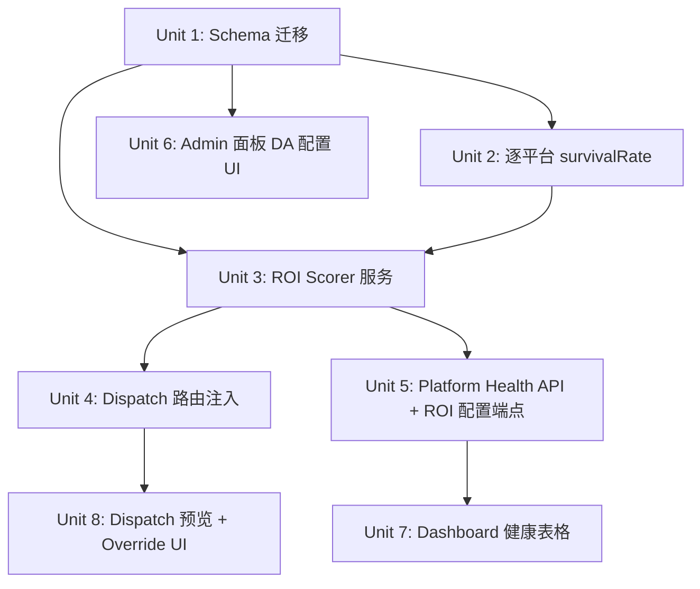

# feat: Platform ROI Auto-Ranking — DA Tier + Survival Learning

## Overview

当前调度器对 7 个 MVP 平台等权重处理，但 Medium（DA≈95）与 Telegra.ph（nofollow 链接）的 SEO 实际价值差异巨大。本计划引入 ROI 评分器：用硬编码 DA 分层作为先验（0.6 权重），随时间融合 link_checks 存活率数据（0.4 权重），在 dispatch 时自动过滤低 ROI 平台，并在调度队列中按优先级排序。同时提供 admin 面板配置入口和 Dashboard 展示表格。

## Problem Frame

系统的核心价值是产出有 SEO 价值的外链。当前问题：所有平台等权重调度，LLM 调用被浪费在低质量平台（如 Telegra.ph nofollow 链接）；已积累的 T+7d/T+30d 存活数据从未用于决策；发布后用户无法判断哪些平台真正在贡献价值。（参见 origin: docs/brainstorms/2026-05-06-platform-roi-auto-ranking-requirements.md）

## Requirements Trace

- R1. 每个平台持有 DA 分层配置：Tier1=1.0，Tier2=0.6，Tier3=0.3
- R2. 默认分层硬编码（Medium/Dev.to/Hashnode → Tier1；Blogger/WordPress → Tier2；Telegra.ph/GitHub → Tier3），管理员可覆盖
- R3. DA 分层改变立即生效，无需重启
- R4. ROI 评分：`score = DA_tier_score × 0.6 + avg(t7d_survival, t30d_survival) × 0.4`（均为逐平台值）
- R5. 冷启动（<5 条存活记录）退化为 `score = DA_tier_score × 1.0`
- R6. 存活率计算范围：最近 90 天 link_checks 记录（逐 check_type 独立计算）
- R7. Dispatch 时按 ROI 分数降序排列 publish_jobs 入队优先级（通过 priority 列实现）
- R8. ROI 分严格小于（`<`）可配置阈值（默认 0.3）的平台自动跳过，不入队
- R9. 跳过的平台在 dispatch 响应中附带 `{platform, score, reason}` 列表
- R10. 前端 dispatch 后可手动勾选跳过的平台强制发布（一次性覆盖）
- R11. 队列状态页新增「平台健康」表格，默认按 ROI 分升序排列（最差在顶部），支持列头点击重排序
- R12. ROI 分 < 阈值的平台行显示橙色警告徽章
- R13. 存活记录 <5 条的平台显示「数据不足」提示，橙色徽章同时隐藏

## Scope Boundaries

- **不**接入外部 DA API（Moz/Ahrefs）：DA 分层手动维护
- **不**自动删除低 ROI 平台配置：只影响调度跳过逻辑
- **不**实现 nofollow 检测：Telegra.ph/GitHub 归 Tier3 的原因是 nofollow，但检测延后
- **不**修改内容生成逻辑或 LLM 提示词
- Twitter/Instapaper 不在 MVP_PLATFORMS → 不参与 ROI 评分，不出现在健康表格

## Context & Research

### Relevant Code and Patterns

- **平台规范 key**：等于 `adapter.name`，与 `publish_jobs.platform` / `link_checks.platform` 完全一致。MVP 7 个平台的规范 key：`'Medium'`, `'Dev.to'`, `'Hashnode'`, `'Blogger'`, `'WordPress'`, `'Telegra.ph'`, `'GitHub'`
- **现有 survivalRate 函数**：`src/db/repositories.ts:442` — `linkChecks.survivalRate(db, checkType, sinceIso)` 无 platform 过滤，返回跨所有平台的聚合值，**必须扩展**
- **schema 模式**：`src/db/schema.ts` 用 `addColumnIfMissing()` 做幂等迁移；`brand_profiles` 已有 `api_keys_encrypted`、`platform_test_status`、`preferred_platforms_json` JSON blob 列 — 本次沿用此模式
- **Dispatch 路由**：`src/routes/publish.ts:312` — `POST /api/v2/dispatch` 验证 variants → 直接调用 `dispatchVariantJobs()` → 返回 `{batchId, jobsCreated}`，无预览步骤
- **`dispatchVariantJobs()`**：`src/services/queue/publish-worker.ts:225` — 遍历 variants，跳过非 MVP，为每个平台创建 `publish_jobs` 行并加随机 jitter
- **调度器 dequeue**：`src/db/repositories.ts:286` — `dequeueDue()` 按 `scheduled_at ASC` 排序；新增 `priority` 列后改为 `ORDER BY priority DESC, scheduled_at ASC`
- **brand_profiles schema**：单行表（trigger 保证），已有若干 JSON blob 列，admin 覆盖配置追加于此
- **Admin 路由**：`src/routes/admin.ts` — 含 `GET /api/platforms`、`PATCH /api/v2/brand-profile/preferred-platforms` 等，新端点追加在此

### Institutional Learnings

- 幂等迁移：`addColumnIfMissing()` + `CREATE INDEX IF NOT EXISTS`；本次 priority 列的默认值必须为 0（非 NULL）确保旧行向后兼容
- publish-worker 已有 `MVP_PLATFORMS` 白名单过滤；ROI 过滤层叠加在 dispatch 入口，不替换 publish-worker 里的守卫（防止绕过 dispatch 直接操作 DB 的情况）

### External References

- Telegra.ph 和 GitHub 链接默认 nofollow（已知，故归 Tier3，待后续 nofollow 检测功能验证）

## Key Technical Decisions

- **DA 分层规范 key = `adapter.name` 字符串**：避免第三套命名系统，与现有 publish_jobs/link_checks 存储一致；R2 需求文档中的 `Telegraph` 改为 `Telegra.ph`，`Twitter`/`Instapaper` 从默认分层中移除（不在 MVP）（see origin: R2）
- **ROI 配置存入 `brand_profiles` JSON blob 列**：沿用现有 `api_keys_encrypted`/`platform_test_status` 模式，避免新建表；两列：`da_tier_config_json`（对象，key=平台名，value=tier score）和 `roi_threshold`（REAL）。读取时合并默认值，只存储管理员覆盖项
- **priority 列 = roiScore as REAL**：dispatch 时写入原始 ROI score 浮点值（0.0–1.0）；dequeue 改为 `ORDER BY priority DESC, scheduled_at ASC`；旧行 priority=0.0 兜底（低于所有有效评分）。使用 REAL 而非 round(×100) INTEGER，避免相近平台碰撞为同一整数优先级（如 Medium 0.928 与 Hashnode 0.916 都会 round 到 93）
- **dispatch 单次调用 = 创建 eligible 任务 + 返回 skip 列表 + 返回 variants 数据**：不新增 `/preview` 端点；dispatch 响应体增加 `skipped`、`variants`（eligible 变体完整数据）、`roiEngineStatus` 字段；前端用 `variants` 提交 override body；override 端点接受 `{batchId, platforms: string[], variants: Variant[]}`
- **auto-publish 路由纳入本次 ROI 过滤范围**：`/api/auto-publish` 调用 `publishService()` 而非 `dispatchVariantJobs()`，是独立管道；在 Unit 4 中于 `publishService()` 调用前注入 `filterByRoi()` 过滤目标平台列表，统一行为
- **ROI 评分器在 dispatch 层实时计算，不做缓存**：每次 dispatch 调用时从 DB 读取（link_checks 查询 + brand_profiles JSON）；查询复杂度固定（7 平台 × 2 check_type = 14 个查询，SQLite 本地，亚毫秒级）；这满足 R3 的「立即生效」语义
- **Status 枚举值**（解决文档审查 P0）：`active`（ROI ≥ 阈值且数据充足）、`warn`（ROI < 阈值且数据充足）、`insufficient`（存活记录 <5 条）
- **冷启动计数 = 每个 check_type 独立计数**：t7d 和 t30d 分别检查是否 ≥5 条；若任一不足则该维度退化为 DA tier only（avg 只含有效维度）；两者都不足则完全退化为 DA × 1.0

## Open Questions

### Resolved During Planning

- **平台 ID key 不一致（原文档 P0）**：已确认规范 key = `adapter.name`。R2 的 `Telegraph` → `Telegra.ph`，Twitter/Instapaper 从默认分层删除（不在 MVP）
- **存活率实时计算 vs 缓存**：实时计算（dispatch 时），14 条简单 COUNT 查询，SQLite 本地亚毫秒，满足 R3
- **DA tier 配置存储位置**：`brand_profiles.da_tier_config_json` + `brand_profiles.roi_threshold`，沿用 JSON blob 模式
- **GitHub/Telegra.ph 归 Tier3 原因**：两者链接均为 nofollow，从 SEO 价值角度归 Tier3；文档中注明 nofollow 是原因，与"DA ≥70"的字面标准不一致属已知权衡
- **dispatch 预览流程**：单端点返回 skip 列表，override 用独立 endpoint；不新增 /preview 端点
- **「状态」列枚举（原文档 P0）**：`active` | `warn` | `insufficient`
- **R5 计数范围**：每个 check_type 独立判断 ≥5 条，不混合计数

### Deferred to Implementation

- 存活率 avg 中某个 check_type 完全没有记录（非 <5 条，而是 0 条）时的精确处理逻辑（建议：仅对有记录的 check_type 取平均，0 条 = 该维度不参与）
- admin.html 中 DA 分层 UI 具体布局（下拉 or 分段按钮）根据现有 UI 风格决定
- 队列页平台健康表的刷新频率（建议：与现有队列刷新共用 5s 轮询）

## High-Level Technical Design

> *这是预期方案的示意图，供审查验证方向，不是实现规格。实现代理应作为上下文参考，不应逐字复现。*

```
Dispatch 请求流
───────────────
POST /api/v2/dispatch
  │
  ├─ [现有] 验证 variants（naked_url、body_too_short）
  │
  ├─ [新增] roi-scorer.filterByRoi(variants, db)
  │     ├─ 读取 da_tier_config_json + roi_threshold（brand_profiles）
  │     ├─ 对每个 MVP 平台：linkChecks.survivalRate(db, type, platform, sinceIso)
  │     ├─ 计算 roiScore（含冷启动保护）
  │     └─ 分流：{ eligible[], skipped[{platform,score,reason}] }
  │
  ├─ [修改] dispatchVariantJobs(eligible, batchId, db)
  │     └─ 写 publish_jobs.priority = round(roiScore × 100)
  │
  └─ 响应：{ batchId, jobsCreated, skipped[] }

POST /api/v2/dispatch/override
  └─ 接受 { batchId, platforms[] }，跳过 ROI 过滤，直接入队（priority=0）

Scheduler 出队（修改）
──────────────────────
SELECT * FROM publish_jobs
WHERE status='scheduled' AND scheduled_at <= now
ORDER BY priority DESC, scheduled_at ASC   ← 核心变化
LIMIT 5

Platform Health API
───────────────────
GET /api/v2/platform-health
  └─ 对 7 个 MVP 平台，调用 roi-scorer.computeRoiScore()
  └─ 返回 { platform, daTierLabel, daTierScore, t7dRate, t30dRate,
             roiScore, status, dataInsufficient }[]
```

## Implementation Units



---

- [ ] **Unit 1: Schema 迁移 — brand_profiles ROI 配置列 + publish_jobs priority 列**

**Goal:** 为 ROI 配置和调度优先级提供持久化存储，向后兼容。

**Requirements:** R1, R2, R3, R7, R8

**Dependencies:** None

**Files:**
- Modify: `src/db/schema.ts`
- Test: `src/db/__tests__/schema.test.ts`

**Approach:**
- 在 `applyV2Schema()` 末尾追加：
  - `addColumnIfMissing(db, 'brand_profiles', 'da_tier_config_json', "TEXT DEFAULT '{}'")`
  - `addColumnIfMissing(db, 'brand_profiles', 'roi_threshold', 'REAL DEFAULT 0.3')`
  - `addColumnIfMissing(db, 'publish_jobs', 'priority', 'REAL NOT NULL DEFAULT 0.0')`（REAL 类型保留精度，避免 round(×100) 后相近平台碰撞为同一整数）
  - `CREATE INDEX IF NOT EXISTS idx_link_checks_platform_type ON link_checks(platform, check_type, checked_at)`（供 Unit 2 逐平台查询使用）
- 删除旧的 `idx_publish_jobs_dispatch` 并重建：
  - `DROP INDEX IF EXISTS idx_publish_jobs_dispatch`（SQLite 完全支持此语法，无需特殊处理）
  - `CREATE INDEX IF NOT EXISTS idx_publish_jobs_dispatch ON publish_jobs(status, priority DESC, scheduled_at ASC)`
- 同步扩展 `src/db/repositories.ts`：
  - `PublishJob` 接口添加 `priority: number` 字段
  - `publishJobs.insert()` 接受可选 `priority?: number`（默认 0.0），INSERT 列列表包含该字段

**Patterns to follow:**
- `addColumnIfMissing()` 模式：`src/db/schema.ts:19`
- 幂等 index：`CREATE INDEX IF NOT EXISTS` 模式

**Test scenarios:**
- Happy path: `applyV2Schema()` 在新空 DB 成功运行，`brand_profiles` 含 `da_tier_config_json` / `roi_threshold`，`publish_jobs` 含 `priority`
- 幂等性：`applyV2Schema()` 在已迁移的 DB 上再次运行不报错、不重复列
- 向后兼容：存量 `publish_jobs` 行的 `priority` 列值为 0
- Index 验证：`PRAGMA index_info(idx_publish_jobs_dispatch)` 返回 `priority DESC` 在 `scheduled_at` 之前

**Verification:** `src/db/__tests__/schema.test.ts` 通过，vitest 不新增失败

---

- [ ] **Unit 2: 逐平台 survivalRate — 扩展 repositories.linkChecks**

**Goal:** 让存活率查询支持 platform 过滤，为 ROI 评分器提供精确数据。

**Requirements:** R4, R6

**Dependencies:** Unit 1（新 index 结构；Unit 2 可与 Unit 1 并行开发，测试需 Unit 1 完成）

**Files:**
- Modify: `src/db/repositories.ts`
- Test: `src/db/__tests__/repositories.test.ts`

**Approach:**
- 为 `linkChecks.survivalRate()` 添加可选 `platform?: string` 第四参数
- 当 platform 传入时，在 WHERE 子句追加 `AND platform = ?`；不传时保持现有行为（向后兼容）
- 新增 `linkChecks.survivalRecordCount(db, checkType, platform, sinceIso): number` — 用于冷启动判断（返回记录数）
- `idx_link_checks_platform_type` 已在 Unit 1 的 `applyV2Schema()` 中创建，此处仅描述查询接口约定
- 现有调用方（无 platform 参数）不受影响

**Patterns to follow:**
- `linkChecks.survivalRate()` 现有实现：`src/db/repositories.ts:442`

**Test scenarios:**
- Happy path: 插入 3 条 `platform='Medium'` t7d alive 记录 + 1 条 t7d dead，`survivalRate(db,'t7d','Medium',since)` 返回 rate=0.75
- 隔离性：插入 2 条 `platform='Dev.to'` t7d alive，上述 Medium 查询结果不变
- 无 platform 参数时：返回跨所有平台的聚合值（向后兼容）
- `survivalRecordCount` 返回窗口内的精确数量，<5 条时 ROI scorer 应触发冷启动

**Verification:** repositories 相关测试全部通过，新增覆盖上述场景

---

- [ ] **Unit 3: ROI Scorer 服务**

**Goal:** 实现 ROI 评分核心逻辑，对外暴露 `filterByRoi()` 和 `computePlatformHealth()` 接口。

**Requirements:** R1-R8

**Dependencies:** Unit 1, Unit 2

**Files:**
- Create: `src/services/roi-scorer.ts`
- Create: `src/services/__tests__/roi-scorer.test.ts`

**Approach:**
- **DEFAULT_DA_TIERS**（只含 7 个 MVP 平台，使用规范 `adapter.name` key）：
  - Tier1 (1.0): `'Medium'`, `'Dev.to'`, `'Hashnode'`
  - Tier2 (0.6): `'Blogger'`, `'WordPress'`
  - Tier3 (0.3): `'Telegra.ph'`, `'GitHub'`（nofollow 链接，SEO 价值低）
- **常量**：`DEFAULT_ROI_THRESHOLD = 0.3` 硬编码在 `roi-scorer.ts`；`getDaTierConfig()` 读取 `brand_profiles.roi_threshold`（存在则覆盖默认值）
- **`getDaTierConfig(db)`**：读取 `brand_profiles.da_tier_config_json` + `roi_threshold`（`SELECT da_tier_config_json, roi_threshold FROM brand_profiles WHERE brand_id = 'main' LIMIT 1`），与 DEFAULT_DA_TIERS 合并（user overrides 覆盖默认值）；读取失败时安全降级为默认值；扩展 `BrandProfileRow` 接口包含这两个字段，或使用原始查询绕过类型限制
- **`computeRoiScore(db, platform, since90Iso)`**：
  - 读取 DA tier score（默认 0.3 for 未知平台）
  - `survivalRecordCount(db, 't7d', platform, since90Iso)` → 若 ≥5 则取 t7d rate；否则跳过
  - `survivalRecordCount(db, 't30d', platform, since90Iso)` → 若 ≥5 则取 t30d rate；否则跳过
  - 有效维度取平均；若两者均无数据 → 冷启动，score = DA × 1.0
  - 否则 score = DA × 0.6 + avg × 0.4
  - 返回 `{score, daTierScore, survivalRates, dataInsufficient, coldStart}`
- **`filterByRoi(variants, db)`**：
  - 计算每个 MVP 平台的 ROI score
  - score < threshold → 加入 `skipped` 列表，附带 `{platform, score, reason: 'low_roi'}`
  - score ≥ threshold → 加入 `eligible`
  - ROI 评分器自身抛出异常时：**fail-soft 降级**——对每个 MVP 平台使用纯 DA 层级评分（`score = DA_tier × 1.0`），继续过滤低 DA 平台；同时在 dispatch 响应中携带 `roiEngineStatus: 'degraded'`。（fail-open 全量通过会在系统压力最高时完全丧失过滤能力，与 Problem Frame 矛盾）
- **`computePlatformHealth(db)`**：为所有 7 个 MVP 平台返回健康数据，供 `/api/v2/platform-health` 使用；包含 `status: 'active' | 'warn' | 'insufficient'`

**Patterns to follow:**
- fail-open 降级模式：参考 `src/utils/smartRetry.ts` 的错误分类
- JSON blob 读取：参考 `src/routes/admin.ts:41` 的 `api_keys_encrypted` 读取方式

**Test scenarios:**
- Happy path: 平台有 ≥5 条 t7d 和 t30d 记录，score = DA × 0.6 + avg(t7d,t30d) × 0.4
- 冷启动（t7d < 5 条但 t30d ≥ 5）：仅用 t30d，score = DA × 0.6 + t30d × 0.4
- 完全冷启动（t7d < 5 且 t30d < 5）：score = DA × 1.0
- `filterByRoi`: score < threshold → skipped；score ≥ threshold → eligible
- Tier3 冷启动边界：score = 0.3（= threshold），用 `<`（严格）判断，不跳过
- 管理员覆盖：`da_tier_config_json = {"Telegra.ph": 0.6}` 时该平台使用 0.6 而非默认 0.3
- 评分器异常（DB 读取失败）：fail-soft 降级，对所有 MVP 平台用纯 DA 层级评分，响应含 `roiEngineStatus: 'degraded'`，不抛出
- `computePlatformHealth` status：score ≥ threshold + 数据充足 → `active`；score < threshold → `warn`；insufficientData → `insufficient`

**Verification:** `src/services/__tests__/roi-scorer.test.ts` 所有场景通过

---

- [ ] **Unit 4: Dispatch 路由注入 ROI 过滤**

**Goal:** 在 `POST /api/v2/dispatch` 中插入 ROI 过滤，向响应添加 skip 列表；添加 override 端点；为入队任务设置 priority。

**Requirements:** R7, R8, R9, R10

**Dependencies:** Unit 3

**Files:**
- Modify: `src/routes/publish.ts`
- Modify: `src/services/queue/publish-worker.ts`（`dispatchVariantJobs` 接受 priority map）
- Modify: `src/db/repositories.ts`（`publishJobs.insert` / `dispatchVariantJobs` 写入 priority 值）
- Test: `src/routes/__tests__/dispatch.test.ts`
- Test: `src/services/queue/__tests__/publish-worker.test.ts`（现有测试调用 `dispatchVariantJobs(variants, batchId, db)` 3 个参数，需确保新参数为**可选**）

**Approach:**
- `POST /api/v2/dispatch`（`src/routes/publish.ts:312`）：
  - 在现有 `invalid` 校验之后，调用 `filterByRoi(variants, db)`（返回 `{eligible, skipped, roiScores, engineStatus}`）
  - 只将 `eligible` variants 传给 `dispatchVariantJobs()`
  - 修改 `dispatchVariantJobs()` 签名：添加可选第四参数 `roiScores?: Map<string, number>`，写入 `publish_jobs.priority = roiScores.get(platform) ?? 0.0`（REAL，直接存原始 score）；参数缺省时 priority=0.0，确保现有 3 个参数调用不变
  - 响应体：`{ batchId, jobsCreated, variants: Variant[], skipped: Array<{platform, score, reason}>, roiEngineStatus: 'ok'|'degraded' }`（`variants` 包含 eligible 变体完整数据，供前端后续提交 override body 使用）
- `POST /api/v2/dispatch/override`（新路由，同文件）：
  - 接受 `{ batchId, platforms: string[], variants: Variant[] }`（前端从 dispatch 响应的 `variants` 字段取得，不依赖 DB）
  - 对指定 platforms 调用 `dispatchVariantJobs([filteredVariant], batchId, db)`，priority 默认 0.5（中位值，高于 Tier3 冷启动的 0.3，低于 Tier1 的 1.0，匹配「手动 override」的语义）
  - 成功后返回 `{ added: platform[] }`
- `dequeueDue()` 已在 Unit 1 更新 index；此处无需修改 scheduler

**Patterns to follow:**
- 现有 `POST /api/v2/dispatch` 验证模式：`src/routes/publish.ts:312-341`
- `dispatchVariantJobs()`：`src/services/queue/publish-worker.ts:225`

**Test scenarios:**
- Happy path: 5 个 eligible 平台入队，2 个 skipped 平台不入队；响应含正确 skipped 列表
- 全通过（无 skipped）：skipped=[] 空数组，jobsCreated=7
- 全跳过（所有平台 ROI < threshold）：eligible=[] 时仍返回 200，jobsCreated=0，skipped=7
- override 端点：指定 2 个 skipped 平台 + 对应 variants，成功创建 2 条新 publish_jobs（priority=0.5）
- override 不存在的 batchId：前端直接从内存提供 variants，此 404 场景不适用
- override 含非 MVP_PLATFORMS 平台名：跳过（已有 publish-worker MVP_PLATFORMS 守卫）
- ROI 评分器异常（fail-soft）：dispatch 返回 200 + `roiEngineStatus: 'degraded'`，仅过滤 DA tier < threshold 的平台
- 现有 `dispatchVariantJobs(variants, batchId, db)`（3 参数）调用：仍正常工作，priority 默认 0.0

**Verification:** `dispatch.test.ts` 新增覆盖 ROI 过滤场景；`publish-worker.test.ts` 现有测试保持通过

---

- [ ] **Unit 5: Platform Health API + ROI 配置端点**

**Goal:** 提供平台健康数据 API 和 admin 配置端点，供 dashboard 和 admin 面板使用。

**Requirements:** R1-R3, R11-R13

**Dependencies:** Unit 3

**Files:**
- Modify: `src/routes/admin.ts`
- Test: `src/routes/__tests__/admin-platforms.test.ts`

**Approach:**
- `GET /api/v2/platform-health`：
  - 调用 `computePlatformHealth(db)`
  - 返回数组：`[{platform, daTierLabel, daTierScore, t7dRate, t30dRate, roiScore, status, dataInsufficient}]`
  - 按 roiScore 升序排列（最差在顶）
  - 错误时返回所有平台 status='insufficient'（fail-safe，前端始终有数据渲染）
- `PATCH /api/v2/roi-config`：
  - 接受 `{ daTierConfig: Record<string, number>, threshold: number }`
  - 验证：`Number.isFinite(threshold) && threshold >= 0 && threshold <= 1`；tier score 用 `Set([0.3, 0.6, 1.0]).has(v)`（枚举验证，非范围检查）；platform key ∈ MVP_PLATFORMS
  - **写入时使用 `WHERE brand_id = 'main'`**（注意：`src/routes/admin.ts:399` 现有模式错用 `'default'`，必须用 `'main'` 以匹配 `repositories.ts:204` 和 `brand-profile.ts:253` 的规范 key）
  - 采用读-改-写模式：先 SELECT 现有 JSON，合并修改，再 UPDATE（防止覆盖 `api_keys_encrypted` 等其他字段）
  - 返回更新后的完整配置

**Patterns to follow:**
- 现有 admin 路由结构：`src/routes/admin.ts:120-458`
- `brand_profiles` JSON blob 读写：`src/routes/admin.ts:41` (api_keys_encrypted 模式)

**Test scenarios:**
- Happy path: 7 个平台均返回，按 roiScore 升序排列
- 混合状态：2 个 `warn`，3 个 `active`，2 个 `insufficient`
- `PATCH /api/v2/roi-config` 更新 threshold：下一次 `GET /api/v2/platform-health` 反映新阈值
- 无效 threshold（>1 或 <0）：返回 400
- 无效 platform key（非 MVP）：返回 400
- DB 读取失败：`GET /api/v2/platform-health` 返回 200 + 7 个 insufficient 行

**Verification:** `admin-platforms.test.ts` 新增 platform-health 和 roi-config 测试，均通过

---

- [ ] **Unit 6: Admin 面板 — DA 分层配置 UI**

**Goal:** 在 admin.html 中新增 ROI 配置区块，让管理员可逐平台调整 DA 分层并设置跳过阈值。

**Requirements:** R2, R3, R8

**Dependencies:** Unit 1, Unit 5

**Files:**
- Modify: `public/admin.html`

**Approach:**
- 在现有「分发平台」配置区块下方新增「ROI 评分配置」折叠面板（与现有折叠风格一致）
- 内容：
  - **ROI 跳过阈值**：number input，min=0，max=1，step=0.1，默认读自 `/api/v2/platform-health`（取 threshold 字段）
  - **逐平台 DA 分层**：7 行，每行：平台名 + 当前分值 + 下拉（Tier1: 1.0 / Tier2: 0.6 / Tier3: 0.3）
  - **保存按钮**：调用 `PATCH /api/v2/roi-config`，三种 toast 状态：成功（'保存成功'，2s 自动消失）、服务端校验失败（显示 API 返回 error message，常驻直到手动关闭）、网络失败（'保存失败，请重试'，带重试按钮）；保存期间按钮显示 loading 状态并禁用二次点击
- 读取：页面加载时从 `GET /api/v2/platform-health` 提取 `daTierScore` 和 `threshold` 初始化表单；GET 失败时在面板内显示内联错误提示 + 「重新加载」按钮，保存按钮禁用直到加载成功
- 立即生效（R3）

**Patterns to follow:**
- 现有折叠面板和 toast 逻辑：`public/admin.html` 中 LLM/API/浏览器区块

**Test scenarios:**
- Test expectation: none — 纯 UI，无独立单元测试；验证通过 `Unit 5` 的 API 测试 + 手动 admin.html 检查

**Verification:** 管理员可在 admin.html 中调整 Medium 的 DA 分层并保存，刷新后值持久；toast 显示成功

---

- [ ] **Unit 7: Dashboard — 平台健康表格**

**Goal:** 在 index.html 队列状态页新增平台健康表格，展示 ROI 分、存活率、状态徽章。

**Requirements:** R11, R12, R13

**Dependencies:** Unit 5

**Files:**
- Modify: `public/index.html`

**Approach:**
- 在队列状态页（queue tab）现有内容下方追加「平台健康」table 区块
- 列：平台名 | DA Tier | T7d 存活率 | T30d 存活率 | ROI 分 | 状态
- 状态渲染逻辑：
  - `insufficient`：T7d/T30d/ROI 分列均显示「—」，状态列显示灰色 badge（「数据不足」），橙色警告徽章不渲染，`insufficient` 行排序置底
  - `warn`：数值列正常显示，ROI 分列追加橙色警告徽章，状态 badge 橙色
  - `active`：正常显示，绿色 badge
- 排序行为：默认按 ROI 分升序（最差在顶）；列头点击切换升/降序（单列，不支持多列）；箭头 3 态（↕ 未排序、↑ 升序、↓ 降序）
- 数据来源：`GET /api/v2/platform-health`，与队列 5s 轮询共享定时器
- 4 种表格状态：
  - 加载中：每行显示 skeleton placeholder
  - 空态（0 个平台）：「暂无平台数据」提示
  - 拉取失败：「无法加载平台健康数据，请稍后重试」错误提示
  - 正常：7 行数据

**Patterns to follow:**
- 现有队列状态表格和 Alpine.js 数据绑定：`public/index.html` 队列 tab

**Test scenarios:**
- Test expectation: none — 纯 UI，验证通过手动检查 + Unit 5 API 集成

**Verification:** 打开 index.html 队列页，平台健康表格显示 7 行，Telegra.ph 和 GitHub 排在顶部（ROI 最低），Medium 等排底部；ROI < 0.3 的平台显示橙色 badge

---

- [ ] **Unit 8: Dispatch 预览 — skip 列表 + Override UI**

**Goal:** dispatch 后，若有平台被跳过，在 index.html 中展示跳过列表，让用户可强制发布。

**Requirements:** R9, R10

**Dependencies:** Unit 4

**Files:**
- Modify: `public/index.html`

**Approach:**
- dispatch 响应解析 `skipped` 数组；若为空则直接跳到队列状态页（现有行为）
- 若 `skipped.length > 0`：在「一键发布」按钮区域下方显示「跳过的平台」卡片，展示：
  - 每个跳过平台的名称、ROI 分（保留 2 位小数）、跳过原因（低 ROI）
  - 勾选框（默认未勾选）
  - 「强制发布所选」按钮（灰色不可用，至少勾选 1 个后激活）
- 强制发布：调用 `POST /api/v2/dispatch/override`，携带 batchId + 选中平台列表
- 结果：成功后显示 toast + 跳转队列状态页；失败显示错误 toast
- 覆盖卡片清除时机：override 请求成功后立即清除（跳转队列页前）；用户点击「跳过，继续」后立即清除；页面（SPA）视图切换至队列 tab 时清除；不支持撤销
- 3 种 UI 状态：
  - 无跳过：跳过卡片不渲染
  - 有跳过 + 未确认：显示勾选列表 + 「跳过，继续」+ 「强制发布所选」两个按钮
  - 覆盖中：按钮显示「发布中...」+ loading spinner；所有 checkbox 和按钮禁用；失败后恢复至「有跳过 + 未确认」态，同时显示内联错误提示（含失败原因）；不支持取消中断
- 全量 override 场景（勾选数 = 全部 skipped 数）：「强制发布所选」按钮触发 confirm 对话框（`window.confirm` 或轻量 modal），文案明确列出平台数量

**Patterns to follow:**
- 现有 dispatch 流程和 Alpine.js 状态管理：`public/index.html` dispatch 区块
- 现有 toast 模式：`public/index.html` toast 区块

**Test scenarios:**
- Test expectation: none — 纯 UI，验证通过手动流程检查

**Verification:** dispatch 后，若有 2 个平台被跳过，UI 展示 2 个勾选框；勾选 1 个并「强制发布」后，队列页新增 1 条该平台的 job

## System-Wide Impact

- **Interaction graph:** ROI 评分器在 `POST /api/v2/dispatch` 中间插入；dispatch 路由现在依赖 `brand_profiles` 表（DA config）和 `link_checks` 表（存活率）；`dispatchVariantJobs()` 签名变化需同步更新所有调用方（当前只有 publish.ts 和 auto-publish 路由）
- **Error propagation:** ROI 评分器异常 → fail-open，dispatch 降级为全量入队；`PATCH /api/v2/roi-config` 写入失败 → 返回 500，保留旧配置
- **State lifecycle risks:** `da_tier_config_json` 和 `roi_threshold` 存在 `brand_profiles` 单行表；写入需确保原有 JSON blob 正确 merge（不覆盖其他字段）；建议读-改-写模式而非直接 UPDATE JSON
- **API surface parity:** `auto-publish` 路由（`src/routes/publish.ts:200`）调用 `publishService()`（非 `dispatchVariantJobs()`），是独立管道。**已决策纳入本次范围**：在 Unit 4 中于 `publishService()` 调用前插入 `filterByRoi()` 过滤 targetPlatforms；`auto-publish` 不返回 skip 列表（内部调用），仅记录过滤日志
- **Integration coverage:** dispatch → ROI scorer → link_checks 查询的端到端链路需集成测试验证；单独 mock ROI scorer 的 dispatch 测试无法证明 DB 查询正确性
- **Unchanged invariants:** `publish-worker.ts` 的 `MVP_PLATFORMS` 白名单守卫保持不变（双层保护）；现有 `link_checks`/`publish_jobs` 表结构不变（只新增列）

## Risks & Dependencies

| Risk | Mitigation |
|------|------------|
| dispatch 路由引入 DB 查询增加响应延迟 | 14 条 COUNT 查询（7 平台 × 2 check_type），SQLite 本地 in-process，预期 <5ms；可在 Unit 4 实测后调整 |
| `brand_profiles` JSON merge 写坏其他字段 | Unit 5 的 `PATCH /api/v2/roi-config` 使用读-改-写模式，只更新指定字段；测试覆盖「只改 threshold，api_keys_encrypted 不变」场景 |
| Index 重建（DROP + CREATE）可能在高并发下有短暂窗口 | 系统为单进程 in-process SQLite，scheduler 2s tick；DROP 在 `applyV2Schema` 启动时执行，不影响运行中任务 |
| `auto-publish` 使用 `publishService()`（独立管道）| **已决策纳入本次**：Unit 4 在 `targetPlatforms` 确定后调用 `filterByRoi(targetPlatforms, db)`，不依赖 `dispatchVariantJobs` |
| 前端 override 调用需要从 `draft_batches` 读取 variants | Unit 4 实现 override 端点时确认 `draft_batches.variants_json` 在 dispatch 时仍有效（当前 status 改为 `dispatched`）；若已失效，改为 override 端点直接从 request body 接收 variant 内容 |

## Documentation / Operational Notes

- `OPTIMIZATION_SUMMARY.md` 可追加「平台 ROI 自动排先」条目，说明默认分层与修改方式
- 管理员首次使用：无需额外操作，默认分层立即生效；如需修改分层，访问 admin.html → ROI 评分配置
- 监控建议：每日 digest 可追加「各平台 ROI 分变化」统计；T+30d 存活率目标 >70% 不变，短期内可增加「高 Tier 平台 dispatch 占比」指标验证优先级效果

## Sources & References

- **Origin document:** [docs/brainstorms/2026-05-06-platform-roi-auto-ranking-requirements.md](docs/brainstorms/2026-05-06-platform-roi-auto-ranking-requirements.md)
- Related code: `src/services/queue/publish-worker.ts:225` (dispatchVariantJobs)
- Related code: `src/db/repositories.ts:442` (linkChecks.survivalRate)
- Related code: `src/db/schema.ts` (applyV2Schema, addColumnIfMissing)
- Related code: `src/routes/publish.ts:312` (POST /api/v2/dispatch)
- Related code: `src/routes/admin.ts` (admin 路由模式)
- Related code: `src/constants.ts` (MVP_PLATFORMS)
