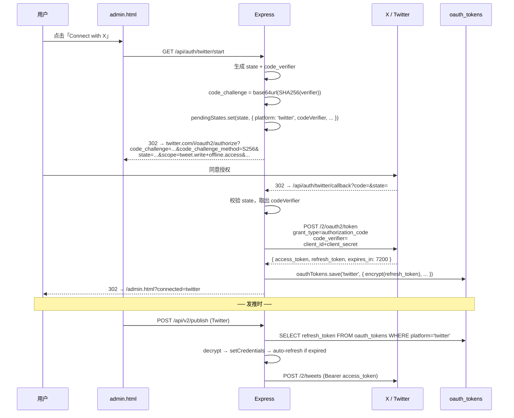
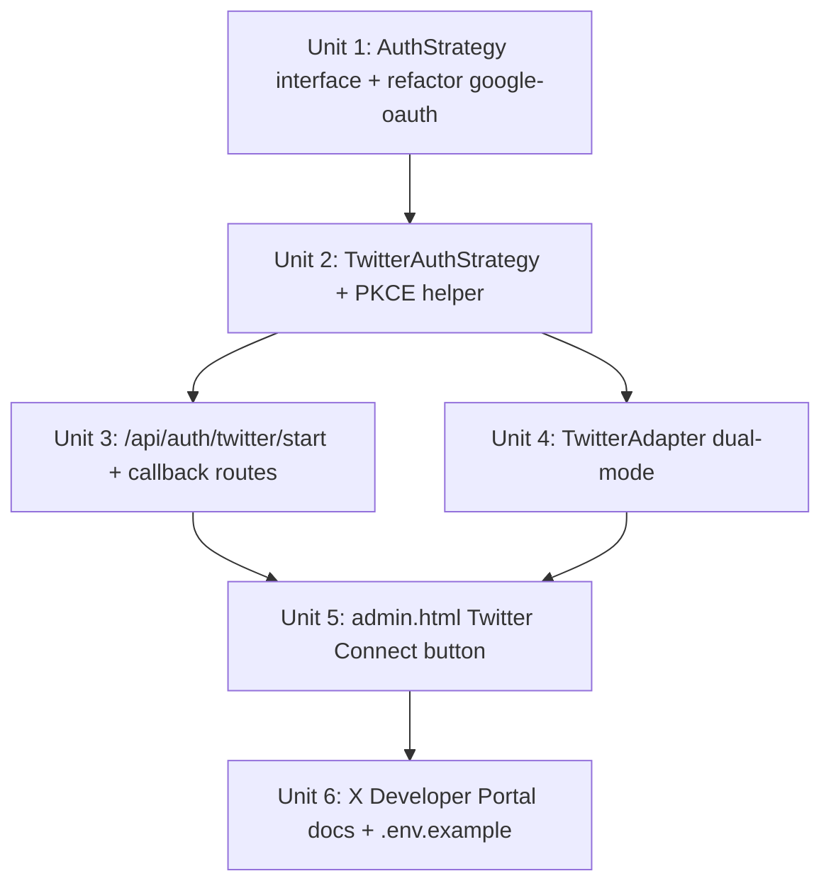

# Twitter / X OAuth 2.0 PKCE + Auth-Strategy 抽象

## Overview

延伸 Blogger OAuth 工作的成果：把「点 Connect 按钮 → 浏览器登录 → 自动连接」UX 推广到 Twitter / X。

**用户选择**：统一 UX（推荐路径）。每个平台用最适合的认证方式，UI 体验一致。Twitter 是首要目标，因为它现在最痛——4 个独立密钥（consumer_key + consumer_secret + access_token + access_token_secret）的 OAuth 1.0a 流程，从 X Developer Portal 拷贝到 .env 是高频出错点。

**目标**：
- Twitter 卡片在 admin.html 显示「Connect with X」按钮
- 点击 → 跳 Twitter 授权页 → 用户同意 → 自动回到 admin → DB 加密存 OAuth 2.0 refresh_token
- TwitterAdapter 优先用 OAuth 2.0（`POST /2/tweets` 用 Bearer access_token），回退到现有 OAuth 1.0a（存量用户零迁移）
- 抽出 AuthStrategy 接口，让后续平台（如果用户要扩）能 plug-and-play

## Problem Frame

| 维度 | 现状 | 目标 |
|---|---|---|
| Twitter 接入门槛 | 4 个 keys，X Developer Portal UI 复杂；新人 30 分钟+ 才能接通 | 1 个 OAuth 2.0 Client（client_id + client_secret），点 Connect 完成 |
| 凭证类型 | OAuth 1.0a（HMAC-SHA1 签名，每次发推手算签名） | OAuth 2.0 PKCE（标准 Bearer token，refresh_token 自动续期） |
| Adapter 内部 | `buildOAuthHeader` 自实现 OAuth 1.0a 签名（38 行手写代码） | 优先 Bearer access_token，OAuth 1.0a 仅作为回退 |
| auth-strategy 复用 | Blogger 单实现，只有 `OAUTH_PLATFORM_REGISTRY` 一层抽象 | 抽出 `AuthStrategy` 接口，Google/Twitter 各为一个实现 |

研究确认（see [X Developer OAuth 2.0 docs](https://developer.x.com/en/docs/authentication/oauth-2-0/authorization-code)）：
- Twitter API v2 完整支持 OAuth 2.0 Authorization Code + PKCE
- `POST /2/tweets` 接受 Bearer access_token（同 OAuth 1.0a 时代的 endpoint）
- Confidential client（带 client_secret）和 public client（纯 PKCE）都支持
- `offline.access` scope 是拿到 refresh_token 的关键
- Required scopes for posting: `tweet.read tweet.write users.read offline.access`

## Requirements Trace

- **R1** — 用户在 admin.html 点击 Twitter 卡片的「Connect with X」→ 跳 X 授权页 → 同意后自动回到管理后台并显示「已连接」
- **R2** — `oauth_tokens.twitter` 行的 refresh_token 用 AES-256-GCM 加密（同 Blogger 模式）
- **R3** — TwitterAdapter 三级回退：OAuth 2.0 token → OAuth 1.0a env keys → 报错（存量 OAuth 1.0a 用户零迁移）
- **R4** — refresh_token 失效时自动清理 oauth_tokens.twitter 行（同 Blogger `isInvalidGrantError` 模式）
- **R5** — PKCE 实现：code_verifier 32+ 字节随机，code_challenge 用 S256（SHA-256 hash + base64url）
- **R6** — CSRF：state 参数沿用现有 `pendingStates` Map（与 Google flow 共享内存 + TTL + cap）
- **R7** — 抽出 `AuthStrategy` 接口；Blogger 重构为 `GoogleAuthStrategy` 实例；Twitter 为新 `TwitterAuthStrategy` 实例。后续添加平台时无需复制路由代码
- **R8** — Loopback-only middleware 同样保护 `/api/auth/twitter/start` 和 `DELETE /api/auth/oauth/twitter`

## Scope Boundaries

**In scope:**
- Twitter / X OAuth 2.0 PKCE 完整 flow
- `AuthStrategy` 接口 + `GoogleAuthStrategy` / `TwitterAuthStrategy` 两个实现
- TwitterAdapter dual-mode（OAuth 2.0 优先 + OAuth 1.0a 回退）
- admin.html UI：Twitter 卡片的 OAuth 按钮（沿用 Blogger 视觉风格）
- X Developer Portal 配置文档

**Out of scope（用户已明确没有立即需求）:**
- WordPress.com OAuth 2.0
- Dev.to OAuth（PAT 工作良好）
- GitHub OAuth（PAT 工作良好）
- Hashnode（无 OAuth API）
- 移除 OAuth 1.0a env 变量（保留作为回退）
- 把 `OAUTH_PLATFORM_REGISTRY` 通用化到「任意 OAuth provider」（暂定 Google / Twitter 硬编码即可，3+ 个 provider 时再泛化）

## Context & Research

### Relevant Code and Patterns

- `src/services/google-oauth.ts` — 现有 Google OAuth helper（`createOAuthClient` / `generateAuthUrl` / `exchangeCodeForTokens` / `getAuthorizedClient` / `OAUTH_PLATFORM_REGISTRY`）。Twitter helper 的模板。
- `src/routes/auth.ts` L40–225 — 现有 Google OAuth 路由（`/api/auth/google/start` + `/callback` + `DELETE /api/auth/oauth/:platform`）。Twitter 路由完全镜像此模式。
- `src/db/oauth-tokens.ts` — 通用 DAO，platform 字段已是 string，不用改 schema 即支持 Twitter
- `src/middleware/loopback-only.ts` — 已有，可直接复用
- `src/adapters/blogger.ts` — 三级回退 + invalid_grant 自动清理 + `on('tokens')` 持久化的成熟模式。Twitter adapter 镜像此结构。
- `src/adapters/twitter.ts` L11–45 — 现有 OAuth 1.0a 签名实现，保留作为回退路径
- `public/admin.html` L707–745 — Blogger 卡片的 actionBtn 渲染逻辑（`supportsOAuth + oauthConfigured + oauthConnected` 三态）。Twitter 直接套用相同分支
- `src/services/google-oauth.ts` `OAUTH_PLATFORM_REGISTRY` — 单一 source of truth，Twitter 加一行即可
- `src/routes/admin.ts` L120–143 — `/api/platforms` 字段填充逻辑，`isOAuthSupported(adapter.name)` 已是 data-driven

### Institutional Learnings

- Google OAuth 流暴露过的坑（已在 Blogger 实现中解决，Twitter 复用经验）：
  - `prompt: 'consent'` 是确保第二次授权也返 refresh_token 的关键 — Twitter 需要等价的 mechanism。X API v2 用 `offline.access` scope 控制（与 Google 用 prompt 不同）
  - State Map 必须有 cap + 一次性删 + 60s 定期 prune（防 DoS + 防 stale）
  - Callback 失败必须 redirect 到 `/admin.html?oauth_error=<code>` 而非 JSON 400（友好 UX）
  - error.message 不能直接进 URL（信息泄漏），转成 stable code（`exchange_failed` / `invalid_state` 等）
- Twitter PKCE 特殊点：
  - `code_verifier` 必须 43–128 字符，URL-safe（A-Z, a-z, 0-9, '-_.~'）
  - `code_challenge_method: 'S256'`（SHA-256），不要用 'plain'（不安全）
  - state 和 code_verifier 必须一对一绑定 — Google flow 只存 platform，Twitter flow 还需要存 code_verifier 在 state Map 里

### External References

- [X Developer Portal — OAuth 2.0 Authorization Code Flow with PKCE](https://developer.x.com/en/docs/authentication/oauth-2-0/authorization-code)
- [X API v2 — POST /2/tweets endpoint](https://docs.x.com/x-api/posts/post-creation-of-a-post)
- [RFC 7636 PKCE](https://datatracker.ietf.org/doc/html/rfc7636) — code_verifier / code_challenge 规范

## Key Technical Decisions

1. **PKCE implementation: 自实现而非引入 `node-twitter-api-v2`**
   - 原因：现有 google-auth-library 走的是标准 OAuth2Client，Twitter 走 PKCE flow 大约 30 行代码；为单一 provider 引入 1.2MB 依赖（含其他不需要的 v2 endpoints）不划算
   - 实现：`crypto.randomBytes(32).toString('base64url')` 生成 verifier；`crypto.createHash('sha256').update(verifier).digest('base64url')` 生成 challenge

2. **state Map 增强：存 code_verifier**
   - 现有结构：`Map<state, { platform, expiresAt }>`
   - 改为：`Map<state, { platform, expiresAt, codeVerifier?: string }>`
   - codeVerifier 字段仅 Twitter（PKCE provider）会写入；Google flow 不动
   - **替代方案**：每 provider 独立 state Map — 拒绝。增加重复代码，且 state 是 CSRF 保护，本质上和 provider 解耦

3. **TwitterAdapter 三级回退**
   - 优先级：`oauth_tokens.twitter` (OAuth 2.0 Bearer) → `TWITTER_*` env keys (OAuth 1.0a) → 报错
   - 与 Blogger 设计完全镜像。OAuth 1.0a 路径保留 `buildOAuthHeader` 函数不动
   - **Why**：现有用户的 4-key 配置一定要继续工作，且 OAuth 1.0a 的 access_token 没有过期机制（无需续期），是稳定的回退

4. **AuthStrategy 接口最小化**
   - ```ts
     interface AuthStrategy {
       providerId: string;             // 'google' | 'twitter'
       supportedAdapters: string[];    // ['Blogger']  /  ['Twitter']
       isConfigured(): boolean;        // env 检查
       generateAuthUrl(state: string, scopes: string[]): string;
       exchangeCodeForTokens(code: string, state: string): Promise<TokenSet>;
       persistTokens(platform: string, tokens: TokenSet): void;
     }
     ```
   - 路由层用 `AuthStrategyRegistry` lookup，而不是硬编码 if/else
   - **替代方案**：保持每 provider 独立路由（`/api/auth/google/*` + `/api/auth/twitter/*`）— 选这个。Provider 的 URL paths 已经分歧（Google 用 `/google/`，Twitter 用 `/twitter/`），强行统一为 `/auth/oauth/:provider/*` 收益不大且增加迁移成本

5. **scope 字符串格式**
   - Google: 数组 `['https://www.googleapis.com/auth/blogger']`，库内部 join
   - Twitter: 文档要求 space-separated 字符串：`tweet.read tweet.write users.read offline.access`
   - 在 strategy 内部各自格式化，对外暴露统一 `string[]` 接口

6. **redirect_uri 各 provider 独立**
   - Google: `OAUTH_REDIRECT_URI`（已有，`/api/auth/google/callback`）
   - Twitter: 新增 `TWITTER_OAUTH_REDIRECT_URI`，默认 `http://localhost:3000/api/auth/twitter/callback`
   - **Why**：X Developer Portal 配置时也是按每个 OAuth Client 独立填一组 redirect URIs，不该混用

## High-Level Technical Design

> *本图为方向性设计，供审阅验证，实现时以代码为准。*



```mermaid
flowchart LR
  subgraph Strategy[AuthStrategy interface]
    G[GoogleAuthStrategy<br/>existing google-oauth.ts]
    Tw[TwitterAuthStrategy<br/>new twitter-oauth.ts]
  end
  subgraph Routes
    GR[/api/auth/google/*]
    TR[/api/auth/twitter/*]
  end
  GR --> G
  TR --> Tw
  G --> DB[(oauth_tokens<br/>platform='blogger')]
  Tw --> DB2[(oauth_tokens<br/>platform='twitter')]
  G -.shared.-> SM[pendingStates Map]
  Tw -.shared.-> SM
```

## Implementation Units



---

- [ ] **Unit 1: AuthStrategy interface + refactor google-oauth**

**Goal:** 把 google-oauth.ts 的导出函数收敛成一个 `GoogleAuthStrategy` 对象（实现 `AuthStrategy` 接口），路由层通过 strategy 查询而非直接 import 函数。Twitter strategy 接入时无需修改路由层抽象。

**Requirements:** R7

**Dependencies:** 无

**Files:**
- Create: `src/services/auth-strategy.ts`（接口 + registry）
- Modify: `src/services/google-oauth.ts`（导出 `googleAuthStrategy` 实例）
- Modify: `src/routes/auth.ts`（用 strategy lookup 替代直接函数 import）
- Modify: `src/routes/admin.ts`（同样用 strategy lookup）
- Test: `src/services/__tests__/auth-strategy.test.ts`

**Approach:**
- 定义 `AuthStrategy` interface（providerId / supportedAdapters / isConfigured / generateAuthUrl / exchangeCodeForTokens / persistTokens / clearTokens / getAuthorizedClient）
- 定义 `AuthStrategyRegistry` — `Map<providerId, AuthStrategy>`，导出 `register()` + `getStrategyByAdapter(adapterName)` + `getStrategyByProvider(providerId)`
- 把 `OAUTH_PLATFORM_REGISTRY` 中的逻辑移入对应 strategy 的 `supportedAdapters`
- google-oauth.ts 末尾 `export const googleAuthStrategy: AuthStrategy = { ... }`，并在模块加载时调用 `registerStrategy(googleAuthStrategy)`
- 路由的 `OAUTH_PLATFORM_REGISTRY[platform]` lookups 改为 `getStrategyByAdapter(...)` 或类似

**Patterns to follow:**
- `src/db/repositories.ts` 的 namespace export 风格（`export const xxx = { ... }`）
- `src/adapters/index.ts` 的 `allAdapters` 数组聚合模式

**Test scenarios:**
- Happy path: 注册一个 mock strategy，`getStrategyByAdapter('Blogger')` 返回正确实例
- Happy path: 现有 Blogger OAuth 流端到端测试无回归（routes/__tests__/google-oauth.test.ts 应继续全绿）
- Edge case: 重复注册同 providerId 抛错（防意外覆盖）
- Edge case: `getStrategyByAdapter('Unknown')` 返回 null
- Integration: BloggerAdapter.testConnection 通过 strategy 拿 client，仍正常工作

**Verification:**
- 现有 562 测试全绿（零回归）
- `npx tsc --noEmit` 无错误
- 手动：admin.html 上 Blogger 卡片依然能 Connect / Disconnect

---

- [ ] **Unit 2: TwitterAuthStrategy + PKCE helper**

**Goal:** 实现 Twitter OAuth 2.0 PKCE 完整 flow 的 strategy 模块。

**Requirements:** R1, R2, R5

**Dependencies:** Unit 1

**Files:**
- Create: `src/services/twitter-oauth.ts`
- Test: `src/services/__tests__/twitter-oauth.test.ts`

**Approach:**
- 导出常量：
  - `TWITTER_AUTH_URL = 'https://twitter.com/i/oauth2/authorize'`（X 也接受 x.com 域）
  - `TWITTER_TOKEN_URL = 'https://api.twitter.com/2/oauth2/token'`
  - `TWITTER_OAUTH2_SCOPES = ['tweet.read', 'tweet.write', 'users.read', 'offline.access']`
- PKCE helper：
  - `generateCodeVerifier(): string` — `crypto.randomBytes(32).toString('base64url')`（44 字符）
  - `codeChallenge(verifier: string): string` — `crypto.createHash('sha256').update(verifier).digest('base64url')`
- `twitterAuthStrategy` 实现：
  - `isConfigured()` — 检查 `TWITTER_OAUTH_CLIENT_ID` + `TWITTER_OAUTH_CLIENT_SECRET` + `TWITTER_OAUTH_REDIRECT_URI`
  - `generateAuthUrl(state, scopes)` — 构造 query string，scope 用 space-separated，加 `code_challenge` + `code_challenge_method=S256`
  - `exchangeCodeForTokens(code, state)` — POST 到 token URL，body 含 `grant_type=authorization_code`、`code`、`code_verifier`（从 pendingStates 取）、`redirect_uri`、`client_id`；Header `Authorization: Basic base64(id:secret)`
  - `getAuthorizedClient(platform)` — 返回一个轻量级 wrapper 暴露 `getValidAccessToken()` 方法（自动 refresh），让 TwitterAdapter 用
  - `persistTokens(platform, tokens)` — `oauthTokens.save(db, platform, ...)`
- pendingStates Map 类型扩展：`{ platform, expiresAt, codeVerifier?: string }` — 在 `routes/auth.ts` 改字段（同 Unit 3）
- token refresh 逻辑：判断 `expires_at < Date.now() + 60s` → POST `grant_type=refresh_token`，更新 DB

**Patterns to follow:**
- `src/services/google-oauth.ts` 的整体结构（导出函数 + isConfigured + scopes 常量）
- `src/services/google-oauth.ts` `getAuthorizedClient` 用 `setCredentials` + `on('tokens')` 持久化的模式

**Test scenarios:**
- Happy path: `generateCodeVerifier()` 返回 ≥ 43 字符 URL-safe 字符串
- Happy path: `codeChallenge('verifier')` 返回正确的 SHA-256 + base64url（用已知 RFC 7636 测试向量验证）
- Happy path: `generateAuthUrl(state, scopes)` 返回 URL 含 `code_challenge`、`code_challenge_method=S256`、`state`、`scope=tweet.read+tweet.write+users.read+offline.access`、`response_type=code`
- Happy path: `exchangeCodeForTokens` mock fetch → 返回 `{ access_token, refresh_token, expires_at }`
- Edge case: `isConfigured()` 在缺任一 env 时返 false
- Error path: token endpoint 返 invalid_grant → 抛错并向上传递
- Error path: token endpoint 返 expires_in 但不返 refresh_token → 抛 `'no_refresh_token'`-style 错误
- Integration: full mock flow（generate URL → simulate callback → exchange）所有字段正确串接

**Verification:**
- 单元测试全绿
- 手动 `node -e "console.log(require('./src/services/twitter-oauth').twitterAuthStrategy.generateAuthUrl(...))"` 输出可在浏览器打开的 X 同意页

---

- [ ] **Unit 3: /api/auth/twitter/start + /callback + DELETE /api/auth/oauth/twitter**

**Goal:** Twitter 的 start / callback / delete 路由，复用 google flow 的 state Map + redirect 模式。

**Requirements:** R1, R6, R8

**Dependencies:** Unit 1, Unit 2

**Files:**
- Modify: `src/routes/auth.ts`
- Test: `src/routes/__tests__/twitter-oauth.test.ts`

**Approach:**
- pendingStates Map 类型扩展（接 Unit 2 设计）：`PendingState { platform: string; expiresAt: number; codeVerifier?: string }`
- 路由：
  - `GET /api/auth/twitter/start` (loopbackOnly):
    - 查 strategy → `isConfigured()` → 503
    - 生成 state（同 google flow，32 字节 hex）
    - 生成 code_verifier + code_challenge
    - `pendingStates.set(state, { platform: 'twitter', expiresAt, codeVerifier })`
    - cap 检查（同 google）
    - `res.redirect(strategy.generateAuthUrl(state, TWITTER_OAUTH2_SCOPES))`
  - `GET /api/auth/twitter/callback`:
    - 全部错误重定向到 `/admin.html?oauth_error=<code>`（与 google 一致）
    - state 校验 → 取 pending（含 codeVerifier） → 一次性删
    - `strategy.exchangeCodeForTokens(code, state)` — 内部用 codeVerifier
    - `oauthTokens.save(db, 'twitter', ...)`
    - `res.redirect('/admin.html?connected=twitter')`
  - `DELETE /api/auth/oauth/twitter` (loopbackOnly): 同 google 风格，调 `oauthTokens.delete(db, 'twitter')`
- exchangeCodeForTokens 接收 state 参数（不只 code）— strategy 内部从 pendingStates 拿 codeVerifier；意味着 routes 层调用前**不能**先删 state。改用 strategy API：`exchangeCodeForTokens(code, codeVerifier)` 把 codeVerifier 显式传入，让 routes 控制 state 生命周期。

**Patterns to follow:**
- `src/routes/auth.ts` 现有 `/api/auth/google/start` / `callback` / DELETE 三件套（直接镜像）
- `oauthErrorRedirect(res, code)` helper 复用

**Test scenarios:**
- Happy path: GET `/api/auth/twitter/start` → 302 到 `twitter.com/i/oauth2/authorize`，URL 含 `code_challenge` + `state`
- Happy path: callback 模拟成功（mock token endpoint）→ 302 到 `/admin.html?connected=twitter`，DB 有加密 refresh_token
- Edge case: callback `state` 不存在 → 302 到 `?oauth_error=invalid_state`
- Edge case: callback `state` 过期 → 302 到 `?oauth_error=state_expired`
- Edge case: token exchange 失败 → 302 到 `?oauth_error=exchange_failed`
- Edge case: GET start 时 strategy `isConfigured() === false` → 503
- Edge case: 非 loopback IP → 403（loopback middleware 在 google 测试已覆盖，此处仅冒烟测试）
- Integration: full end-to-end with supertest（在 mock token endpoint 下走完 start→callback→DB write→testConnection）

**Verification:**
- 测试套件全绿
- 手动用真实 X Developer Portal client 走端到端：admin → Connect with X → 同意 → 回到 admin

---

- [ ] **Unit 4: TwitterAdapter dual-mode（OAuth 2.0 优先 + OAuth 1.0a 回退）**

**Goal:** TwitterAdapter 在 oauth_tokens.twitter 行存在时走 OAuth 2.0 Bearer；否则走现有 OAuth 1.0a env keys；两者都没就报错。

**Requirements:** R3, R4

**Dependencies:** Unit 2

**Files:**
- Modify: `src/adapters/twitter.ts`
- Test: `src/adapters/__tests__/twitter-oauth.test.ts`（新建）
- Test: `src/adapters/__tests__/adapter-test-connection.test.ts`（更新现有 Twitter 段）

**Approach:**
- 抽出 `private async getAuthHeader(method, url): Promise<string>`:
  - 先 `oauthTokens.exists(db, 'twitter')` → 用 OAuth 2.0 path：从 strategy 拿 access_token（含 auto-refresh），返回 `Bearer ${access_token}`
  - 否则 fallback 到现有 `buildOAuthHeader(...)` OAuth 1.0a 签名
  - 都没有 → 抛错
- testConnection / publish / 都调 `getAuthHeader()`，不再各自 `if (!this.configured()) ...`
- invalid_grant / 401 时检测 OAuth 2.0 path 并清理 oauth_tokens.twitter（与 BloggerAdapter 同模式）
- OAuth 2.0 token 自动 refresh：当 `expires_at < Date.now() + 60s` 时主动 POST `grant_type=refresh_token`（在 strategy 内部）

**Patterns to follow:**
- `src/adapters/blogger.ts` 三级回退 + invalid_grant 清理 + on('tokens') 持久化 — 几乎逐字镜像

**Test scenarios:**
- Happy path: oauth_tokens.twitter 存在 + access_token 未过期 → 调 fetch 时 Authorization header 是 `Bearer xxx`
- Happy path: oauth_tokens.twitter 存在 + access_token 即将过期 → 自动 refresh，新 token 落库
- Happy path: oauth_tokens.twitter 不存在 + 4 个 env keys 齐 → 用 OAuth 1.0a HMAC-SHA1 签名
- Edge case: 都没配 → testConnection 返 `{ ok: false, error: <auth-hint> }`
- Edge case: oauth_tokens 存在但 401 invalid_token → 清理 oauth_tokens 行，返「Session revoked」错误
- Edge case: refresh_token 自身失效（Twitter 强制 90 天 rotation 或用户撤销）→ 清理 + 错误
- Error path: tweet text > 280 - URL.length → 现有 `tweetText` 截断逻辑不变
- Integration: full publish flow under OAuth 2.0（mock /2/tweets endpoint）

**Verification:**
- 测试全绿，包括现有 OAuth 1.0a 测试不回归
- 手动：先 disconnect Twitter，留 OAuth 1.0a env keys → 发推走 OAuth 1.0a；再 Connect with X → 发推走 OAuth 2.0

---

- [ ] **Unit 5: admin.html — Twitter Connect with X 按钮 + /api/platforms 字段**

**Goal:** Twitter 卡片显示「Connect with X」按钮（同 Blogger 三态视觉），`/api/platforms` 反映 Twitter 的 OAuth 状态。

**Requirements:** R1

**Dependencies:** Unit 1, Unit 3

**Files:**
- Modify: `src/routes/admin.ts`（`/api/platforms` 已用 `isOAuthSupported`，Twitter 加入后自动正确）
- Modify: `public/admin.html`（actionBtn 渲染逻辑已是 data-driven，会自动适配 Twitter）

**Approach:**
- Unit 1 的 `AuthStrategyRegistry` 已经把 Twitter 的 supportedAdapters 映射到 OAuth provider，`isOAuthSupported('Twitter')` 自动返 true
- `/api/platforms` 对 Twitter 已经会输出 `supportsOAuth: true` + `oauthConfigured` + `oauthConnected` — Unit 1 完成时即工作
- admin.html 的 actionBtn 三态分支（`!oauthConfigured` / `oauthConnected` / 默认 Connect）已通用
- **唯一需要的 UI 改动**：Twitter 按钮文字应该是「Connect with X」而非通用「Connect with Google」。把当前硬编码 `Connect with Google` 改成 data-driven：
  - `/api/platforms` 加 `oauthProviderLabel` 字段（`'Google' | 'X'`）
  - admin.html 模板用 `Connect with ${p.oauthProviderLabel}`
- 中文 toast 消息：「✅ 已成功连接 ${platformId}」— 现有逻辑无需改

**Patterns to follow:**
- 现有 admin.html L707–745 的 actionBtn 模板渲染
- 现有 `handleOAuthRedirect` toast 处理

**Test scenarios:**
- Happy path: `/api/platforms` Twitter 显示 `supportsOAuth: true`、`oauthConfigured: true/false`（按 env）、`oauthConnected: true/false`（按 DB 行）、`oauthProviderLabel: 'X'`
- Happy path: admin.html 渲染 Twitter 卡片显示蓝色「Connect with X」按钮（env 配齐时）
- Happy path: 已连接时显示「重新授权 / 断开」两按钮
- Happy path: env 未配时按钮灰化 + tooltip
- Edge case: oauthProviderLabel 缺省时 fallback 到 'Google'（兼容老 client）
- Edge case: callback 重定向带 `?connected=twitter` → toast 显示「✅ 已成功连接 twitter」

**Verification:**
- 本地 server 启动后访问 admin.html，Twitter 卡片显示三态按钮
- 完整端到端跑一遍：点 Connect → X 同意页 → 回 admin → toast + 已连接

---

- [ ] **Unit 6: X Developer Portal 配置文档 + .env.example**

**Goal:** 让用户能 5 分钟在 X Developer Portal 完成 OAuth 2.0 client 配置。

**Requirements:** R1

**Dependencies:** Unit 3（确认路由路径 final）

**Files:**
- Modify: `CHANNEL_SETUP_GUIDE.md`
- Modify: `.env.example`

**Approach:**
- CHANNEL_SETUP_GUIDE.md 加段「Twitter / X — OAuth 2.0 配置」：
  1. 进 [X Developer Portal](https://developer.x.com/)
  2. Create Project + App（Free tier 即可发推，但有月限额）
  3. App settings → User authentication settings → Set up
  4. **App permissions**: Read and write
  5. **Type of App**: Web App
  6. **Callback URI / Redirect URL**: `http://localhost:3000/api/auth/twitter/callback`
  7. **Website URL**: 任填一个真实 URL
  8. Save → 跳到 Keys and tokens 页 → OAuth 2.0 Client ID and Client Secret 段
  9. Generate / regenerate → 拷贝到 `.env`
- 警告：X 的免费 tier 有发推月限额，超了 OAuth 2.0 token 一样不能用（但是 token 仍有效）
- `.env.example` 加：
  ```
  # Twitter / X OAuth 2.0 (推荐 — 一键 Connect with X)
  TWITTER_OAUTH_CLIENT_ID=
  TWITTER_OAUTH_CLIENT_SECRET=
  TWITTER_OAUTH_REDIRECT_URI=http://localhost:3000/api/auth/twitter/callback

  # Twitter / X OAuth 1.0a (legacy，仍可用作回退)
  TWITTER_CONSUMER_KEY=
  TWITTER_CONSUMER_SECRET=
  TWITTER_ACCESS_TOKEN=
  TWITTER_ACCESS_TOKEN_SECRET=
  ```

**Test scenarios:** N/A — 文档单元

**Test expectation:** none — 纯文档

**Verification:**
- 让一个未读过项目的同事按 README 走完 X 配置 + 一次发推，能在 ≤10 分钟完成

## Open Questions

### Resolved During Planning

- **state Map 是否需要为 Twitter 单独维护？** 不。共享一个 Map（同进程内 CSRF 防护，state 是随机 hex 不会冲突）。新增 codeVerifier 字段为 optional。
- **是否引入 node-twitter-api-v2 依赖？** 不。30 行 PKCE 实现 vs 1.2MB 依赖，不划算。
- **OAuth 1.0a 是否应该删掉？** 不。保留作为回退路径，存量 4-key 用户零迁移。删除决策推迟到 OAuth 2.0 稳定运行 3+ 月后。
- **AuthStrategy 接口是否需要泛化到任意 OAuth provider？** 不。Google + Twitter 两个 provider 直接硬编码 strategy 实例足矣。3+ 个 provider 时再讨论泛化。

### Deferred to Implementation

- **Twitter token refresh 时机**：`expires_at < Date.now() + 60s` 是初始策略；实际 token 寿命 7200s（2h），refresh 行为可能在测试中调整。
- **错误码映射**：Twitter token endpoint 的具体错误结构（`error: 'invalid_grant'` vs `error_description`）需在实跑时确认，目前按 Google 模式做 best guess。
- **PKCE code_verifier 在 state Map 里 vs 在 cookie 里**：当前选 state Map（不引入新机制）；若未来要扩展到多进程部署，迁移到 SQLite 表。
- **/api/auth/oauth/:platform 是否合并为通用路由（替代 /google/* 和 /twitter/*）**：暂不动。Provider URL 路径分开更直观，且 Google Cloud Console 和 X Developer Portal 都按这个 callback URL 配置过，迁移有真实成本。

## System-Wide Impact

- **Interaction graph:**
  - 新增 `GET /api/auth/twitter/start`、`GET /api/auth/twitter/callback`、`DELETE /api/auth/oauth/twitter`
  - `/api/platforms` 返回 Twitter 字段：`supportsOAuth: true`, `oauthConfigured`, `oauthConnected`, `oauthProviderLabel: 'X'`
  - `pendingStates` Map 字段扩展：增加 optional `codeVerifier`
  - `AuthStrategyRegistry` 是新模块，路由层切换为 strategy lookup（影响 google + twitter 两条路径）
- **Error propagation:**
  - Twitter OAuth 失败重定向到 `/admin.html?oauth_error=<code>`（与 google 一致）
  - refresh_token 失效 → adapter 清理 DB + 报「Session revoked」（与 blogger 一致）
- **State lifecycle risks:**
  - state Map 增加 codeVerifier 字段后，single-process Map 内存占用略增（每条 +44 字符），cap 1000 仍安全
  - server 重启丢失 in-flight Twitter OAuth state（与 google 同失败模式，已记录）
- **API surface parity:**
  - Twitter 现在与 Blogger 一样是 OAuth-first，OAuth 1.0a env 仅为回退
  - 后续添加 OAuth provider（如果用户决定扩 WordPress.com）只需新建一个 strategy + 一组路由
- **Integration coverage:**
  - 端到端测试：start → callback → DB 写 → adapter 用 token 调 /2/tweets 全链路
  - state Map 共享后需测试：Google 和 Twitter 并发 OAuth 不会串台
- **Unchanged invariants:**
  - oauth_tokens 表 schema 不动（platform 字段已是 string）
  - 加密层不动（AES-GCM + ENCRYPTION_KEY 同密钥）
  - loopback-only middleware 不动（直接复用）
  - OAuth 1.0a TwitterAdapter 路径行为不变（fallback 时仍走 buildOAuthHeader 签名）

## Risks & Dependencies

| Risk | Mitigation |
|------|------------|
| X Developer Portal OAuth 2.0 client 配置错误（callback URL 不匹配）— 最常见接入失败 | 启动时 `isConfigured()` 校验 + UI 灰化 + 启动日志清楚打印 redirect_uri；docs 配截图步骤 |
| Twitter Free tier 月限额（约 1500 推）— OAuth 2.0 token 拿到也没用 | 不阻塞接入，但在 publish 失败 429 时友好提示「已超 Free tier 月限额」 |
| refresh_token 90 天未使用 Twitter 会撤销 | 与 Google 同模式：失效检测 + 清理 + UI 提示重连。可选 background refresh job 保活（推迟到 P3） |
| AuthStrategy 抽象重构引起 Blogger 现有功能回归 | Unit 1 的 verification 步骤明确要求 562 测试零回归；先抽象再加 Twitter，每步独立可验证 |
| code_verifier 长度不足导致 X 拒绝 | 用 32 字节 base64url（44 字符），符合 RFC 7636 (43-128 chars) |
| state Map 内存增加 codeVerifier 后单进程容量减少 | cap 1000 + 60s prune 仍能容纳；高负载下 OAuth 2.0 不会 sustained burst（用户主动触发） |
| OAuth 2.0 vs OAuth 1.0a 共存导致 TwitterAdapter 行为分叉难维护 | dual-mode 写明 doc，用 `getAuthHeader()` 单一抽象隔离；测试覆盖两条路径 |

## Documentation / Operational Notes

- 部署后需在 `.env` 设 `TWITTER_OAUTH_CLIENT_ID`、`TWITTER_OAUTH_CLIENT_SECRET`、`TWITTER_OAUTH_REDIRECT_URI`；生产域名变化时同步 X Developer Portal callback URL
- `oauth_tokens.twitter` 行加密同 Google 模式，备份 DB + ENCRYPTION_KEY 即可恢复
- 监控：日志中 `[Twitter] OAuth grant revoked` 频次告警 — 异常高说明 X 撤销 token 增加（可能是 ToS 触发）

## Sources & References

- **Origin plan:** [docs/plans/2026-05-06-003-feat-medium-blogger-oauth-flow-plan.md](docs/plans/2026-05-06-003-feat-medium-blogger-oauth-flow-plan.md)
- 现有 strategy: `src/services/google-oauth.ts`
- 现有 Twitter adapter: `src/adapters/twitter.ts`（OAuth 1.0a HMAC-SHA1 签名 — 保留作为 fallback）
- 现有路由: `src/routes/auth.ts` L40–225（Google OAuth 路由模板）
- 现有 DAO: `src/db/oauth-tokens.ts`（platform 字段已支持任意 string）
- 现有 middleware: `src/middleware/loopback-only.ts`
- X OAuth 2.0 PKCE: [developer.x.com/en/docs/authentication/oauth-2-0/authorization-code](https://developer.x.com/en/docs/authentication/oauth-2-0/authorization-code)
- RFC 7636 PKCE: [datatracker.ietf.org/doc/html/rfc7636](https://datatracker.ietf.org/doc/html/rfc7636)
- X API v2 POST /2/tweets: [docs.x.com/x-api/posts/post-creation-of-a-post](https://docs.x.com/x-api/posts/post-creation-of-a-post)
