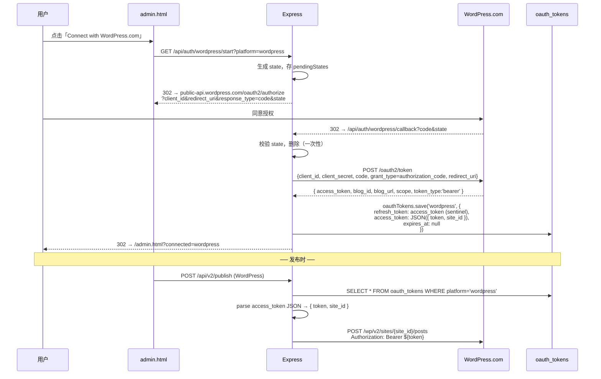
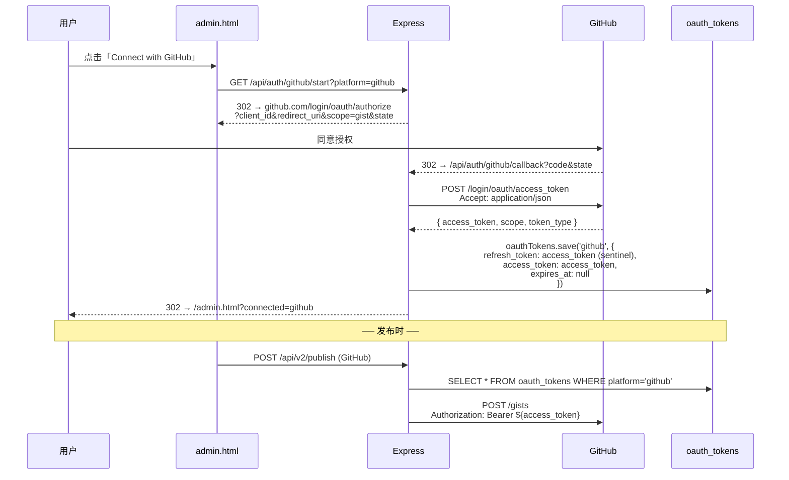
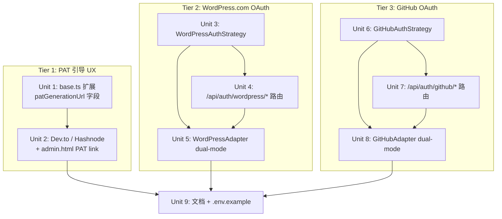

# Tier 1-3 平台一键认证：WordPress.com / GitHub OAuth + Dev.to / Hashnode PAT 引导

## Overview

延伸 Blogger（plan #003）+ Twitter（plan #004）已建好的 `AuthStrategy` 抽象，把「点 Connect → 一键完成认证」推广到剩余 MVP 平台，按 Tier 1 → Tier 3 顺序处理：

| 层级 | 平台 | 现状 | 目标 |
|---|---|---|---|
| Tier 1 (DA=1.0) | Medium | ✅ 已完成（plan #003 browser fallback） | — |
| Tier 1 | Dev.to | PAT 表单（用户自己摸路径） | 加「打开 Dev.to API Keys 页」引导按钮 |
| Tier 1 | Hashnode | PAT 表单 | 加「打开 Hashnode Developer Settings」引导按钮 |
| Tier 2 (DA=0.6) | Blogger | ✅ 已完成（plan #003 Google OAuth） | — |
| Tier 2 | WordPress | self-hosted Application Password only | 新增 WordPress.com OAuth 2.0；三级回退 OAuth → App Password → 报错 |
| Tier 3 (DA=0.3) | Telegra.ph | 自动启用 | — 跳过（无认证需求） |
| Tier 3 | GitHub | PAT (GITHUB_TOKEN) | 新增 GitHub OAuth 2.0；二级回退 OAuth → PAT → 报错 |

**用户已选择**：Tier 1 平台（Dev.to / Hashnode）保留 PAT，**仅改善 UX**——新增「一键打开生成页」引导按钮，不做无 OAuth API 的 browser-fallback；WordPress 双模式都支援；只处理 MVP_PLATFORMS。

**目标**：让用户在 admin.html 上对每个 MVP 平台都看到「一致的 Connect/获取凭证 入口」，配置时间从 30 分钟降到 5 分钟。

## Problem Frame

接入用户当前面对的现实痛点：
- **Dev.to / Hashnode**：用户不知道在哪里生成 token，要去翻 Settings 各种深层页面。**没有 OAuth API**（确认：dev.to 文档明确仅支持 API Keys；Hashnode GraphQL 仅 PAT），无法做真 OAuth
- **WordPress**：现有 self-hosted Application Password 流要求用户搭 WP 站点 + 生成应用密码，门槛高。WordPress.com 用户（占很大比例）则完全没法用现有路径
- **GitHub**：用户要去 Settings → Developer settings → PAT 创建，权限选错就 publish 失败；OAuth 一键即可

研究已确认：
- **WordPress.com OAuth 2.0**：标准 authorization_code flow，[官方 docs](https://developer.wordpress.com/docs/oauth2/)。**不返回 refresh_token**，access_token 永久有效（除非用户在 Account Settings → Connected Apps 撤销）。Endpoint：`https://public-api.wordpress.com/oauth2/authorize` + `https://public-api.wordpress.com/oauth2/token`
- **GitHub OAuth Apps**：标准 web flow，[官方 docs](https://docs.github.com/en/apps/oauth-apps/building-oauth-apps/authorizing-oauth-apps)。OAuth App 默认 **不返回 refresh_token**，access_token 永久（除非撤销或开 OAuth App expiration）。Endpoint：`https://github.com/login/oauth/authorize` + `https://github.com/login/oauth/access_token`
- **Schema 约束**：`oauth_tokens.refresh_token TEXT NOT NULL`（schema.ts L235）。SQLite 不支持原地改 column 约束 → 用 **sentinel 模式**：access_token 同时复制到 refresh_token 字段，DAO/加密层零改动；adapter 取 OAuth 路径时直接用 access_token，不调 refresh

## Requirements Trace

- **R1** — Dev.to / Hashnode 卡片在「连接」按钮旁加「获取 API Key」次级 link，点击在新窗口打开各自的 token 生成页；表单内增加 placeholder + 提示步骤
- **R2** — WordPress 卡片：env 配齐 WordPress.com OAuth client 时显示「Connect with WordPress.com」按钮；点击 → WP.com OAuth → 回到 admin → ✅ 已连接
- **R3** — GitHub 卡片：env 配齐 GitHub OAuth client 时显示「Connect with GitHub」按钮；点击 → GitHub OAuth → 回到 admin → ✅ 已连接
- **R4** — WordPressAdapter 三级回退：`oauth_tokens.wordpress` (WP.com REST) → `WORDPRESS_SITE_URL + WORDPRESS_USERNAME + WORDPRESS_APP_PASSWORD` (self-hosted REST) → 报错。OAuth 路径用 WordPress.com `/wp/v2/sites/{site_id}/posts` endpoint
- **R5** — GitHubAdapter 二级回退：`oauth_tokens.github` (Bearer access_token) → `GITHUB_TOKEN` env (token Auth header) → 报错
- **R6** — `oauth_tokens` 表沿用现有 schema 不动；no-refresh-token 的 provider 用 sentinel 模式（access_token 复制到 refresh_token 字段）
- **R7** — 加密层 + state Map（CSRF）+ loopback-only middleware 全部复用 plan #003 / #004 已有
- **R8** — 文档：CHANNEL_SETUP_GUIDE.md 加「WordPress.com OAuth 配置」「GitHub OAuth App 配置」段，`.env.example` 加新 env 变量
- **R9** — 删除 OAuth 行不破坏 fallback：`DELETE /api/auth/oauth/wordpress` / `DELETE /api/auth/oauth/github` 后，adapter 自动回退到 env path

## Scope Boundaries

**In scope:**
- Tier 1：Dev.to / Hashnode 的 PAT 生成引导 UX（admin.html 渲染 + adapter `patGenerationUrl` 静态字段）
- Tier 2：WordPress.com OAuth 2.0 完整 flow（authorization_code，无 PKCE）+ WordPressAdapter dual-mode + admin UI
- Tier 3：GitHub OAuth 2.0 完整 flow（OAuth App，标准 web flow）+ GitHubAdapter dual-mode + admin UI
- 复用现有 `AuthStrategy` 接口、`pendingStates` Map、loopback middleware
- CHANNEL_SETUP_GUIDE.md + .env.example 文档更新

**Out of scope（已与用户对齐）:**
- Medium 真 OAuth（已确认 Medium API 停发新 token，plan #003 已用 browser fallback）
- Dev.to / Hashnode 的 browser fallback 或 mock-OAuth 包装（PAT 引导是用户首选）
- LinkedIn / Substack / Quora / Product Hunt / Indie Hackers OAuth（不在 MVP_PLATFORMS）
- Telegra.ph 认证（无凭证需求）
- WordPress.com 多 site 选择 UI（首版用户首次 OAuth 后从 `/me/sites` 拿第一个 site_id 自动用；多 blog UI 推迟）
- GitHub Apps + refresh_token（OAuth Apps 简单足够；access_token 永久不需 refresh）
- 删除现有 OAuth 1.0a / Application Password / PAT env path（保留作为回退）
- 把 `/api/auth/<provider>/*` 路由抽象为通用 `/api/auth/oauth/:provider/*`（plan #004 已明确决定每 provider 独立路径，与 Console 配置匹配）
- WordPress / GitHub 的 webhook / OAuth scopes 范围扩展（仅请求 publish 所需最小 scope）

## Context & Research

### Relevant Code and Patterns

- `src/services/auth-strategy.ts` — `AuthStrategy` 接口 + 注册中心。新 provider 加一个 `export const xxxAuthStrategy: AuthStrategy = { ... }; registerStrategy(xxxAuthStrategy);` 即可
- `src/services/google-oauth.ts` — Google strategy 实现，**有** refresh_token 流程的标准模板
- `src/services/twitter-oauth.ts` — Twitter PKCE strategy，**有** refresh_token + rotation + concurrency guard 的复杂模板（WordPress/GitHub 不需要 PKCE，更接近 google-oauth.ts 简化版）
- `src/routes/auth.ts` L134-244 — `handleOAuthStart` / `handleOAuthCallback` 通用 helper。新增 provider 只需 `router.get('/api/auth/<provider>/start', loopbackOnly, handleOAuthStart(strategy, [...platforms]))` 两行
- `src/db/oauth-tokens.ts` — DAO 不动，platform 字段已是 string，sentinel 模式直接落库
- `src/adapters/blogger.ts` — 三级回退 + invalid_grant 自动清理 + on('tokens') refresh hook 的样板（WordPressAdapter 镜像，但去掉 refresh hook 因 WP.com 没 refresh_token）
- `src/adapters/twitter.ts` — fetch-based REST 调用 + Bearer header 模式（GitHubAdapter Gist API 直接套用）
- `public/admin.html` L702-782 platform 卡片渲染逻辑：`supportsOAuth + oauthConfigured + oauthConnected` 三态分支已是 data-driven，新平台自动适配
- `src/routes/admin.ts` L130-155 `/api/platforms` 字段填充：`getStrategyByAdapter(a.name)` 已 data-driven
- `src/middleware/loopback-only.ts` — `/start` 和 `DELETE /oauth/:platform` 都需要套此 middleware（plan #004 已确立）
- `src/utils/encryption.ts` — AES-256-GCM 加密层，DAO 自动调用，新 provider 透明使用

### Institutional Learnings

- 已在 Blogger / Twitter 实现中沉淀（直接复用，不重新踩坑）：
  - `state` Map 必须有 cap (`STATE_MAX_ENTRIES = 1000`) + 60s prune + 一次性删除
  - Callback 失败 redirect 到 `/admin.html?oauth_error=<stable_code>`，不要泄漏 raw error.message
  - error.message 必须转成 stable code（`exchange_failed` / `invalid_state` / `state_expired` 等）
  - `/start` 必须套 loopbackOnly；`/callback` 不能（provider 必须能从外网到达）
  - `oauth_tokens` 行删除 + adapter fallback 链路必须明确测试（避免「断开后无法 publish」隐藏 bug）
  - `getStrategyByAdapter()` 已 case-insensitive，传 adapter.name 直接查（不需要 toLowerCase）
- **No-refresh-token providers 的特别约束**（首次接入新经验）：
  - sentinel 模式：access_token 复制到 refresh_token 字段（schema 不动 + DAO 不动）
  - adapter 取 token 时直接读 `oauthTokens.get(db, 'wordpress').access_token` 或 `.refresh_token`（值相同）
  - adapter **不能**调 OAuth2Client.refreshAccessToken() 或类似 refresh 流程（这些 provider 没 token endpoint 接受 grant_type=refresh_token，会 400）
  - 401 / invalid_token 时直接清理 oauth_tokens 行 + 提示用户重连（不要尝试 refresh）

### External References

- [WordPress.com OAuth 2.0 docs](https://developer.wordpress.com/docs/oauth2/) — authorization_code flow，scope 字段为空字符串表示 `posts` 权限（默认）；`/oauth2/token` 返回 `{access_token, blog_id, blog_url, scope}`，**无** refresh_token
- [WordPress.com REST API — POST /sites/{site_id}/posts/new](https://developer.wordpress.com/docs/api/1.1/post/sites/%24site/posts/new/) — Bearer access_token，body 含 title/content/status/categories/tags
- [WordPress.com /me/sites endpoint](https://developer.wordpress.com/docs/api/1.1/get/me/sites/) — 取 OAuth 用户的 site_id 列表，首版自动取第一个 (primary blog)
- [GitHub OAuth App docs](https://docs.github.com/en/apps/oauth-apps/building-oauth-apps/authorizing-oauth-apps) — authorization code flow；token endpoint 默认返回 `application/x-www-form-urlencoded`（要在 Accept header 显式要 JSON）；scope 用 space-separated
- [GitHub Gist API](https://docs.github.com/en/rest/gists/gists#create-a-gist) — `Authorization: Bearer <access_token>` 与现有 PAT (`token <pat>`) 兼容（Bearer 是新写法，GitHub 同时支持）；scope 需 `gist`
- [Dev.to API Keys page](https://dev.to/settings/extensions) — 用户访问后向下滚动到 API Keys 段；引导按钮直接打开此 URL
- [Hashnode Developer Settings](https://hashnode.com/settings/developer) — 直接打开此 URL 让用户生成 PAT

## Key Technical Decisions

1. **WordPress.com / GitHub access_token 用 sentinel 模式存进 refresh_token 字段**
   - schema 不改，DAO 不改，加密层不改
   - access_token 也写入 access_token 字段（双份冗余）— 后续若 schema 改 nullable 可平滑切换
   - **理由**：SQLite 不支持改 NOT NULL 约束；重建表风险高（要 dump+drop+recreate+restore）；sentinel 是唯一无侵入方案。文档化「refresh_token 字段对 no-refresh providers 实质等同于 long-lived access_token」
   - **拒绝方案**：drop+recreate `oauth_tokens` 表会破坏现有 Blogger / Twitter 行；保留两表（一个 has_refresh，一个 no_refresh）增加 DAO 复杂度

2. **每 provider 独立路由 `/api/auth/<provider>/*`**
   - 沿用 plan #004 决定，不强行通用化
   - **理由**：WordPress.com Console / GitHub OAuth App settings 都按各自的 callback URL 配置；URL 路径分歧已是事实

3. **WordPress.com 不要 PKCE，要 client_secret**
   - WordPress.com 文档明确支持 confidential client（带 client_secret），无需 PKCE
   - **理由**：PKCE 主要解决无 client_secret 的 public client（mobile app / SPA）的安全问题；后端 confidential client + client_secret 已足；少代码

4. **GitHub OAuth 也不要 PKCE**
   - GitHub 支持 PKCE（2023 加入）但非必需；OAuth App 走 confidential client 即可
   - **理由**：与 WordPress 一致简化

5. **WordPressAdapter 三级回退：OAuth 优先 → Application Password 回退 → 错误**
   - OAuth 路径用 `https://public-api.wordpress.com/wp/v2/sites/{site_id}/posts`
   - App Password 路径用现有 `process.env.WORDPRESS_SITE_URL/wp-json/wp/v2/posts`（self-hosted）
   - 两个 endpoint 是不同 base URL，但 REST shape 一致（都是 `wp/v2`）
   - site_id 在 OAuth callback 时从 token 响应取，写入 `oauth_tokens.wordpress.access_token` 旁的副字段——具体方案：用 JSON 复合 access_token，例如 `access_token = JSON.stringify({ token: '...', site_id: '...' })`（最小 schema 变更），或加一个 `oauth_tokens.metadata` 列
   - **决定**：用 access_token 字段存 JSON `{ "access_token": "...", "site_id": "..." }`。adapter 解析时如失败则当 plain string 处理（兼容 Blogger/Twitter 单字段）
   - **拒绝方案**：加 `metadata` 列需 schema migration；环境变量 `WORDPRESS_SITE_ID` 又退回手动配置；从 `/me/sites` 每次发布前查询会增加 latency + 失败点

6. **GitHubAdapter 二级回退：OAuth 优先 → GITHUB_TOKEN 回退 → 错误**
   - OAuth 用 `Authorization: Bearer <access_token>`
   - PAT 用现有 `Authorization: token <pat>`
   - 两种 header 格式 GitHub 都支持，统一用 Bearer 更现代但保留 token 兼容性
   - **决定**：OAuth 走 Bearer，PAT 走 token（保持现有 publish 行为；不要在 PAT path 偷换 header 引发未预期变化）

7. **scope 选择最小集**
   - WordPress.com：留空（默认 posts 权限）。文档说明
   - GitHub OAuth App：`gist`（当前 GitHubAdapter publish 用 Gist；后续若改用 Issues / Repo PR 再加 `repo` scope）
   - **理由**：最小权限原则；用户授权页看到的 permission scope 越少越愿意点同意

8. **PAT 引导 UX：admin.html 内嵌 link，不引入新 modal**
   - Dev.to / Hashnode adapter 加静态属性 `patGenerationUrl: string`（base.ts 接口扩展）
   - admin.html 卡片 在「连接 / 更新」按钮旁，如 `p.patGenerationUrl` 存在 → 渲染「获取 API Key ↗」次级 link，target="_blank"
   - API key 表单内加一行 inline hint：「点上方链接生成 → 复制 → 粘贴到此」
   - **理由**：单一信息流，不打断用户当前任务；与 Medium 的「使用浏览器登录」次级 link 视觉风格一致

9. **删除 OAuth 行后 adapter 自动回退（不重启服务）**
   - DELETE /api/auth/oauth/wordpress → oauth_tokens 行删除 → 下次 publish 时 adapter `getAuth()` 检测到无 OAuth 行，回退到 env path
   - **理由**：用户体验（U 不必重启服务，直接生效）；测试要明确覆盖此 transition path

## High-Level Technical Design

> *本图为方向性设计，供审阅验证，实现时以代码为准。*

### Auth strategy 注册关系（已有 Google/Twitter，新增 WordPress/GitHub）

```mermaid
flowchart LR
  subgraph Strategies[AuthStrategyRegistry 注册]
    G[GoogleAuthStrategy<br/>已有 ✅]
    Tw[TwitterAuthStrategy<br/>已有 ✅]
    Wp[WordPressAuthStrategy<br/>新增]
    Gh[GitHubAuthStrategy<br/>新增]
  end
  subgraph Routes[per-provider 路由]
    GR[/api/auth/google/*]
    TR[/api/auth/twitter/*]
    WR[/api/auth/wordpress/*]
    HR[/api/auth/github/*]
  end
  GR --> G
  TR --> Tw
  WR --> Wp
  HR --> Gh
  G & Tw & Wp & Gh -.shared.-> SM[pendingStates Map]
  G & Tw & Wp & Gh -.shared.-> DB[(oauth_tokens<br/>per-platform row)]
```

### WordPress.com OAuth 流（无 refresh_token）



### GitHub OAuth 流（无 refresh_token）



### Implementation Units 依赖图



## Implementation Units

---

- [ ] **Unit 1: base.ts 扩展 patGenerationUrl 字段 + /api/platforms 反映**

**Goal:** 在 `PlatformAdapter` 基类层加一个静态字段 `patGenerationUrl?: string`，让任何用 PAT 的 adapter 能声明「用户去这里生成凭证」。`/api/platforms` 把字段透出，admin.html 渲染。

**Requirements:** R1

**Dependencies:** 无

**Files:**
- Modify: `src/adapters/base.ts`
- Modify: `src/routes/admin.ts`（`/api/platforms` 返回值加 `patGenerationUrl`）
- Test: `src/routes/__tests__/admin-platforms.test.ts`（扩展现有测试 — 验证字段透出）

**Approach:**
- `BaseAdapter` / `PlatformAdapter` 加 optional `patGenerationUrl?: string` 字段（不强制；只 PAT-only adapter 设置）
- `/api/platforms` 在每个 platform 对象加 `patGenerationUrl: a.patGenerationUrl ?? null`
- 字段语义文档化：「外部链接，让用户在新窗口生成 API key/PAT。打开后用户复制 token，回到此页粘贴到现有 API key 表单」

**Patterns to follow:**
- `supportsBrowserFallback` 字段同样的 optional declaration 风格（adapters/base.ts）
- `/api/platforms` 现有 `browserSessionExists` 等 adapter-derived 字段的填充模式

**Test scenarios:**
- Happy path: BaseAdapter 子类未设 patGenerationUrl → `/api/platforms` 返回 `patGenerationUrl: null`
- Happy path: 设了字段的 adapter → 正确透出 URL string
- Edge case: 字段为空字符串 → 透出 null（防 UI 渲染坏链接）

**Verification:**
- `npx vitest run admin-platforms` 全绿
- 手动 `curl http://localhost:3000/api/platforms | jq '.platforms[]|{name,patGenerationUrl}'` 看到新字段

---

- [ ] **Unit 2: Dev.to / Hashnode adapter 设置 patGenerationUrl + admin.html 渲染 PAT 引导 link**

**Goal:** Dev.to / Hashnode adapter 声明各自 token 生成页 URL；admin.html 在 API key 卡片旁渲染「获取 API Key ↗」次级 link，新窗口打开。Tier 1 完成。

**Requirements:** R1

**Dependencies:** Unit 1

**Files:**
- Modify: `src/adapters/devto.ts` (加 `patGenerationUrl = 'https://dev.to/settings/extensions'`)
- Modify: `src/adapters/hashnode.ts` (加 `patGenerationUrl = 'https://hashnode.com/settings/developer'`)
- Modify: `public/admin.html`（platform 卡片渲染 + API key 表单 inline hint）
- Test: `src/adapters/__tests__/adapter-test-connection.test.ts`（轻量 — 验证字段存在）

**Approach:**
- 两 adapter class 顶部加：`patGenerationUrl = '<URL>';`（不影响 publish/testConnection 行为）
- admin.html L702-782 platform 卡片：在 fallbackLink 那一段（L755）加并列分支，当 `p.patGenerationUrl && !p.supportsOAuth && !p.browserAutomation` 时渲染：
  ```html
  <a href="${p.patGenerationUrl}" target="_blank" rel="noopener"
     class="text-xs text-blue-600 hover:underline ml-2">
     获取 API Key ↗
  </a>
  ```
- API key 表单容器（admin.html L546 附近 `openApiKeyForm`）：当 selected platform 有 patGenerationUrl 时显示一行小字 hint 「点[此处]生成 → 复制 → 粘贴到下方输入框」

**Patterns to follow:**
- 现有 Medium 卡片的 `fallbackLink` 渲染（admin.html L755-761）— 同样的 next-to-button link 视觉
- `openApiKeyForm` 已有的 platform-aware 表单刷新模式

**Test scenarios:**
- Happy path: DevToAdapter / HashnodeAdapter 实例的 `patGenerationUrl` 字段与文档 URL 一致
- Happy path: `/api/platforms` 中 Dev.to / Hashnode 卡片含正确 URL
- Edge case: Medium 卡片不显示 PAT link（已有 supportsBrowserFallback path）
- Edge case: WordPress 卡片在 OAuth 配齐时不显示 PAT link（OAuth 优先）

**Verification:**
- 本地 server 启动 + 浏览器打开 admin.html，Dev.to / Hashnode 卡片显示蓝色「获取 API Key ↗」link，点击新窗口打开正确页面
- API key 表单选中 Dev.to / Hashnode 时显示 inline hint
- 现有 Medium / Blogger / Twitter 卡片视觉无回归

---

- [ ] **Unit 3: WordPressAuthStrategy + service module**

**Goal:** 实现 WordPress.com OAuth 2.0 authorization_code flow 的 strategy，遵循 `AuthStrategy` 接口；处理「无 refresh_token + site_id 嵌入 access_token」的 sentinel 设计。

**Requirements:** R2, R6

**Dependencies:** 无（沿用 auth-strategy.ts）

**Files:**
- Create: `src/services/wordpress-oauth.ts`
- Test: `src/services/__tests__/wordpress-oauth.test.ts`

**Approach:**
- 导出常量：
  - `WORDPRESS_AUTH_URL = 'https://public-api.wordpress.com/oauth2/authorize'`
  - `WORDPRESS_TOKEN_URL = 'https://public-api.wordpress.com/oauth2/token'`
  - `WORDPRESS_OAUTH_SCOPES = ['']` (空 scope = 默认 posts 权限)
- 配置：`isWordPressOAuthConfigured()` 检查 `WORDPRESS_OAUTH_CLIENT_ID` + `WORDPRESS_OAUTH_CLIENT_SECRET` + `WORDPRESS_OAUTH_REDIRECT_URI`
- `generateAuthUrl({ state })` → URL 含 `client_id`, `redirect_uri`, `response_type=code`, `state`, `scope=`（empty）
- `exchangeCodeForTokens(code)` → POST 到 token endpoint，body urlencoded：`client_id`, `client_secret`, `code`, `grant_type=authorization_code`, `redirect_uri`；返回 `{ access_token, blog_id, blog_url, scope }`
- 包装结果：
  ```ts
  {
    refresh_token: tokenResp.access_token,  // sentinel
    access_token: JSON.stringify({ token: tokenResp.access_token, site_id: tokenResp.blog_id }),
    expires_at: null,
  }
  ```
- 导出辅助 `parseWordPressToken(stored: OAuthTokens): { token: string; site_id: string }` 给 adapter 用：尝试 JSON.parse(access_token)，失败则把 access_token 当 plain token + 抛 missing site_id 错
- 注册：`registerStrategy(wordpressAuthStrategy)`
- providerLabel: `'WordPress.com'`，supportedAdapters: `['WordPress']`

**Patterns to follow:**
- `src/services/google-oauth.ts` 的 `generateAuthUrl` / `exchangeCodeForTokens` 函数式 export + `xxxAuthStrategy` 对象 wrapping 模式
- `src/services/twitter-oauth.ts` 的 fetch + URLSearchParams + AbortSignal.timeout(15_000) 模式（无需 PKCE 部分）

**Test scenarios:**
- Happy path: env 配齐时 `isConfigured()` 返 true
- Happy path: `generateAuthUrl({ state: 'abc' })` 返回 URL 含 `public-api.wordpress.com/oauth2/authorize`、`response_type=code`、`state=abc`、`client_id`
- Happy path: `exchangeCodeForTokens('valid-code')` mock fetch → 返回 sentinel-shaped tokens（refresh_token == access_token-token、access_token JSON 含 site_id）
- Happy path: `parseWordPressToken({ access_token: '{"token":"t","site_id":"123"}', ... })` → `{ token: 't', site_id: '123' }`
- Edge case: env 缺任一 → `isConfigured()` 返 false
- Edge case: token endpoint 返回 200 但缺 blog_id → 抛 `'WordPress.com response missing blog_id'`
- Edge case: parseWordPressToken 收到非 JSON access_token → 抛清晰错误（「OAuth row missing site_id — please reconnect」）
- Error path: token endpoint 返 400 invalid_request → 抛错并向上传递

**Verification:**
- 测试套件全绿
- 手动 `node -e "require('./src/services/wordpress-oauth').generateAuthUrl({state:'x'})"` 输出可点击的 WP.com 同意页 URL

---

- [ ] **Unit 4: /api/auth/wordpress/start + /callback + DELETE /api/auth/oauth/wordpress 路由**

**Goal:** WordPress 三件套路由，沿用 `handleOAuthStart` / `handleOAuthCallback` 通用 helper。

**Requirements:** R2, R7

**Dependencies:** Unit 3

**Files:**
- Modify: `src/routes/auth.ts`
- Test: `src/routes/__tests__/wordpress-oauth.test.ts`

**Approach:**
- 在 routes/auth.ts 末尾加：
  ```ts
  import '../services/wordpress-oauth'; // self-register
  const WORDPRESS_PLATFORMS = ['wordpress'];
  router.get('/api/auth/wordpress/start', loopbackOnly,
    handleOAuthStart(getStrategyByProvider('wordpress')!, WORDPRESS_PLATFORMS));
  router.get('/api/auth/wordpress/callback', handleOAuthCallback('wordpress'));
  ```
- 把 `WORDPRESS_PLATFORMS` 合并进 `KNOWN_PLATFORMS` Set（DELETE 路由白名单）— 现有 `KNOWN_PLATFORMS` 拼接逻辑已支持，加一个 spread 即可

**Patterns to follow:**
- routes/auth.ts L256-263 Twitter 三件套（直接镜像）
- `oauthErrorRedirect` 错误处理已通用

**Test scenarios:**
- Happy path: GET `/api/auth/wordpress/start?platform=wordpress` → 302 到 `public-api.wordpress.com/oauth2/authorize`，URL 含 state
- Happy path: callback 模拟成功 → 302 到 `/admin.html?connected=wordpress`，DB oauth_tokens.wordpress 行有加密的 token + site_id JSON
- Happy path: DELETE `/api/auth/oauth/wordpress` (loopback) → oauth_tokens 行删除，下次 publish 走 fallback
- Edge case: `WORDPRESS_OAUTH_CLIENT_ID` 缺 → /start 返 503
- Edge case: callback state 不存在 → 302 `?oauth_error=invalid_state`
- Edge case: callback 收到 `error=access_denied` → 302 `?oauth_error=access_denied`
- Edge case: 非 loopback 调 /start → 403（middleware 已测，冒烟）
- Error path: token exchange fetch 返 400 → 302 `?oauth_error=exchange_failed`
- Integration: full flow with supertest mock token endpoint，验证 oauth_tokens 行内容（解密后 access_token 是 JSON 串、site_id 正确）

**Verification:**
- 测试套件全绿
- 手动用真实 WordPress.com OAuth client（dev account）走端到端，admin → Connect → 同意 → 回 admin → DB 行有 site_id

---

- [ ] **Unit 5: WordPressAdapter 三级回退（OAuth → Application Password → 错误）**

**Goal:** WordPressAdapter 优先用 OAuth 走 wordpress.com REST，回退到 self-hosted Application Password。401/invalid_token 时清理 OAuth 行。

**Requirements:** R4, R9

**Dependencies:** Unit 3

**Files:**
- Modify: `src/adapters/wordpress.ts`
- Test: `src/adapters/__tests__/wordpress-oauth.test.ts`（新建，类似 blogger-oauth.test.ts）

**Approach:**
- 抽出 `private async getPublishContext(): Promise<{ kind: 'oauth' | 'app_password'; ... }>`：
  - 如 `oauthTokens.exists(db, 'wordpress')`：调 `parseWordPressToken` → 返回 `{ kind: 'oauth', token, site_id, baseUrl: 'https://public-api.wordpress.com' }`；解密失败按 Blogger 同模式（warn + delete + 落到下一级）
  - 否则 `WORDPRESS_SITE_URL + USERNAME + APP_PASSWORD` 都齐 → 返回 `{ kind: 'app_password', basicAuth, baseUrl: SITE_URL }`
  - 都没 → 抛 `'WordPress 未配置：请点 Connect with WordPress.com 或设置 WORDPRESS_SITE_URL/USERNAME/APP_PASSWORD'`
- `publish()` / `testConnection()` 都调 `getPublishContext()`：
  - OAuth path: POST `${baseUrl}/wp/v2/sites/${site_id}/posts`，header `Authorization: Bearer ${token}`
  - App password path: POST `${baseUrl}/wp-json/wp/v2/posts`（现有逻辑），header `Authorization: Basic ${basicAuth}`
  - body 一样：`{ title, content (markdownToHtml), status, excerpt }`
- testConnection OAuth path：GET `/wp/v2/sites/${site_id}` 验证 site 可访问
- 401 / invalid_token / token_revoked 错误码识别：
  ```ts
  private isInvalidWordPressToken(err): boolean {
    // wp.com 返回 { error: 'authorization_required' } 或 401
    return /authorization_required|invalid_token|401/i.test(err.message ?? '');
  }
  ```
- 检测到 OAuth path + invalid_token → `oauthTokens.delete(db, 'wordpress')` + 返回 `{ ok: false, error: 'WordPress.com session revoked — please reconnect' }`

**Patterns to follow:**
- `src/adapters/blogger.ts` getAuthClient + isInvalidGrantError + auto-cleanup 模式（逐字镜像）
- 现有 `wordpress.ts` `markdownToHtml` 函数复用

**Test scenarios:**
- Happy path: OAuth 行存在（含 valid JSON site_id）→ publish 调 wp.com REST endpoint，header Bearer
- Happy path: 无 OAuth 行 + APP_PASSWORD env 配齐 → publish 调 self-hosted endpoint，header Basic
- Happy path: 同时存在 → OAuth 优先（mock + 验证 baseUrl）
- Happy path: testConnection OAuth 路径 → GET sites/{site_id} 200 → ok
- Edge case: OAuth 行存在但 access_token JSON parse 失败 → 报清晰错误「OAuth row missing site_id — please reconnect」
- Edge case: OAuth 行 + 401 invalid_token → 清理 oauth_tokens.wordpress + 返回「session revoked」错；**下一次** testConnection 走 fallback（验证 transition）
- Edge case: 都没配 → testConnection 返「WordPress 未配置...」清晰指引
- Edge case: ENCRYPTION_KEY 旋转后 oauth_tokens 解密失败 → 删行 + 落到 fallback（同 Blogger 模式）
- Error path: publish 返 500 server error → fail() 透传
- Integration: full publish flow OAuth path，断开后立即 publish 走 app_password path（验证无服务重启的 transition）

**Verification:**
- 测试全绿（含 OAuth + app_password 两条 publish 路径）
- 手动：先 disconnect WordPress，env 留 APP_PASSWORD → 走 self-hosted publish；Connect with WordPress.com → publish 切到 wp.com endpoint

---

- [ ] **Unit 6: GitHubAuthStrategy + service module**

**Goal:** 实现 GitHub OAuth App authorization_code flow 的 strategy。无 PKCE，无 refresh_token，sentinel 模式。

**Requirements:** R3, R6

**Dependencies:** 无

**Files:**
- Create: `src/services/github-oauth.ts`
- Test: `src/services/__tests__/github-oauth.test.ts`

**Approach:**
- 导出常量：
  - `GITHUB_AUTH_URL = 'https://github.com/login/oauth/authorize'`
  - `GITHUB_TOKEN_URL = 'https://github.com/login/oauth/access_token'`
  - `GITHUB_OAUTH_SCOPES = ['gist']`
- `isGitHubOAuthConfigured()` 检查 `GITHUB_OAUTH_CLIENT_ID` + `GITHUB_OAUTH_CLIENT_SECRET` + `GITHUB_OAUTH_REDIRECT_URI`
- `generateAuthUrl({ state, scopes })` → URL 含 `client_id`, `redirect_uri`, `scope` (space-separated, default `gist`), `state`
- `exchangeCodeForTokens(code)` → POST 到 token endpoint，body urlencoded：`client_id`, `client_secret`, `code`, `redirect_uri`；header `Accept: application/json`（关键 — 默认是 form-encoded 响应）
- 响应：`{ access_token, scope, token_type:'bearer' }` — 验证 scope 含 `gist`，否则报「scope 不足」
- 包装：
  ```ts
  {
    refresh_token: access_token,  // sentinel
    access_token: access_token,
    expires_at: null,
  }
  ```
- providerLabel: `'GitHub'`，supportedAdapters: `['GitHub']`
- 注册：`registerStrategy(githubAuthStrategy)`

**Patterns to follow:**
- `src/services/wordpress-oauth.ts`（同 Unit 3，更接近，无 site_id 复杂度）
- `src/services/twitter-oauth.ts` fetch + AbortSignal.timeout(15_000) + URLSearchParams 模式

**Test scenarios:**
- Happy path: env 配齐 → `isConfigured()` true
- Happy path: `generateAuthUrl({ state })` 返 URL 含 `github.com/login/oauth/authorize`、`scope=gist`、`state`
- Happy path: `exchangeCodeForTokens` mock fetch + Accept JSON → sentinel tokens（refresh_token == access_token）
- Edge case: GitHub 返回 scope 不含 'gist' → 抛 `'Insufficient scope: please re-authorize and grant gist permission'`
- Edge case: token endpoint 返 `error: 'bad_verification_code'` → 抛错并向上传递
- Error path: 网络超时 → 抛 timeout 错

**Verification:**
- 测试全绿
- 手动 generateAuthUrl 输出可在浏览器打开 GitHub 同意页

---

- [ ] **Unit 7: /api/auth/github/start + /callback + DELETE /api/auth/oauth/github 路由**

**Goal:** GitHub 三件套路由。

**Requirements:** R3, R7

**Dependencies:** Unit 6

**Files:**
- Modify: `src/routes/auth.ts`
- Test: `src/routes/__tests__/github-oauth.test.ts`

**Approach:**
- 镜像 Twitter / WordPress 路由注册：
  ```ts
  import '../services/github-oauth';
  const GITHUB_PLATFORMS = ['github'];
  router.get('/api/auth/github/start', loopbackOnly,
    handleOAuthStart(getStrategyByProvider('github')!, GITHUB_PLATFORMS));
  router.get('/api/auth/github/callback', handleOAuthCallback('github'));
  ```
- `KNOWN_PLATFORMS` Set 加入 `'github'`（DELETE 路由白名单）

**Patterns to follow:**
- routes/auth.ts Twitter / WordPress 三件套

**Test scenarios:**
- Happy path: /start 302 到 github.com/login/oauth/authorize，URL 含 state
- Happy path: callback 模拟成功 → 302 connected=github，DB 有加密 token
- Edge case: invalid state / state expired → ?oauth_error=invalid_state / state_expired
- Edge case: callback 收到 `error=access_denied` → ?oauth_error=access_denied
- Edge case: GitHub 返 scope 不足 → ?oauth_error=insufficient_scope（需在 classifyExchangeError 加分支）
- Integration: full flow supertest

**Verification:**
- 测试全绿
- 手动用真实 GitHub OAuth App 走端到端

---

- [ ] **Unit 8: GitHubAdapter 二级回退（OAuth → PAT → 错误）**

**Goal:** GitHubAdapter 优先用 OAuth Bearer token，回退到 GITHUB_TOKEN env (token Auth)。

**Requirements:** R5, R9

**Dependencies:** Unit 6

**Files:**
- Modify: `src/adapters/github.ts`
- Test: `src/adapters/__tests__/github-oauth.test.ts`

**Approach:**
- 抽出 `private async getAuthHeader(): Promise<{ kind: 'oauth' | 'pat'; header: string }>`：
  - `oauthTokens.exists(db, 'github')` → 解密 + 返回 `{ kind: 'oauth', header: 'Bearer ${access_token}' }`
  - 否则 `process.env.GITHUB_TOKEN` 存在 → 返回 `{ kind: 'pat', header: 'token ${GITHUB_TOKEN}' }`
  - 都没 → 抛错
- `publish()` / `testConnection()` 都调 `getAuthHeader()`，统一发 `Authorization: ${header}`
- 401 错误检测：OAuth path + 401 → `oauthTokens.delete(db, 'github')` + 「session revoked」错
- 现有 publish 逻辑（Gist 创建）不变，仅替换 header 来源

**Patterns to follow:**
- BloggerAdapter / TwitterAdapter dual-mode 抽象
- 现有 GitHubAdapter publish/testConnection 流程（仅注入新 header source）

**Test scenarios:**
- Happy path: OAuth 行存在 → fetch /gists 用 Bearer header
- Happy path: 无 OAuth 行 + GITHUB_TOKEN 设 → fetch 用 token header
- Happy path: 同时存在 → OAuth 优先
- Happy path: testConnection OAuth + GET /user 200 → ok
- Edge case: OAuth + 401 → 清理 oauth_tokens.github + 「session revoked」错；下次 testConnection 走 PAT
- Edge case: 都没配 → testConnection 「API key not configured」（保持现有错文）
- Edge case: ENCRYPTION_KEY 旋转 + 解密失败 → 删行 + 落 PAT
- Error path: GitHub 返 422（Gist 创建失败）→ fail() 透传
- Integration: full publish OAuth path → disconnect → 立即 publish PAT path（无重启）

**Verification:**
- 测试全绿（含两条 path）
- 手动：disconnect GitHub + 留 GITHUB_TOKEN → publish 走 PAT；Connect → publish 切到 OAuth Bearer

---

- [ ] **Unit 9: 文档 + .env.example + admin.html UI 微调**

**Goal:** CHANNEL_SETUP_GUIDE.md 加 WordPress.com / GitHub OAuth 配置段；.env.example 加新 env；admin.html 现有渲染逻辑无需大改（前几个 unit 已 data-driven），但 toast 文案 + 错误码映射加新 codes。

**Requirements:** R8

**Dependencies:** Unit 4, Unit 7（确认路由路径 final）

**Files:**
- Modify: `CHANNEL_SETUP_GUIDE.md`
- Modify: `.env.example`
- Modify: `public/admin.html`（toast 错误码文案补 `insufficient_scope`、`authorization_required` 等新 codes — 已是 data-driven 的话只加 i18n 字典项）

**Approach:**
- CHANNEL_SETUP_GUIDE.md 新加段：
  - **「WordPress.com OAuth 2.0（推荐 — WordPress.com 用户）」**：
    1. 进 [WordPress.com Apps](https://developer.wordpress.com/apps/) → Create New Application
    2. Redirect URLs: `http://localhost:3000/api/auth/wordpress/callback`
    3. Type: Web，Save
    4. 拷贝 Client ID / Client Secret 到 .env
  - **「GitHub OAuth App（推荐 — Gist 发布）」**：
    1. 进 [GitHub Settings → Developer settings → OAuth Apps](https://github.com/settings/developers) → New OAuth App
    2. Authorization callback URL: `http://localhost:3000/api/auth/github/callback`
    3. Save → 在 OAuth App 详情页 generate client secret
    4. 拷贝到 .env
  - **「Dev.to / Hashnode PAT 一键生成」**：admin.html 卡片旁有「获取 API Key ↗」link，点击新窗口跳转，按页面提示生成后回贴
  - 「现有 self-hosted WordPress / GITHUB_TOKEN 等老配置仍可作为 fallback，零迁移」
- `.env.example` 加段：
  ```
  # WordPress.com OAuth 2.0 (推荐 — WordPress.com 用户)
  WORDPRESS_OAUTH_CLIENT_ID=
  WORDPRESS_OAUTH_CLIENT_SECRET=
  WORDPRESS_OAUTH_REDIRECT_URI=http://localhost:3000/api/auth/wordpress/callback

  # WordPress self-hosted (回退 — Application Password)
  WORDPRESS_SITE_URL=
  WORDPRESS_USERNAME=
  WORDPRESS_APP_PASSWORD=

  # GitHub OAuth 2.0 (推荐 — Gist 发布)
  GITHUB_OAUTH_CLIENT_ID=
  GITHUB_OAUTH_CLIENT_SECRET=
  GITHUB_OAUTH_REDIRECT_URI=http://localhost:3000/api/auth/github/callback

  # GitHub PAT (回退 — 现有用户)
  GITHUB_TOKEN=
  ```
- admin.html `oauth_error` URL 参数 → toast 文案字典加 `insufficient_scope: 'GitHub 授权权限不足，请重新授权并勾选 gist 权限'`、`authorization_required: 'WordPress.com 授权失效，请重新连接'`（如果现有逻辑已 generic display raw code 则可跳过）

**Patterns to follow:**
- 现有 CHANNEL_SETUP_GUIDE.md Blogger / Twitter 段的格式（编号步骤 + 截图 placeholder + 注意事项）
- 现有 .env.example 已有 `# Blogger OAuth 2.0` / `# Twitter / X OAuth 2.0` 段的视觉风格

**Test scenarios:** N/A — 文档单元

**Test expectation:** none — 纯文档

**Verification:**
- `.env.example` 新字段名与 service 模块读取的 process.env.* 一致（grep 校验）
- 让一个未读过项目的同事按 README 走完 WordPress.com / GitHub OAuth 配置 + 一次发布，能在 ≤10 分钟完成
- 手动触发 `?oauth_error=insufficient_scope` 看到中文提示

---

## Open Questions

### Resolved During Planning

- **Tier 1 (Dev.to / Hashnode) 是否做真 OAuth？** 不。两平台无公开 OAuth API；用户已选 PAT 引导（Tier 1 决策已与用户对齐）
- **WordPress 双模式还是只 OAuth？** 双模式（用户已选）。OAuth 优先 + Application Password fallback
- **WordPress.com OAuth 没 refresh_token，schema 怎么办？** Sentinel 模式：access_token 复制到 refresh_token 字段，schema 不动；adapter 取 token 时只读 access_token，不调 refresh
- **WordPress.com site_id 怎么存？** 写入 `oauth_tokens.access_token` JSON 串 `{token, site_id}`，adapter 解析。比加 `metadata` 列简单，比 `WORDPRESS_SITE_ID` env 用户体验好
- **GitHub OAuth App vs GitHub App？** OAuth App。GitHub App 配置复杂、需要 installation token、access_token 有 1h 过期 + 需 JWT 签 refresh，对 Gist publish 用例 overkill
- **GitHub OAuth 也要 PKCE？** 不。GitHub 支持 PKCE 但非必需；后端 confidential client + client_secret 已足够（与 WordPress 一致简化）
- **新增 provider 的路由是否要数据化？** 不。沿用 plan #004 决策，每 provider 独立路径

### Deferred to Implementation

- **WordPress.com 多 site 选择 UI**：用户首次 OAuth 后用 primary site_id 自动；后续 callback 时 `/me/sites` 列出全部供选择留 P3
- **GitHub Gist publish 是否要支持 private gist toggle？** 现有 `public: true` 写死；OAuth 后用户可能希望选 private（需 `repo` scope）→ 留 P2 反馈
- **WordPress.com REST publish content type**：用户内容是 markdown；`content` 字段 wp.com 接受 HTML，需 markdownToHtml 转换（现 wordpress.ts 已有 helper，复用）。具体：是否需要原始 markdown 选项给 Gutenberg 用户？留实现时确认
- **invalid_token 自动清理时机**：testConnection 中清还是 publish 中清？同 Blogger plan #003 决策（两个都清）
- **WordPress.com `expires_at: null` 在 expires_at INTEGER 字段是 NULL 还是 0？** 实现时确认（sqlite 会接受 null，DAO 已支持 `expires_at?: number | null`）

## System-Wide Impact

- **Interaction graph:**
  - 新增 `GET /api/auth/wordpress/start`、`GET /api/auth/wordpress/callback`、`DELETE /api/auth/oauth/wordpress`
  - 新增 `GET /api/auth/github/start`、`GET /api/auth/github/callback`、`DELETE /api/auth/oauth/github`
  - `/api/platforms` 返回值新增字段 `patGenerationUrl: string | null`（Tier 1）
  - `oauth_tokens` 表行 schema 不变，但 WordPress 行的 `access_token` 字段约定为 JSON 串（GitHub 仍是 plain string）
  - admin.html 卡片渲染逻辑已 data-driven，新增 PAT link 分支
- **Error propagation:**
  - 新错误码：`insufficient_scope`（GitHub 授权 scope 缺）、`authorization_required`（WordPress.com session 失效）
  - WordPress / GitHub adapter 401 → 自动清理 oauth_tokens 行 + 错误指引「请重新连接」
  - WordPress site_id JSON parse 失败 → 错误指引「OAuth row missing site_id — please reconnect」
- **State lifecycle risks:**
  - `oauth_tokens.wordpress.access_token` 是 JSON 串（与其他 provider 的 plain string 不同），adapter 解析必须 try/catch 兼容
  - 若用户在 WordPress.com Account → Connected Apps 撤销授权，下次 publish 401 → 自动清理 + UI 提示重连
  - sentinel 模式下，refresh_token 字段实质是 long-lived access_token；若误调 refresh API 会失败（adapter 必须不调）
- **API surface parity:**
  - 现有 Blogger / Twitter OAuth 行为零变化
  - 现有 self-hosted WordPress (App Password) / GITHUB_TOKEN 路径继续工作
  - Tier 1 (Dev.to / Hashnode) PAT 行为不变，仅 UX 增强
- **Integration coverage:**
  - 端到端测试：WordPress / GitHub 各自 OAuth start → callback → DB 写 → adapter publish OAuth path → disconnect → publish fallback path
  - 测试覆盖 OAuth ↔ env path transition（断开后立即 publish 不需重启）
  - 测试覆盖 access_token JSON parse 失败的兜底（WordPress 专属）
- **Unchanged invariants:**
  - `oauth_tokens` 表 schema 不动（refresh_token NOT NULL 约束保留 — sentinel 模式兼容）
  - 加密层不动（AES-GCM + ENCRYPTION_KEY）
  - loopback-only middleware 不动
  - `pendingStates` Map 容量 + TTL 不动（state 是 32 字节 hex，新 provider 无 PKCE extras 字段，每条 entry 比 Twitter 还小）
  - Blogger / Twitter / Medium / Telegra.ph adapter 行为零变化
  - `AuthStrategy` 接口不动（新 provider 是新实现，非接口扩展）

## Risks & Dependencies

| Risk | Mitigation |
|------|------------|
| WordPress.com Application 配置错误（callback URL 不匹配） | 启动时 `isConfigured()` 校验 + UI 灰化 + 启动日志打印 redirect_uri；docs 配截图 |
| GitHub OAuth App callback URL 不匹配 | 同上模式；GitHub 错误更友好，会显示 mismatch redirect_uri |
| sentinel 模式下 refresh_token 字段被误用调 refresh API | adapter 严禁调 refresh；测试覆盖；代码 comment 明确说明 |
| WordPress.com `access_token` JSON parse 失败（旧测试数据 / 手动构造） | adapter `parseWordPressToken` 兜底：失败时清理行 + 报「请重新授权」 |
| WordPress.com primary blog 不是用户想发的 blog | 文档说明：用户应先在 WP.com 设置 primary blog 为目标 blog；多 blog UI 留 P3 |
| GitHub `gist` scope 用户拒绝勾选 | callback 检测 scope 不含 gist → ?oauth_error=insufficient_scope + UI 中文提示重连 |
| Dev.to / Hashnode 修改 settings 页 URL | 新窗口跳 404 → 用户手动搜索；adapter `patGenerationUrl` 是 best-effort，不是 contract |
| OAuth client_secret 泄漏（commit 进 repo） | `.env.example` 占位空 + `.gitignore` 含 `.env`；docs 标红警示（与 plan #003 同模式） |
| WordPress 双模式行为分叉，调试困难 | `getPublishContext()` 返回 `kind: 'oauth' \| 'app_password'`，logger 在每次调用打印 kind；测试覆盖两条 publish path |
| WordPress.com site_id 写入后用户在 wp.com 删除 site → site_id 失效 | publish 返 404 → 报错指引「请重新连接 WordPress.com 选择新 site」（不自动清理 — site_id 失效不等于 token 失效，留 P3 自动 detect） |
| 多 OAuth 实例并发（一个用户同时连 WP + GitHub） | `pendingStates` Map 共享但 state 是 random hex，无碰撞；providerId 字段 disambiguate；plan #004 已测覆盖 |

## Documentation / Operational Notes

- 部署需在 .env 设置 4 组 OAuth client (Blogger / Twitter / WordPress / GitHub) — 全部可选，未配则 UI 灰化按钮
- `oauth_tokens` 表备份必须含 `ENCRYPTION_KEY` env；丢任一无法恢复
- 监控建议：`[OAuth] insufficient_scope` 频次、`[WordPress] session revoked`、`[GitHub] session revoked` — 高频说明用户授权 scope 设错或频繁主动撤销
- 生产部署 redirect URI 必须与各 Console 配置严格一致（path + scheme + host + port）
- `WORDPRESS_OAUTH_REDIRECT_URI` / `GITHUB_OAUTH_REDIRECT_URI` 需在生产域名变化时同步更新对应 Console

## Sources & References

- **Origin plan:** [docs/plans/2026-05-06-004-feat-twitter-oauth2-pkce-plan.md](2026-05-06-004-feat-twitter-oauth2-pkce-plan.md)
- 上游 plans: [Blogger OAuth #003](2026-05-06-003-feat-medium-blogger-oauth-flow-plan.md), [Browser login #002](2026-05-06-002-feat-browser-platform-login-flow-plan.md)
- 现有 strategy: `src/services/auth-strategy.ts`、`src/services/google-oauth.ts`、`src/services/twitter-oauth.ts`
- 现有 adapters: `src/adapters/blogger.ts`、`src/adapters/twitter.ts`、`src/adapters/wordpress.ts`、`src/adapters/github.ts`、`src/adapters/devto.ts`、`src/adapters/hashnode.ts`、`src/adapters/medium.ts`
- 现有 routes: `src/routes/auth.ts`（OAuth 三件套通用 helper L134-244）、`src/routes/admin.ts`（/api/platforms L130-155）
- 现有 DAO: `src/db/oauth-tokens.ts`
- 现有 frontend: `public/admin.html` L702-782 (platform 卡片渲染)
- WordPress.com OAuth: [developer.wordpress.com/docs/oauth2/](https://developer.wordpress.com/docs/oauth2/)
- WordPress.com REST API: [developer.wordpress.com/docs/api/1.1/post/sites/%24site/posts/new/](https://developer.wordpress.com/docs/api/1.1/post/sites/%24site/posts/new/)
- GitHub OAuth Apps: [docs.github.com/en/apps/oauth-apps/building-oauth-apps/authorizing-oauth-apps](https://docs.github.com/en/apps/oauth-apps/building-oauth-apps/authorizing-oauth-apps)
- GitHub Gist API: [docs.github.com/en/rest/gists/gists](https://docs.github.com/en/rest/gists/gists)
- Dev.to API Keys: [dev.to/settings/extensions](https://dev.to/settings/extensions)
- Hashnode Developer: [hashnode.com/settings/developer](https://hashnode.com/settings/developer)
